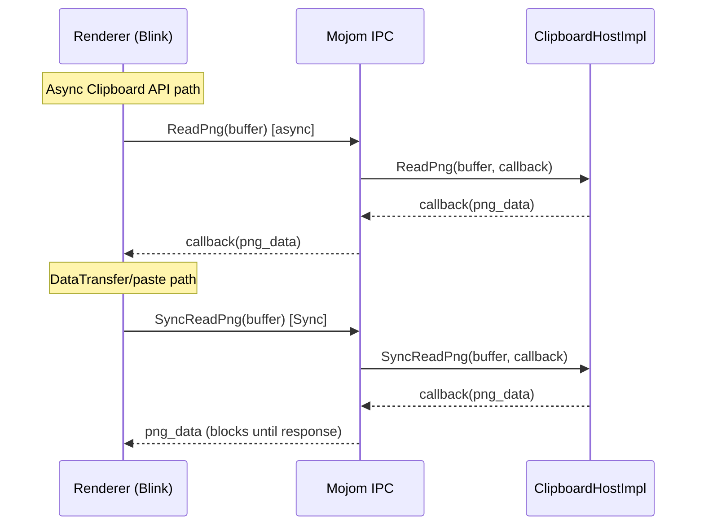
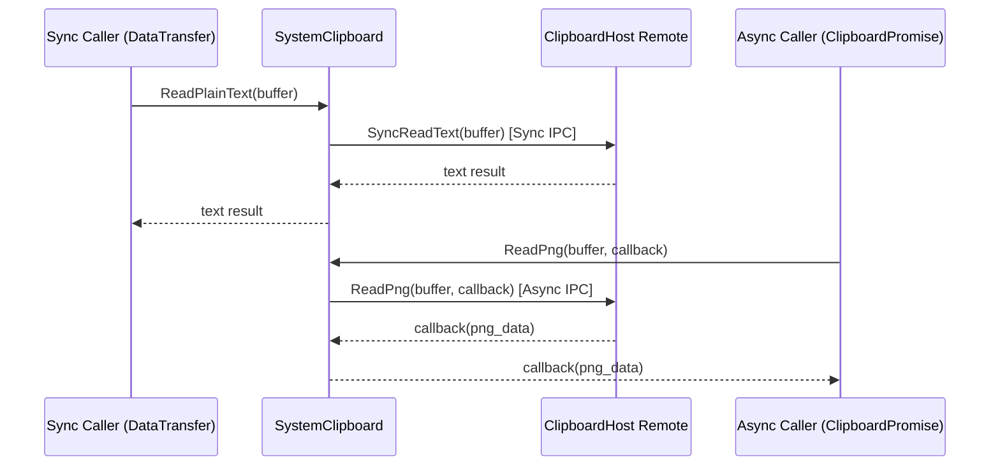
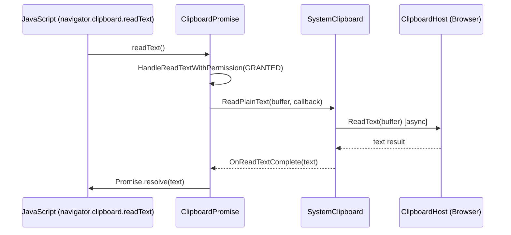
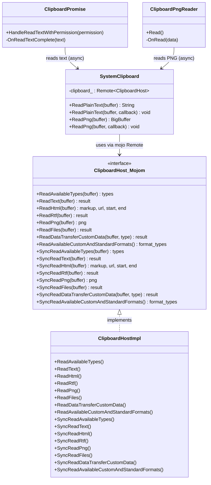
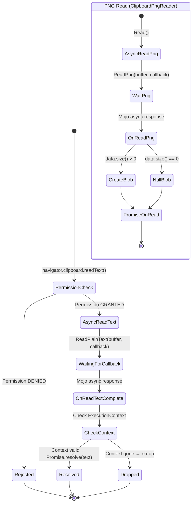

# Low-Level Design: CL 7579673 — Async Clipboard API: Convert sync mojom IPC to async

## Summary

This CL converts 8 `ClipboardHost` mojom read methods from synchronous (`[Sync]`) to asynchronous in `clipboard.mojom`. For each converted method, a `[Sync] SyncRead*` legacy variant is added so that existing synchronous callers (DataTransfer / paste events) continue working unchanged. The Async Clipboard API path (`navigator.clipboard.read/readText`) now uses the async variants, unblocking the renderer main thread during clipboard reads.

---

## 1. File-by-File Analysis

---

#### `third_party/blink/public/mojom/clipboard/clipboard.mojom`
**Purpose of changes**: Split 8 clipboard read IPC methods into async + sync pairs.

**Key modifications**:
- Removed `[Sync]` annotation from 8 existing `Read*` methods: `ReadAvailableTypes`, `ReadText`, `ReadHtml`, `ReadRtf`, `ReadPng`, `ReadFiles`, `ReadDataTransferCustomData`, `ReadAvailableCustomAndStandardFormats`.
- Added 8 new `[Sync] SyncRead*` methods with identical signatures/return types, serving as legacy synchronous variants.

**New/Modified Functions**:
| Function | Purpose | Parameters | Returns |
|----------|---------|------------|---------|
| `ReadAvailableTypes` (async) | Read available clipboard types without blocking | `ClipboardBuffer buffer` | `array<String16> types` |
| `SyncReadAvailableTypes` | Sync variant for DataTransfer/paste callers | `ClipboardBuffer buffer` | `array<String16> types` |
| `ReadText` (async) | Read plain text without blocking | `ClipboardBuffer buffer` | `BigString16 result` |
| `SyncReadText` | Sync variant | `ClipboardBuffer buffer` | `BigString16 result` |
| `ReadHtml` (async) | Read HTML without blocking | `ClipboardBuffer buffer` | `BigString16 markup, Url url, uint32 start, uint32 end` |
| `SyncReadHtml` | Sync variant | `ClipboardBuffer buffer` | `BigString16 markup, Url url, uint32 start, uint32 end` |
| `ReadRtf` (async) | Read RTF without blocking | `ClipboardBuffer buffer` | `BigString result` |
| `SyncReadRtf` | Sync variant | `ClipboardBuffer buffer` | `BigString result` |
| `ReadPng` (async) | Read PNG image without blocking | `ClipboardBuffer buffer` | `BigBuffer png` |
| `SyncReadPng` | Sync variant | `ClipboardBuffer buffer` | `BigBuffer png` |
| `ReadFiles` (async) | Read files without blocking | `ClipboardBuffer buffer` | `ClipboardFiles result` |
| `SyncReadFiles` | Sync variant | `ClipboardBuffer buffer` | `ClipboardFiles result` |
| `ReadDataTransferCustomData` (async) | Read custom data without blocking | `ClipboardBuffer buffer, String16 type` | `BigString16 result` |
| `SyncReadDataTransferCustomData` | Sync variant | `ClipboardBuffer buffer, String16 type` | `BigString16 result` |
| `ReadAvailableCustomAndStandardFormats` (async) | Read format list without blocking | _(none)_ | `array<String16> format_types` |
| `SyncReadAvailableCustomAndStandardFormats` | Sync variant | _(none)_ | `array<String16> format_types` |

**Data Flow**:


---

#### `content/browser/renderer_host/clipboard_host_impl.h`
**Purpose of changes**: Declare 8 new `SyncRead*` override methods on the browser-side implementation.

**Key modifications**:
- Added 8 method declarations under a comment "Legacy [Sync] variants for DataTransfer/paste event callers."
- All marked `override` to satisfy the updated mojom interface.

**New/Modified Functions**:
| Function | Purpose | Parameters | Returns |
|----------|---------|------------|---------|
| `SyncReadAvailableTypes` | Sync delegate to `ReadAvailableTypes` | `ClipboardBuffer, callback` | void |
| `SyncReadText` | Sync delegate to `ReadText` | `ClipboardBuffer, callback` | void |
| `SyncReadHtml` | Sync delegate to `ReadHtml` | `ClipboardBuffer, callback` | void |
| `SyncReadRtf` | Sync delegate to `ReadRtf` | `ClipboardBuffer, callback` | void |
| `SyncReadPng` | Sync delegate to `ReadPng` | `ClipboardBuffer, callback` | void |
| `SyncReadFiles` | Sync delegate to `ReadFiles` | `ClipboardBuffer, callback` | void |
| `SyncReadDataTransferCustomData` | Sync delegate to `ReadDataTransferCustomData` | `ClipboardBuffer, type, callback` | void |
| `SyncReadAvailableCustomAndStandardFormats` | Sync delegate to `ReadAvailableCustomAndStandardFormats` | `callback` | void |

---

#### `content/browser/renderer_host/clipboard_host_impl.cc`
**Purpose of changes**: Implement the 8 `SyncRead*` methods as simple trampolines to the existing `Read*` methods.

**Key modifications**:
- Each `SyncRead*` method directly calls the corresponding `Read*` method, forwarding all arguments and the callback via `std::move(callback)`.
- No new logic — the browser-side processing is identical for sync and async variants.

**Logic Flow**: Each `SyncRead*` delegates immediately:
```
SyncReadText(buffer, callback) → ReadText(buffer, std::move(callback))
```

---

#### `third_party/blink/renderer/core/clipboard/system_clipboard.h`
**Purpose of changes**: Add an async overload of `ReadPng` that accepts a callback.

**Key modifications**:
- Added `void ReadPng(ClipboardBuffer buffer, ClipboardHost::ReadPngCallback callback)` — async overload alongside the existing synchronous `mojo_base::BigBuffer ReadPng(ClipboardBuffer)`.

**New/Modified Functions**:
| Function | Purpose | Parameters | Returns |
|----------|---------|------------|---------|
| `ReadPng` (async overload) | Non-blocking PNG read for Async Clipboard API | `ClipboardBuffer, ReadPngCallback` | void (result via callback) |

---

#### `third_party/blink/renderer/core/clipboard/system_clipboard.cc`
**Purpose of changes**: Route existing synchronous callers to `SyncRead*` methods; add async `ReadPng` overload implementation.

**Key modifications**:
- Changed 7 call sites from `clipboard_->Read*()` to `clipboard_->SyncRead*()`:
  - `ReadAvailableTypes` → `SyncReadAvailableTypes`
  - `ReadText` → `SyncReadText`
  - `ReadHtml` → `SyncReadHtml`
  - `ReadRtf` → `SyncReadRtf`
  - `ReadPng` → `SyncReadPng` (synchronous overload)
  - `ReadFiles` → `SyncReadFiles`
  - `ReadDataTransferCustomData` → `SyncReadDataTransferCustomData`
- Added new async `ReadPng(buffer, callback)` method that calls `clipboard_->ReadPng(buffer, std::move(callback))` (the now-async mojom method).
- The async overload validates `IsValidBufferType` and `clipboard_.is_bound()` before calling, returning an empty `BigBuffer` via callback on failure.

**Data Flow**:


---

#### `third_party/blink/renderer/modules/clipboard/clipboard_promise.cc`
**Purpose of changes**: Convert `HandleReadTextWithPermission` to use async clipboard reads instead of blocking sync reads.

**Key modifications**:
- Replaced synchronous `ReadPlainText()` call with async `ReadPlainText(buffer, callback)` using `BindOnce(&ClipboardPromise::OnReadTextComplete, WrapPersistent(this))`.
- Added new method `OnReadTextComplete(const String& text)` that receives the async result and resolves the JavaScript promise.
- `OnReadTextComplete` checks `GetExecutionContext()` for validity before resolving (guards against detached frames).
- Same async conversion applied in the secondary read-text path (non-Mac / flag-disabled path).

**New/Modified Functions**:
| Function | Purpose | Parameters | Returns |
|----------|---------|------------|---------|
| `OnReadTextComplete` | Callback for async ReadPlainText; resolves JS promise | `const String& text` | void |
| `HandleReadTextWithPermission` (modified) | Now uses async read instead of sync | `PermissionStatus` | void |

**Data Flow**:


---

#### `third_party/blink/renderer/modules/clipboard/clipboard_promise.h`
**Purpose of changes**: Declare the new `OnReadTextComplete` callback method.

**Key modifications**:
- Added `void OnReadTextComplete(const String& text)` private method declaration.

---

#### `third_party/blink/renderer/modules/clipboard/clipboard_reader.cc`
**Purpose of changes**: Convert `ClipboardPngReader::Read()` from sync to async.

**Key modifications**:
- Replaced synchronous `system_clipboard()->ReadPng(buffer)` with async `system_clipboard()->ReadPng(buffer, BindOnce(&ClipboardPngReader::OnRead, WrapPersistent(this)))`.
- Extracted the blob-creation and `promise_->OnRead(blob)` logic into a new private method `OnRead(mojo_base::BigBuffer data)`.
- Moved existing `private:` section to accommodate the new method placement.

**New/Modified Functions**:
| Function | Purpose | Parameters | Returns |
|----------|---------|------------|---------|
| `ClipboardPngReader::Read` (modified) | Now initiates async PNG read | _(none)_ | void |
| `ClipboardPngReader::OnRead` (new) | Callback; creates Blob from PNG data, resolves promise | `mojo_base::BigBuffer data` | void |

---

#### `content/web_test/renderer/test_runner.cc`
**Purpose of changes**: Fix test runner to use the sync variant after the mojom change.

**Key modifications**:
- Changed `remote_clipboard->ReadPng(...)` → `remote_clipboard->SyncReadPng(...)` since the test runner requires synchronous clipboard reads.

---

#### `content/test/mock_clipboard_host.h` / `content/test/mock_clipboard_host.cc`
**Purpose of changes**: Implement `SyncRead*` methods on the content-layer mock for unit testing.

**Key modifications**:
- Added 8 `SyncRead*` method declarations (`.h`) and implementations (`.cc`).
- Each `SyncRead*` delegates to the corresponding `Read*` method (same trampoline pattern as `ClipboardHostImpl`).

---

#### `third_party/blink/renderer/core/testing/mock_clipboard_host.h` / `third_party/blink/renderer/core/testing/mock_clipboard_host.cc`
**Purpose of changes**: Implement `SyncRead*` methods on the Blink-layer mock for unit testing.

**Key modifications**:
- Added 8 `SyncRead*` method declarations (`.h`) and implementations (`.cc`).
- Each `SyncRead*` delegates to the corresponding `Read*` method.
- Uses Blink types (`mojom::ClipboardBuffer`, `String`) instead of content-layer types.

---

#### `content/browser/renderer_host/clipboard_host_impl_unittest.cc`
**Purpose of changes**: Update existing tests and add new tests for `SyncRead*` methods.

**Key modifications**:
- Changed 2 existing test calls from `ReadAvailableTypes` → `SyncReadAvailableTypes` to match the new API.
- Added 4 new tests:
  - `Bug474131935_SyncReadTextReturnsCorrectData` — Verifies `SyncReadText` returns same data as async `ReadText`.
  - `Bug474131935_SyncReadHtmlReturnsCorrectData` — Verifies `SyncReadHtml` returns valid HTML.
  - `Bug474131935_SyncReadPngReturnsCorrectData` — Verifies `SyncReadPng` returns decodable PNG.
  - `Bug474131935_SyncReadAvailableCustomAndStandardFormats` — Verifies `SyncReadAvailableCustomAndStandardFormats` returns format list.

---

#### `third_party/blink/renderer/core/clipboard/system_clipboard_test.cc`
**Purpose of changes**: Add tests for the new async `ReadPng` overload.

**Key modifications**:
- Added 3 new tests:
  - `Bug474131935_ReadPngAsync` — Writes a bitmap, reads via async `ReadPng`, verifies PNG decodes to correct dimensions.
  - `Bug474131935_ReadPngAsyncWithUnboundHost` — Verifies async `ReadPng` returns empty data when mojo remote is unbound.
  - `Bug474131935_ReadPngAsyncEmpty` — Verifies async `ReadPng` returns empty data when clipboard has no image.

---

## 2. Class Diagram



---

## 3. State Diagram



---

## 4. Implementation Concerns

### Memory Management
- **No new ownership issues**: `SyncRead*` methods use `std::move(callback)` for proper ownership transfer. The async callbacks use `WrapPersistent(this)` to prevent garbage collection of `ClipboardPromise` and `ClipboardPngReader` during the async gap — this is the correct Blink pattern for preventing premature GC.
- **BigBuffer handling**: `mojo_base::BigBuffer` moves efficiently (shared memory for large data, inline for small). No copies introduced.

### Thread Safety
- All read methods are called on the renderer main thread (validated by `DCHECK_CALLED_ON_VALID_SEQUENCE`).
- The async gap between `ReadPng` call and `OnRead` callback does not introduce thread-safety issues since Mojo callbacks are posted to the calling sequence.
- **Potential concern**: During the async gap, clipboard contents could change (another application writes to the clipboard). This is inherent to any async clipboard API and matches the web platform spec expectations.

### Performance Implications
- **Positive**: The primary goal is achieved — the Async Clipboard API path no longer blocks the renderer main thread during clipboard reads. This is significant when the source application uses delayed clipboard rendering (e.g., Excel).
- **Neutral**: The `SyncRead*` methods add a trivial trampoline indirection (~1 extra function call) for existing synchronous callers. The overhead is negligible compared to IPC costs.
- **Interface size**: The mojom interface now has 16 read methods instead of 8. This increases generated code size but has no runtime cost.

### Maintainability Concerns
- **Code duplication**: Every `SyncRead*` is a one-line trampoline to `Read*`. This pattern is repeated across 3 implementations (`ClipboardHostImpl`, `MockClipboardHost` in content, `MockClipboardHost` in Blink). Future changes to `Read*` signatures will require updating `SyncRead*` in all 3 places.
- **Mojom interface growth**: 8 new methods is substantial. An alternative approach (e.g., a single `ReadSync` method with a format enum) could reduce interface size, but would sacrifice type safety and backwards compatibility.
- **Only ReadPng and ReadText are actually used asynchronously**: While all 8 methods were converted to async in the mojom, only `ReadPng` (via `ClipboardPngReader`) and `ReadText` (via `ClipboardPromise`) have actual async call sites in this CL. The remaining 6 methods (`ReadHtml`, `ReadRtf`, `ReadFiles`, `ReadAvailableTypes`, `ReadDataTransferCustomData`, `ReadAvailableCustomAndStandardFormats`) are preemptively converted but currently only used via their `SyncRead*` variants.

---

## 5. Suggestions for Improvement

1. **Consider adding async overloads for ReadText on SystemClipboard**: The `ClipboardPromise` calls `ReadPlainText(buffer, callback)` but the diff only shows an async overload added for `ReadPng`. The `ReadPlainText` async overload is presumably pre-existing or added in a part not shown — worth verifying this compiles.

2. **Add SEQUENCE_CHECKER to ClipboardPngReader::OnRead**: The `OnRead` callback has `DCHECK_CALLED_ON_VALID_SEQUENCE` but should also verify that the promise/execution context is still valid (similar to `ClipboardPromise::OnReadTextComplete` which checks `GetExecutionContext()`). If the frame is detached during the async gap, calling `promise_->OnRead(blob)` might operate on a stale object.

3. **Consider combining SyncRead* into a shared implementation**: A template or macro could reduce the boilerplate in the 3 mock/impl classes. For example:
   ```cpp
   #define SYNC_READ_DELEGATE(Name) \
     void SyncRead##Name(...) override { Read##Name(...); }
   ```

4. **Test coverage for async ReadText path**: Tests cover async `ReadPng` and sync `SyncRead*` methods, but there are no new tests for the async `ReadText` path in `ClipboardPromise`. Consider adding a test that verifies `ClipboardPromise::HandleReadTextWithPermission` correctly resolves the promise asynchronously.

5. **Guard against double-resolution in OnReadTextComplete**: If `HandleReadTextWithPermission` is called twice (e.g., due to a race), `OnReadTextComplete` could attempt to resolve an already-resolved promise. The `GetExecutionContext()` check alone may not prevent this — consider adding a resolved state flag.

6. **Document the migration plan**: Since only 2 of 8 methods are currently used asynchronously, document which callers are planned for async migration and a timeline. This helps future contributors understand why the other 6 async methods exist.
