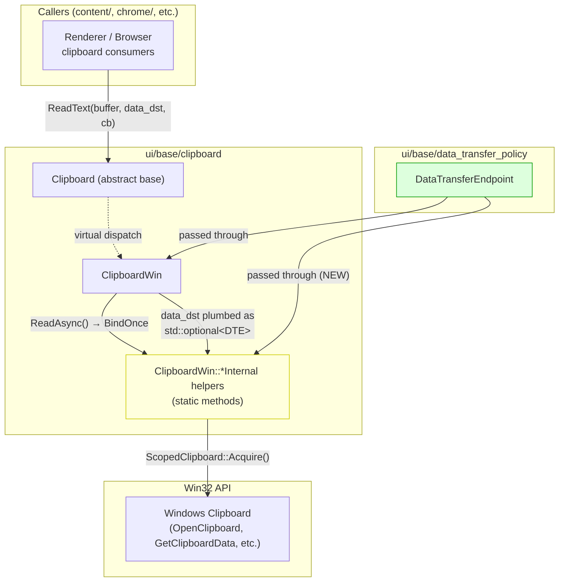
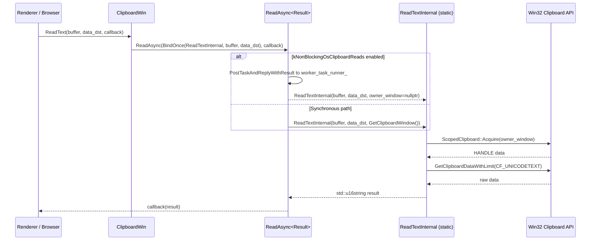
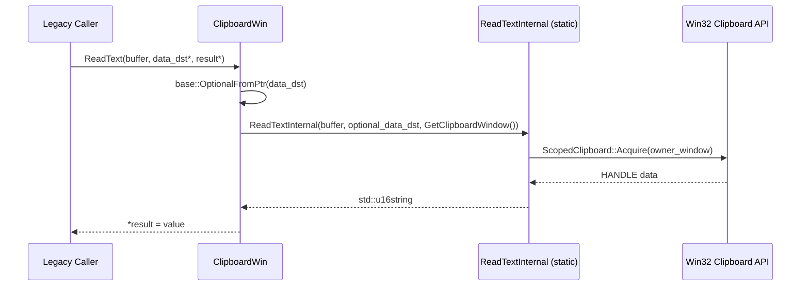
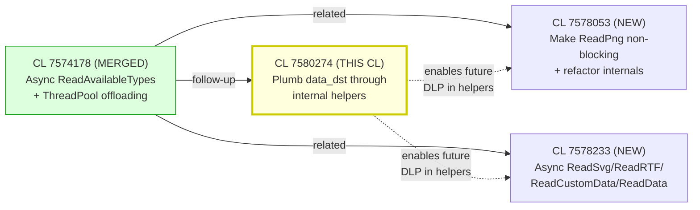

# High-Level Design: CL 7580274 — [Clipboard][Windows] Plumb `data_dst` through internal helpers

**CL URL:** https://chromium-review.googlesource.com/c/chromium/src/+/7580274
**Author:** Hewro Hewei (ihewro@chromium.org)
**Bug:** [crbug.com/458194647](https://crbug.com/458194647)
**Status:** NEW (pending review)

---

## 1. Executive Summary

This CL is a **pure refactoring** that threads the `data_dst` (`DataTransferEndpoint`) parameter through the private `*Internal` static helper methods of `ClipboardWin`. Previously, the async public APIs (e.g., `ReadText`, `ReadAsciiText`, `ReadHTML`, `ReadFilenames`) received a `data_dst` parameter but dropped it before calling internal helpers; the synchronous overloads converted it via `base::OptionalFromPtr` but the internal helpers did not accept it. After this CL, every `*Internal` helper uniformly receives `const std::optional<DataTransferEndpoint>& data_dst`, making the plumbing consistent and preparing the codebase for future policy enforcement that may inspect `data_dst` inside these helpers. **No behavior change is intended**—the parameter is accepted but unused in all helpers today.

This CL is a direct follow-up to the already-merged [CL 7574178](https://chromium-review.googlesource.com/c/chromium/src/+/7574178) ("Use async ReadAvailableTypes with ThreadPool offloading") which established the pattern for `ReadAvailableTypesInternal`. It is also part of a broader CL chain that includes:
- [CL 7578053](https://chromium-review.googlesource.com/c/chromium/src/+/7578053): "Make ReadPng non-blocking and refactor internals"
- [CL 7578233](https://chromium-review.googlesource.com/c/chromium/src/+/7578233): "Use async ReadSvg/ReadRTF/ReadDataTransferCustomData/ReadData with ThreadPool offloading"

---

## 2. Architecture Overview

### Affected Components

This CL exclusively touches the **Windows clipboard implementation** (`ui/base/clipboard/`), which is part of the `ui/base` component.

| Component | Role |
|-----------|------|
| `ClipboardWin` | Windows-specific `Clipboard` subclass; talks to Win32 clipboard API |
| `Clipboard` (base class) | Abstract cross-platform clipboard interface |
| `DataTransferEndpoint` | Represents the source/destination of a clipboard data transfer (used for DLP policy) |

### Component Diagram

### How It Fits

`Clipboard` is the abstract base class for all platforms. `ClipboardWin` implements it for Windows. The internal helpers are static methods that perform the actual Win32 clipboard reads. This CL ensures the `data_dst` parameter flows from the public API → internal helper consistently, matching the pattern already established by `ReadAvailableTypesInternal`, `GetStandardFormatsInternal`, and `IsFormatAvailableInternal`.

---

## 3. Design Goals & Non-Goals

### Goals
1. **Uniform `data_dst` plumbing**: All `*Internal` static helpers accept `const std::optional<DataTransferEndpoint>& data_dst`, matching the pattern set by CL 7574178.
2. **Future-readiness**: Enable future CLs to inspect `data_dst` inside helpers for Data Loss Prevention (DLP) policy checks without further signature changes.
3. **No behavior change**: The parameter is passed but not used—purely structural.

### Non-Goals
- **Actually using `data_dst`**: No policy enforcement is added in this CL.
- **Changing other platforms**: Only `clipboard_win.cc/.h` are modified; no changes to `clipboard_x11.cc`, `clipboard_mac.mm`, etc.
- **Modifying the `Clipboard` base class interface**: The virtual interface is unchanged.
- **Adding tests**: Since there is no behavior change, no new tests are needed.

---

## 4. System Interactions

### Data Flow

The `ReadAsync` template method is the key dispatch point. It binds the internal read function (with all its arguments pre-bound) into a `OnceCallback<Result(HWND)>` and then either:
- Runs it on a worker thread (if `kNonBlockingOsClipboardReads` is enabled), or
- Runs it synchronously on the current thread.

### Sequence Diagram — Async Read Path

### Sequence Diagram — Synchronous Read Path (Legacy Overload)

### IPC/Mojo

No IPC or Mojo interactions are modified. This CL operates entirely within the UI process clipboard implementation.

---

## 5. API & Interface Changes

### Modified Internal Interfaces (Private)

All changes are to **private static methods** of `ClipboardWin`. No public or protected APIs are modified.

| Method | Before | After |
|--------|--------|-------|
| `ReadTextInternal` | `(ClipboardBuffer, HWND)` | `(ClipboardBuffer, const std::optional<DTE>&, HWND)` |
| `ReadAsciiTextInternal` | `(ClipboardBuffer, HWND)` | `(ClipboardBuffer, const std::optional<DTE>&, HWND)` |
| `ReadHTMLInternal` | `(HWND, ClipboardBuffer, u16string*, string*, uint32_t*, uint32_t*)` | `(HWND, ClipboardBuffer, const std::optional<DTE>&, u16string*, string*, uint32_t*, uint32_t*)` |
| `ReadFilenamesInternal` | `(ClipboardBuffer, HWND)` | `(ClipboardBuffer, const std::optional<DTE>&, HWND)` |

*`DTE` = `DataTransferEndpoint`*

### Already Had `data_dst` (Unchanged by This CL)

| Method | Signature |
|--------|-----------|
| `ReadAvailableTypesInternal` | `(ClipboardBuffer, const std::optional<DTE>&, HWND)` |
| `GetStandardFormatsInternal` | `(ClipboardBuffer, const std::optional<DTE>&)` |
| `IsFormatAvailableInternal` | `(ClipboardFormatType, ClipboardBuffer, const std::optional<DTE>&)` |

### New Interfaces

None.

### Deprecated Interfaces

None.

---

## 6. Dependencies

### What This Code Depends On

| Dependency | Purpose |
|------------|---------|
| `base::OptionalFromPtr` (`base/types/optional_util.h`) | Converts `const DTE*` → `std::optional<DTE>` at the synchronous API boundary |
| `base::BindOnce` | Pre-binds `data_dst` into the callback passed to `ReadAsync` |
| `DataTransferEndpoint` (`ui/base/data_transfer_policy/`) | The type being plumbed |
| `Clipboard` base class | Defines the virtual interface that `ClipboardWin` implements |
| Win32 Clipboard API | The actual OS clipboard operations (unchanged) |

### What Depends on This Code

- **No external dependents are affected.** All modified methods are `private` or `static` within `ClipboardWin`. The public/virtual interface (`Clipboard`) is unchanged.
- **Sibling CLs** in the same chain ([CL 7578053](https://chromium-review.googlesource.com/c/chromium/src/+/7578053), [CL 7578233](https://chromium-review.googlesource.com/c/chromium/src/+/7578233)) may rebase on top of this CL or be affected by ordering.

### Version / Compatibility

No compatibility concerns. The changes are purely internal to `ClipboardWin` with no ABI/API surface changes.

---

## 7. Risks & Mitigations

### Risk Assessment

| Risk | Severity | Likelihood | Mitigation |
|------|----------|------------|------------|
| **`data_dst` is captured by value in `BindOnce` lambdas** — could be expensive if `DataTransferEndpoint` is large | Low | Low | `DataTransferEndpoint` is lightweight (contains an `EndpointType` enum, optional `GURL`, and a small options struct). Copy is acceptable. |
| **Parameter ordering mismatch** — `ReadHTMLInternal` takes `(HWND, buffer, data_dst, ...)` while others take `(buffer, data_dst, HWND)` | Low | Low | The inconsistency in `ReadHTMLInternal`'s parameter ordering (HWND first) predates this CL and is preserved. A TODO exists (crbug.com/458194647) to refactor this. |
| **Incorrect `BindOnce` argument order** could cause compile error or silent misuse | Low | Very Low | C++ strong typing ensures mismatched argument types would fail at compile time. Dry run passed on LUCI. |
| **Removed `result->clear()` calls** in synchronous `ReadText` and `ReadFilenames` | Low | Very Low | The removal of explicit `result->clear()` is safe because `*result` is immediately overwritten by assignment (`*result = ...Internal(...)`), making the clear redundant. |
| **Thread safety of `std::optional<DataTransferEndpoint>`** passed to worker thread | Low | Very Low | The optional is bound by value into the `OnceCallback`, so each thread has its own copy. No shared mutable state. |

### Backward Compatibility

- ✅ No public API changes
- ✅ No behavior changes
- ✅ No platform-specific regressions expected (Windows-only code)
- ✅ LUCI dry run passed

---

## 8. Testing Strategy

### Existing Test Coverage

- The CL states **"No behavior change intended"**, so no new tests are required.
- Existing clipboard tests (`clipboard_unittest.cc`, `clipboard_win_unittest.cc`) exercise the public `ReadText`, `ReadAsciiText`, `ReadHTML`, `ReadFilenames` interfaces and will continue to pass since the behavior is unchanged.
- The LUCI dry run (CQ+1) has passed, confirming no regressions.

### Recommended Verification

| Verification | Status |
|--------------|--------|
| LUCI dry run (all platforms) | ✅ Passed (Patch Set 2) |
| Unit tests (`clipboard_unittest`) | Covered by existing tests via public API |
| Manual testing | Not required (no behavior change) |
| Code review for correctness | Pending (reviewers: Rohan Raja, Dan Clark) |

### Future Testing

When `data_dst` is actually used inside the `*Internal` helpers (per bug 458194647), new unit tests should be added to verify DLP policy enforcement at the clipboard read level.

---

## Appendix: Relationship to Sibling CLs

All four CLs are part of a coordinated effort to:
1. Move clipboard reads to async/ThreadPool (CL 7574178, 7578053, 7578233)
2. Ensure `data_dst` is consistently available throughout the call stack (this CL)
3. Eventually use `data_dst` for DLP policy checks within the internal helpers (future work)

---

## Appendix: File-Level Change Summary

### `ui/base/clipboard/clipboard_win.h` (+20/−12)
- `/workspace/cr1/src/ui/base/clipboard/clipboard_win.h#L143-L150`: `ReadTextInternal` and `ReadAsciiTextInternal` signatures updated to include `data_dst` parameter.
- `/workspace/cr1/src/ui/base/clipboard/clipboard_win.h#L170-L181`: `ReadHTMLInternal` and `ReadFilenamesInternal` signatures updated to include `data_dst` parameter.

### `ui/base/clipboard/clipboard_win.cc` (+43/−27)
- `/workspace/cr1/src/ui/base/clipboard/clipboard_win.cc#L426`: `ReadText` async path now passes `data_dst` to `ReadTextInternal`.
- `/workspace/cr1/src/ui/base/clipboard/clipboard_win.cc#L437`: `ReadAsciiText` async path now passes `data_dst` to `ReadAsciiTextInternal`.
- `/workspace/cr1/src/ui/base/clipboard/clipboard_win.cc#L455-L466`: `ReadHTML` async lambda updated to capture and forward `data_dst`.
- `/workspace/cr1/src/ui/base/clipboard/clipboard_win.cc#L482-L484`: `ReadFilenames` async path now passes `data_dst` to `ReadFilenamesInternal`.
- `/workspace/cr1/src/ui/base/clipboard/clipboard_win.cc#L537-L546`: Synchronous `ReadText` → `ReadTextInternal` with `OptionalFromPtr`.
- `/workspace/cr1/src/ui/base/clipboard/clipboard_win.cc#L576-L584`: Synchronous `ReadAsciiText` → `ReadAsciiTextInternal` with `OptionalFromPtr`.
- `/workspace/cr1/src/ui/base/clipboard/clipboard_win.cc#L615-L640`: Synchronous `ReadHTML` → `ReadHTMLInternal` with `OptionalFromPtr`.
- `/workspace/cr1/src/ui/base/clipboard/clipboard_win.cc#L778-L787`: Synchronous `ReadFilenames` → `ReadFilenamesInternal` with `OptionalFromPtr`.
