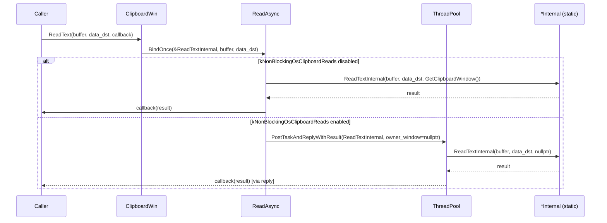
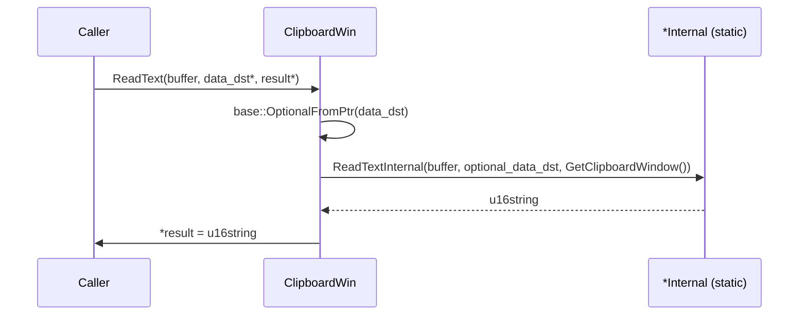
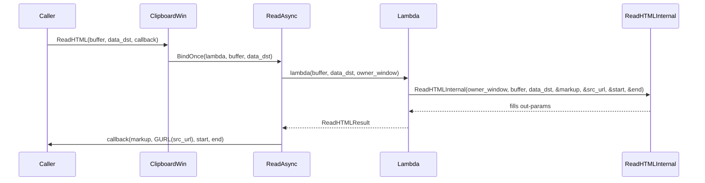
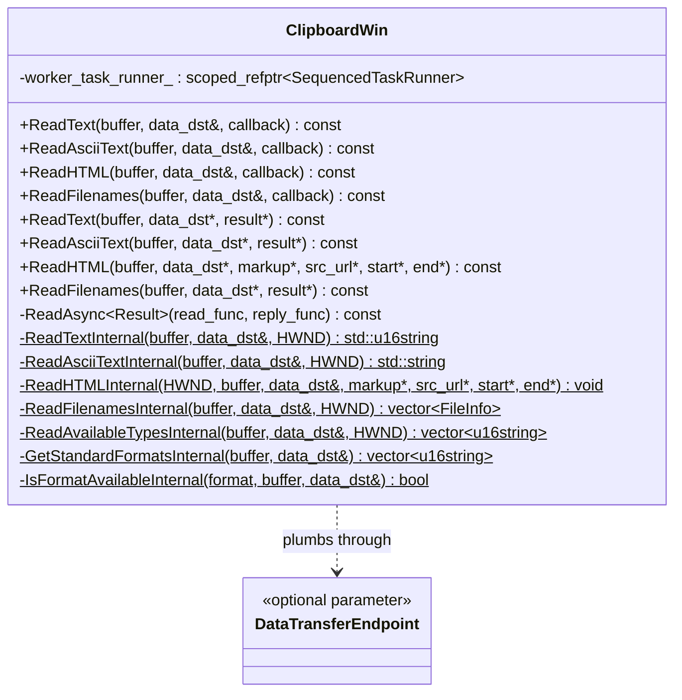

# Low-Level Design: CL 7580274 — [Clipboard][Windows] Plumb data_dst through internal helpers

## Overview

This CL is a mechanical, no-behavior-change refactoring that adds a `const std::optional<DataTransferEndpoint>& data_dst` parameter to four `static` `*Internal` helper methods in `ClipboardWin`. The parameter is threaded through from the public API but is **not used** inside any of the helpers—it is plumbed purely to enable future consumption (e.g., policy-based clipboard filtering by destination).

### CL Chain Context

| Order | CL | Title | Status |
|-------|----|-------|--------|
| 1 | [7574178](https://chromium-review.googlesource.com/c/chromium/src/+/7574178) | Use async ReadAvailableTypes with ThreadPool offloading | **MERGED** |
| 2 | **7580274** (this CL) | Plumb data_dst through internal helpers | NEW |
| 3 | [7578053](https://chromium-review.googlesource.com/c/chromium/src/+/7578053) | Make ReadPng non-blocking and refactor internals | NEW |
| 4 | [7578233](https://chromium-review.googlesource.com/c/chromium/src/+/7578233) | Use async ReadSvg/ReadRTF/ReadDataTransferCustomData/ReadData with ThreadPool offloading | NEW |

This CL follows the pattern established in CL 7574178 for `ReadAvailableTypesInternal` / `GetStandardFormatsInternal` / `IsFormatAvailableInternal`, which already accept `data_dst`. The downstream CLs (7578053, 7578233) build on this CL to further refactor read paths.

---

## 1. File-by-File Analysis

### 1.1 `ui/base/clipboard/clipboard_win.h`

**Purpose of changes**: Add `data_dst` parameter to the declarations of four static internal helper methods.

**Key modifications**:
- `ReadTextInternal` — added `const std::optional<DataTransferEndpoint>& data_dst` as second parameter (before `HWND owner_window`).
- `ReadAsciiTextInternal` — same addition.
- `ReadHTMLInternal` — added `data_dst` as third parameter (after `ClipboardBuffer buffer`, before out-params).
- `ReadFilenamesInternal` — added `data_dst` as second parameter (before `HWND owner_window`).

**New/Modified Functions**:

| Function | Change | New Signature |
|----------|--------|---------------|
| `ReadTextInternal` | Added `data_dst` param | `static std::u16string ReadTextInternal(ClipboardBuffer, const std::optional<DataTransferEndpoint>&, HWND)` |
| `ReadAsciiTextInternal` | Added `data_dst` param | `static std::string ReadAsciiTextInternal(ClipboardBuffer, const std::optional<DataTransferEndpoint>&, HWND)` |
| `ReadHTMLInternal` | Added `data_dst` param | `static void ReadHTMLInternal(HWND, ClipboardBuffer, const std::optional<DataTransferEndpoint>&, std::u16string*, std::string*, uint32_t*, uint32_t*)` |
| `ReadFilenamesInternal` | Added `data_dst` param | `static std::vector<ui::FileInfo> ReadFilenamesInternal(ClipboardBuffer, const std::optional<DataTransferEndpoint>&, HWND)` |

No other declarations or struct definitions were changed. The `ReadHTMLResult` struct and `ReadAsync` template are unchanged.

---

### 1.2 `ui/base/clipboard/clipboard_win.cc`

**Purpose of changes**: Update all call sites and definitions of the four internal helpers to pass `data_dst` through. Minor cleanup of redundant `result->clear()` calls.

**Key modifications**:

#### A. Async call sites (public async overloads → ReadAsync → *Internal)

| Public Method | Change |
|---------------|--------|
| `ReadText(buffer, data_dst, callback)` | `BindOnce(&ReadTextInternal, buffer)` → `BindOnce(&ReadTextInternal, buffer, data_dst)` |
| `ReadAsciiText(buffer, data_dst, callback)` | `BindOnce(&ReadAsciiTextInternal, buffer)` → `BindOnce(&ReadAsciiTextInternal, buffer, data_dst)` |
| `ReadHTML(buffer, data_dst, callback)` | Lambda now captures `data_dst` and passes it to `ReadHTMLInternal` |
| `ReadFilenames(buffer, data_dst, callback)` | `BindOnce(ReadFilenamesInternal, buffer)` → `BindOnce(ReadFilenamesInternal, buffer, data_dst)` |

#### B. Sync call sites (public sync overloads → *Internal)

| Public Method | Change |
|---------------|--------|
| `ReadText(buffer, data_dst*, result*)` | Now calls `ReadTextInternal(buffer, base::OptionalFromPtr(data_dst), GetClipboardWindow())` |
| `ReadAsciiText(buffer, data_dst*, result*)` | Now calls `ReadAsciiTextInternal(buffer, base::OptionalFromPtr(data_dst), GetClipboardWindow())` |
| `ReadHTML(buffer, data_dst*, ...)` | Now calls `ReadHTMLInternal(GetClipboardWindow(), buffer, base::OptionalFromPtr(data_dst), ...)` |
| `ReadFilenames(buffer, data_dst*, result*)` | Now calls `ReadFilenamesInternal(buffer, base::OptionalFromPtr(data_dst), GetClipboardWindow())` |

#### C. Cleanup: removed redundant `result->clear()` calls

In the sync overloads of `ReadText` and `ReadFilenames`, the previous code called `result->clear()` before assigning `*result = ...Internal(...)`. Since assignment replaces the value entirely, the `clear()` was redundant and has been removed.

#### D. Internal method definitions

All four `*Internal` static methods now accept `data_dst` but do **not use it**. Each has a comment: `// |data_dst| is not used, but is kept as it may be used in the future.`

**New/Modified Functions (definitions)**:

| Function | Parameters Added | Body Changed? | Notes |
|----------|-----------------|---------------|-------|
| `ReadTextInternal` | `const std::optional<DataTransferEndpoint>& data_dst` | No | Same clipboard read logic |
| `ReadAsciiTextInternal` | `const std::optional<DataTransferEndpoint>& data_dst` | No | Same clipboard read logic |
| `ReadHTMLInternal` | `const std::optional<DataTransferEndpoint>& data_dst` | No | Same HTML parsing logic |
| `ReadFilenamesInternal` | `const std::optional<DataTransferEndpoint>& data_dst` | No | Same CF_HDROP / filename logic |

---

## 2. Data Flow

### 2.1 Async Path



### 2.2 Sync Path



### 2.3 ReadHTML Async Path (lambda wrapper)



---

## 3. Class Diagram



Note: The six `*Internal` methods that already had `data_dst` before this CL are: `ReadAvailableTypesInternal`, `GetStandardFormatsInternal`, `IsFormatAvailableInternal` (from CL 7574178). This CL adds `data_dst` to the remaining four: `ReadTextInternal`, `ReadAsciiTextInternal`, `ReadHTMLInternal`, `ReadFilenamesInternal`.

---

## 4. State Diagram

This CL does not introduce any state changes. The clipboard read operations are stateless request-response flows. The only relevant state is the feature flag `kNonBlockingOsClipboardReads` which determines whether reads go through the ThreadPool (async) or execute synchronously.

```mermaid
stateDiagram-v2
    [*] --> CheckFeatureFlag
    CheckFeatureFlag --> SyncPath : kNonBlockingOsClipboardReads disabled
    CheckFeatureFlag --> AsyncPath : kNonBlockingOsClipboardReads enabled

    SyncPath --> AcquireClipboard : ReadXxxInternal(buffer, data_dst, GetClipboardWindow())
    AsyncPath --> PostToThreadPool : PostTaskAndReplyWithResult
    PostToThreadPool --> AcquireClipboard : ReadXxxInternal(buffer, data_dst, nullptr)

    AcquireClipboard --> ReadData : ScopedClipboard::Acquire()
    ReadData --> ReturnResult
    ReturnResult --> [*]
```

---

## 5. Implementation Concerns

### 5.1 Memory / Copying

- **`std::optional<DataTransferEndpoint>` by const-ref**: The `data_dst` parameter is passed by `const std::optional<DataTransferEndpoint>&`, which avoids copies in the sync path. However, in the **async path**, `base::BindOnce` will **copy** the `std::optional<DataTransferEndpoint>` into the bound callback closure. This is necessary because the async callback may outlive the caller's stack frame, but it does mean each async read incurs one copy of the `DataTransferEndpoint` object. This is acceptable since `DataTransferEndpoint` is a small object.

- **Removed `result->clear()` calls**: The removal of `result->clear()` before `*result = ...` in `ReadText` and `ReadFilenames` sync overloads is correct—assignment replaces the entire value. This is consistent with `ReadAsciiText` which already did `*result = ReadAsciiTextInternal(...)` without a preceding `clear()`.

### 5.2 Thread Safety

- No new thread-safety concerns. The `*Internal` methods are `static` and do not access instance state. The `data_dst` parameter is passed by const-ref and is not mutated. In the async path, `BindOnce` captures a copy, so there is no shared-state issue.

### 5.3 Performance

- No performance impact. The `data_dst` parameter is not used inside any of the `*Internal` methods, so there is zero additional work at runtime beyond the (trivial) cost of passing an extra reference/copy.

### 5.4 Consistency

- After this CL, **all** `*Internal` static helper methods in `ClipboardWin` consistently accept `data_dst`. The only remaining methods that do NOT have `data_dst` are `ReadPngInternal` and `ReadBitmapInternal`, which are non-static instance methods (they use `GetClipboardWindow()` directly). This is addressed by the downstream CLs (7578053, 7578233).

---

## 6. Suggestions for Improvement

### 6.1 Minor: Parameter ordering consistency

`ReadHTMLInternal` places `HWND owner_window` as the **first** parameter, while `ReadTextInternal`, `ReadAsciiTextInternal`, and `ReadFilenamesInternal` place it as the **last** parameter. This inconsistency predates this CL, but could be noted for a follow-up cleanup. There is an existing TODO (`crbug.com/458194647`) to refactor `ReadHTMLInternal` to return `ReadHTMLResult` instead of using out-params, which would be a natural time to also fix parameter ordering.

### 6.2 Minor: Comment style

The comments `// |data_dst| is not used, but is kept as it may be used in the future.` are placed as `// static` followed by `// |data_dst| is not used...` on separate lines. This is consistent with the existing style in the file (e.g., `GetStandardFormatsInternal`, `IsFormatAvailableInternal`), so no change needed.

### 6.3 Observation: ReadHTML lambda captures data_dst by value

In the `ReadHTML` async overload, a lambda captures `data_dst` (via `base::BindOnce(lambda, buffer, data_dst)`). Since `data_dst` is `const std::optional<DataTransferEndpoint>&`, `BindOnce` will copy it. This is correct behavior for the async path (the lambda may execute after the caller returns). The lambda already captures `buffer` by value; adding `data_dst` is consistent.

### 6.4 Cross-CL observation: ReadSvg, ReadRTF, ReadData, ReadDataTransferCustomData

These methods (addressed in CL 7578233) still use the sync-only `data_dst*` raw pointer path and do not yet have `*Internal` helpers. This CL correctly scopes itself to only the methods that already have `*Internal` static helpers. The downstream CL 7578233 will create new `*Internal` methods for the remaining read operations, completing the full plumbing.

### 6.5 Cross-CL observation: ReadPng

`ReadPng` and `ReadPngInternal`/`ReadBitmapInternal` do not receive `data_dst` in this CL. CL 7578053 addresses this by making ReadPng non-blocking. The current CL is correctly scoped.

---

## 7. Summary

| Aspect | Assessment |
|--------|------------|
| **Correctness** | ✅ All call sites correctly updated. No behavior change. |
| **Completeness** | ✅ All four target `*Internal` methods plumbed. Remaining methods deferred to downstream CLs. |
| **Thread safety** | ✅ No new concerns. Static methods, const-ref params, BindOnce copies. |
| **Memory** | ✅ Minor copy of `std::optional<DataTransferEndpoint>` in async path; acceptable. |
| **Style** | ✅ Consistent with existing patterns from CL 7574178. |
| **Risk** | ✅ Very low. Mechanical change, no logic modifications, dry run passed. |
