# High-Level Design: CL 7595193

## [Editing] Fix incorrect text selection behavior with `:after` pseudo-element and ` ` element

| Field | Value |
|---|---|
| **CL** | [7595193](https://chromium-review.googlesource.com/c/chromium/src/+/7595193) |
| **Bug** | [crbug.com/357889508](https://crbug.com/357889508) |
| **Author** | Tanu Jain (tanujain@microsoft.com) |
| **Status** | NEW (pending review) |
| **Files Changed** | 4 (+129/−2) |

---

## 1. Executive Summary

This CL fixes a bug where extending a text selection by line (Shift+Down/Up) would behave incorrectly when a line contains only CSS pseudo-element content (e.g., `::after` with `display:inline-block`) following a ` ` element. The root cause is that `CanBeCaretContainer()` in `AbstractLineBox` used `GetNode()` to check if a line contained valid caret targets, but `GetNode()` returns a node even for pseudo-elements—despite pseudo-elements having no DOM node suitable for caret positioning. When `PositionForPoint()` subsequently failed to resolve a caret position, the selection would extend in the wrong direction (backwards instead of forwards). The fix changes the check to use `NonPseudoNode()`, which returns `nullptr` for pseudo-elements, causing the algorithm to correctly skip pseudo-only lines. The change is gated behind a new `SkipPseudoOnlyLinesInLineNavigation` runtime feature flag set to `"stable"`, providing a rollback mechanism.

---

## 2. Architecture Overview

### Affected Components

This CL is confined to the **Blink editing subsystem**, specifically the line-based selection navigation logic within the inline layout cursor infrastructure.

| Component | Path | Role |
|---|---|---|
| **SelectionModifier (line navigation)** | `third_party/blink/renderer/core/editing/selection_modifier_line.cc` | Computes next/previous line positions for caret movement and selection extension |
| **AbstractLineBox** | (internal to `selection_modifier_line.cc`) | Wraps `InlineCursor` line boxes to provide caret-container validation, line traversal, and point-to-position mapping |
| **LayoutObject** | `third_party/blink/renderer/core/layout/layout_object.h` | Provides `NonPseudoNode()` and `GetNode()` methods for DOM-node resolution |
| **InlineCursor** | `third_party/blink/renderer/core/layout/inline/inline_cursor.cc` | Traverses inline layout fragments; already uses `NonPseudoNode()` in `MoveToFirstNonPseudoLeaf()` and `MoveToLastNonPseudoLeaf()` |
| **RuntimeEnabledFeatures** | `third_party/blink/renderer/platform/runtime_enabled_features.json5` | Feature flag registry for the new `SkipPseudoOnlyLinesInLineNavigation` flag |

### Component Diagram

**Legend:**
- 🟨 **Yellow** (`CanBeCaretContainer`): The modified function — core of this CL
- 🟩 **Green** (`NonPseudoNode`): The correct API now used (returns `nullptr` for pseudo-elements)
- 🟥 **Red** (`GetNode`): The previously (implicitly) used API that returned nodes for pseudo-elements
- 🟦 **Blue** (`RuntimeEnabledFeatures`): New feature flag gating the behavior change

---

## 3. Design Goals & Non-Goals

### Goals

| # | Goal |
|---|---|
| G1 | Fix Shift+Down/Up selection extending in the wrong direction when encountering pseudo-element-only lines |
| G2 | Make `CanBeCaretContainer()` consistent with `MoveToFirstNonPseudoLeaf()` and `MoveToLastNonPseudoLeaf()` which already use `NonPseudoNode()` |
| G3 | Gate the fix behind a runtime feature flag (`SkipPseudoOnlyLinesInLineNavigation`) for safe rollback |
| G4 | Add unit tests (C++ and web test) to prevent regression |

### Non-Goals

| # | Non-Goal |
|---|---|
| NG1 | Changing how pseudo-elements render or participate in layout |
| NG2 | Fixing caret movement (`SelectionModifyAlteration::kMove`) — only selection extension (`kExtend`) is addressed by the test, though the fix also benefits `kMove` |
| NG3 | Addressing selection issues with `::before` pseudo-elements (though the fix also covers them, no test is provided) |
| NG4 | Refactoring `AbstractLineBox` or removing the `TODO(1229581)` to eliminate it |
| NG5 | Changing the `PositionForPoint()` fallback behavior when no caret position is found |

---

## 4. System Interactions

### Main Flow: Extend Selection Forward by Line

### Bug Flow (Before Fix)

```mermaid
sequenceDiagram
    participant User as User (Shift+Down)
    participant NLP as NextLinePosition()
    participant CBC as CanBeCaretContainer()
    participant LO as LayoutObject
    participant PFP as PositionForPoint()

    User->>NLP: extend forward by line
    NLP->>CBC: CanBeCaretContainer() on pseudo-only line

    Note over CBC: OLD CODE: GetNode() returns<br/>the pseudo-element's node
    CBC->>LO: GetNode()
    LO-->>CBC: non-null (pseudo element node)
    CBC-->>NLP: true ❌ (wrong — line has no valid caret target)

    NLP->>PFP: PositionForPoint() on pseudo-only line
    PFP-->>NLP: null position (no DOM node for caret)

    Note over NLP: Fallback produces incorrect/<br/>backwards selection
    NLP-->>User: Selection extends BACKWARD ❌
```

### IPC/Mojo Interactions

**None.** This change is entirely within Blink's renderer process. There is no IPC, Mojo, or cross-process communication involved. The selection modification operates on in-process DOM and layout data structures.

---

## 5. API & Interface Changes

### New Public Interfaces

**None.** No new public C++ APIs or web-exposed APIs are introduced.

### Modified Interfaces

| Interface | Change | Location |
|---|---|---|
| `AbstractLineBox::CanBeCaretContainer()` | Internal behavior change: now uses `NonPseudoNode()` instead of implicitly relying on `GetNode()` when the feature flag is enabled | `/workspace/cr1/src/third_party/blink/renderer/core/editing/selection_modifier_line.cc#L59` |

This is a **file-local** class (within an anonymous namespace), so no external API surface changes.

### New Runtime Feature Flag

| Flag | Status | Purpose |
|---|---|---|
| `SkipPseudoOnlyLinesInLineNavigation` | `"stable"` (enabled by default) | Guards the pseudo-element skipping behavior in `CanBeCaretContainer()` |

Defined at: `/workspace/cr1/src/third_party/blink/renderer/platform/runtime_enabled_features.json5#L4964`

### Deprecated Interfaces

**None.**

---

## 6. Dependencies

### What This Code Depends On

| Dependency | Relationship |
|---|---|
| `LayoutObject::NonPseudoNode()` | Core API used to distinguish real DOM nodes from pseudo-element layout objects (`layout_object.h#L1688`) |
| `LayoutObject::IsPseudoElement()` | Called internally by `NonPseudoNode()` |
| `InlineCursor` / `InlineCursorPosition` | Used to iterate through inline layout items within a line box |
| `RuntimeEnabledFeatures` | Used to gate the new behavior behind `SkipPseudoOnlyLinesInLineNavigation` |
| `SelectionModifier` | The parent class that calls into `NextLinePosition()` / `PreviousLinePosition()` |

### What Depends On This Code

| Dependent | Impact |
|---|---|
| `SelectionModifier::Modify()` | Calls `NextLinePosition()` and `PreviousLinePosition()`, which use `CanBeCaretContainer()`. Behavior now correctly skips pseudo-only lines. |
| All keyboard selection extension by line (Shift+Up/Down) | End-user visible behavior change: selection no longer extends in wrong direction for pages with `::after`/`::before` pseudo-elements on ` ` lines |
| Web platform tests | New test added; existing tests should pass (dry run passed on PS3) |

### Version/Compatibility Considerations

- The runtime feature flag (`status: "stable"`) means this is **enabled by default** for all users.
- If regressions are discovered, the flag can be **disabled via `chrome://flags`** or Finch experiments without a code change.
- No web-platform compatibility concern: this fixes behavior to match the expected spec behavior (pseudo-elements should not create caret positions).

---

## 7. Risks & Mitigations

| Risk | Severity | Likelihood | Mitigation |
|---|---|---|---|
| **Other code paths rely on `CanBeCaretContainer()` returning `true` for pseudo-only lines** | Medium | Low | `CanBeCaretContainer()` is only called from `PreviousLinePosition()` and `NextLinePosition()` within the same file. The scope of impact is small and well-understood. |
| **Edge cases with `::before` pseudo-elements** | Low | Low | The fix handles both `::before` and `::after` uniformly via `NonPseudoNode()`, though only `::after` is explicitly tested. |
| **Regression in selection behavior for other pseudo-element combinations** | Medium | Low | The fix is gated behind `SkipPseudoOnlyLinesInLineNavigation` feature flag (status: `"stable"`). If regressions surface, the flag can be disabled without a code rollback. |
| **Lines with a mix of pseudo-element and real content** | Low | Very Low | The loop in `CanBeCaretContainer()` iterates all leaves. If **any** leaf has a `NonPseudoNode()`, the function returns `true`. Only purely pseudo-element lines are skipped. |
| **Performance impact of additional `NonPseudoNode()` call** | Negligible | N/A | `NonPseudoNode()` is an inlined method (`IsPseudoElement() ? nullptr : GetNode()`) — essentially free. |
| **Feature flag overhead** | Negligible | N/A | `RuntimeEnabledFeatures` checks are compile-time optimized for `"stable"` flags in release builds. |

### Backward Compatibility

- **Web compatibility:** This CL fixes incorrect behavior; the corrected behavior aligns with user expectations (Shift+Down should always extend forward). No legitimate web content would depend on the broken behavior.
- **Chromium backward compatibility:** The feature flag provides a safe rollback path.

---

## 8. Testing Strategy

### Test Coverage Added

| Test Type | File | Description |
|---|---|---|
| **C++ Unit Test** | `/workspace/cr1/src/third_party/blink/renderer/core/editing/selection_modifier_test.cc` | `ExtendByLineWithInlineBlockPseudoAfterBr` — verifies that `SelectionModifier::Modify(kExtend, kForward, kLine)` produces a forward-extending range selection (not backward) when a `::after` pseudo-element with `display:inline-block` follows a ` ` |
| **Web Test (Layout Test)** | `/workspace/cr1/src/third_party/blink/web_tests/editing/selection/modify_extend/extend_by_line_with_pseudo_after_br.html` | Three `testharness.js` tests: (1) extend forward skips pseudo-only line, (2) extend backward skips pseudo-only line, (3) extend forward never causes backward selection (the original bug) |

### Test Execution History

| Patch Set | Result |
|---|---|
| PS1 | ❌ Failed — `extend_by_line_with_pseudo_after_br.html` on mac-rel |
| PS2 | Updated test |
| PS3 | ✅ Passed dry run |
| PS4–PS5 | Added feature flag, resolved conflicts |

### Test Coverage Analysis

**Recommendation:** The tested scenarios directly cover the reported bug. The untested scenarios (yellow) are low risk because:
- The `NonPseudoNode()` check is generic — it doesn't distinguish `::before` from `::after` or by display type.
- Mixed lines (pseudo + real content) will correctly return `true` from `CanBeCaretContainer()` because the loop finds the real-content leaf.
- `kMove` uses the same `NextLinePosition()`/`PreviousLinePosition()` code path, so it implicitly benefits.

---

## Appendix: Key Code References

| Reference | Path |
|---|---|
| Modified function | `/workspace/cr1/src/third_party/blink/renderer/core/editing/selection_modifier_line.cc#L59` (`CanBeCaretContainer()`) |
| `NonPseudoNode()` definition | `/workspace/cr1/src/third_party/blink/renderer/core/layout/layout_object.h#L1688` |
| `MoveToFirstNonPseudoLeaf()` (pattern source) | `/workspace/cr1/src/third_party/blink/renderer/core/layout/inline/inline_cursor.cc#L1018` |
| `MoveToLastNonPseudoLeaf()` (pattern source) | `/workspace/cr1/src/third_party/blink/renderer/core/layout/inline/inline_cursor.cc#L1087` |
| Feature flag definition | `/workspace/cr1/src/third_party/blink/renderer/platform/runtime_enabled_features.json5#L4964` |
| C++ unit test | `/workspace/cr1/src/third_party/blink/renderer/core/editing/selection_modifier_test.cc` (`ExtendByLineWithInlineBlockPseudoAfterBr`) |
| Web test | `/workspace/cr1/src/third_party/blink/web_tests/editing/selection/modify_extend/extend_by_line_with_pseudo_after_br.html` |
