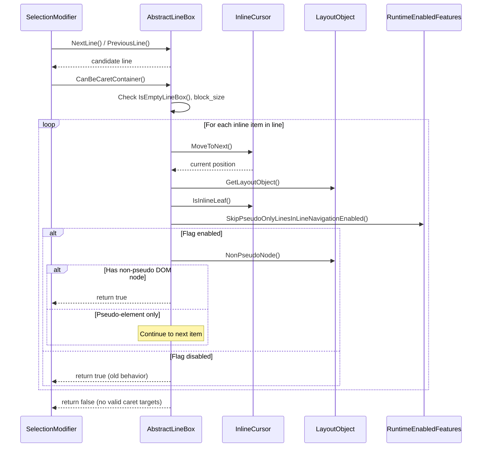
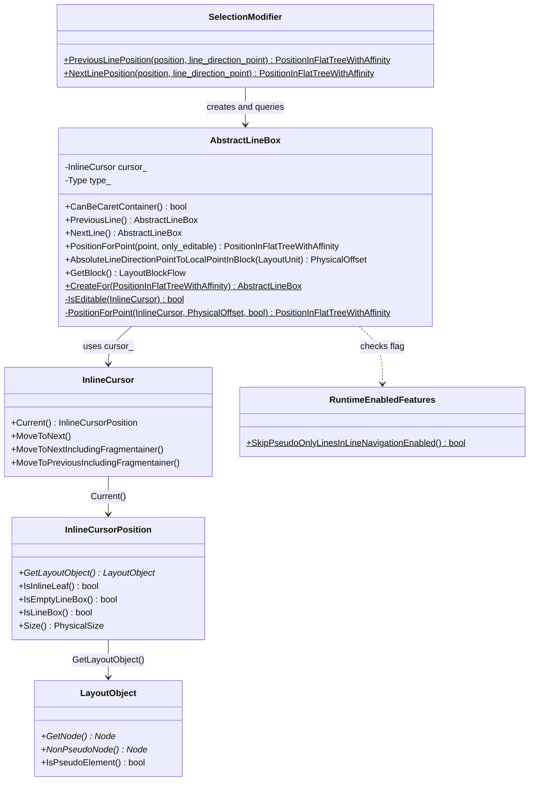
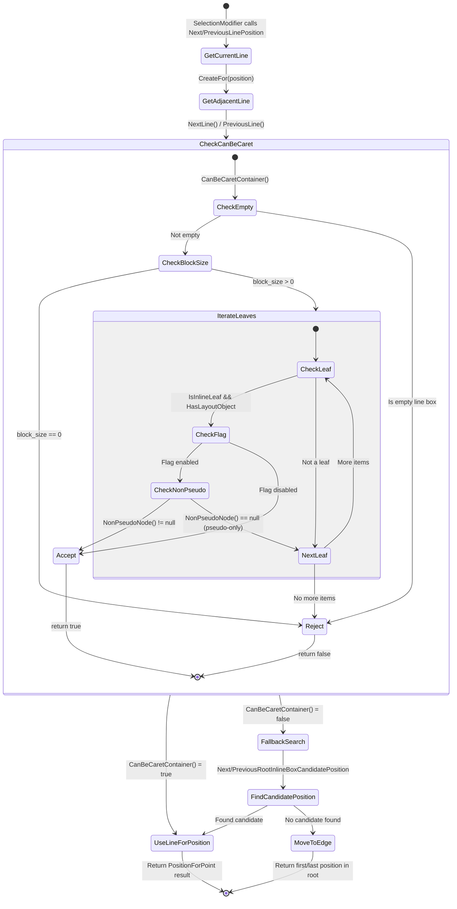

# Low-Level Design: CL 7595193

## [Editing] Fix incorrect text selection behavior with :after pseudo-element and \<br\> element

**Bug**: [crbug.com/357889508](https://crbug.com/357889508)  
**Owner**: Tanu Jain \<tanujain@microsoft.com\>  
**Status**: NEW (Patch Set 5)

---

## 1. File-by-File Analysis

### 1.1 `third_party/blink/renderer/core/editing/selection_modifier_line.cc` (+14/-2)

**Purpose of changes**: Fix `CanBeCaretContainer()` in the `AbstractLineBox` class to skip lines that contain only pseudo-element content (e.g., `::after` with `display:inline-block`), which have no DOM nodes for caret positioning.

**Key modifications**:
- Added `#include "third_party/blink/renderer/platform/runtime_enabled_features.h"` to access the new feature flag.
- Modified the inline leaf detection loop in `CanBeCaretContainer()` to check `NonPseudoNode()` instead of implicitly accepting any layout object with `GetNode()`.
- Gated the new behavior behind a runtime-enabled feature flag `SkipPseudoOnlyLinesInLineNavigation`.

**Original code** (lines 71-72):
```cpp
if (current.GetLayoutObject() && current.IsInlineLeaf())
    return true;
```

**New code** (lines 71-83):
```cpp
if (current.GetLayoutObject() && current.IsInlineLeaf()) {
    if (RuntimeEnabledFeatures::SkipPseudoOnlyLinesInLineNavigationEnabled()) {
        if (current.GetLayoutObject()->NonPseudoNode()) {
            return true;
        }
    } else {
        return true;
    }
}
```

**New/Modified Functions**:

| Function | Purpose | Parameters | Returns |
|----------|---------|------------|---------|
| `AbstractLineBox::CanBeCaretContainer()` | Determines if a line box can hold a caret for line navigation. Now skips lines whose only inline leaves are pseudo-elements. | `void` (const method, uses `cursor_` member) | `bool` — `true` if the line has at least one non-pseudo inline leaf with non-zero block size |

**Logic Flow**:

The `CanBeCaretContainer()` method is called from two call sites:
1. **`PreviousLinePosition()`** (line 411) — when navigating up (Shift+Up)
2. **`NextLinePosition()`** (line 480) — when navigating down (Shift+Down)

Both follow the same pattern:
```cpp
line = line.NextLine(); // or PreviousLine()
if (!line || !line.CanBeCaretContainer())
    line = AbstractLineBox(); // reset to null, triggering fallback search
```

When `CanBeCaretContainer()` returns `false`, the line is discarded and a fallback candidate position search is performed via `NextRootInlineBoxCandidatePosition()` / `PreviousRootInlineBoxCandidatePosition()`.

**Data Flow**:



**Key API detail — `NonPseudoNode()` vs `GetNode()`**:

From `layout_object.h:1688`:
```cpp
Node* NonPseudoNode() const {
    return IsPseudoElement() ? nullptr : GetNode();
}
```

- `GetNode()` returns the associated DOM node for *any* layout object, including pseudo-elements (which are associated with their originating element).
- `NonPseudoNode()` returns `nullptr` for pseudo-elements, ensuring only real DOM nodes are considered as valid caret targets.

This is consistent with existing patterns in `InlineCursor::MoveToLastNonPseudoLeaf()` and `MoveToFirstNonPseudoLeaf()` (in `inline_cursor.cc`, lines ~1023-1107) which already use `NonPseudoNode()` to skip pseudo-element content.

---

### 1.2 `third_party/blink/renderer/core/editing/selection_modifier_test.cc` (+32/-0)

**Purpose of changes**: Add a C++ unit test validating that extending selection forward by line correctly skips a pseudo-element-only line.

**Key modifications**:
- Added `TEST_F(SelectionModifierTest, ExtendByLineWithInlineBlockPseudoAfterBr)` test case.

**New/Modified Functions**:

| Function | Purpose | Parameters | Returns |
|----------|---------|------------|---------|
| `ExtendByLineWithInlineBlockPseudoAfterBr` (TEST_F) | Validates forward line extension skips pseudo-only lines | N/A (test fixture) | N/A |

**Test setup**:
1. Loads Ahem font (monospace test font for pixel-precise layout).
2. Inserts CSS: `body { font: 10px/20px Ahem; }` and `.after::after { content: ''; display: inline-block; }`.
3. Creates DOM: `<div class='after'>first|<br></div><div>second</div>` with caret after "first".

**Test structure**:
```
DOM Layout:
Line 1: "first" + <br>          (div1, text content)
Line 2: ::after inline-block     (div1, pseudo-element only — NO DOM caret target)
Line 3: "second"                  (div2, text content)
```

**Assertions**:
1. `EXPECT_FALSE(result.IsNone())` — Selection exists.
2. `EXPECT_TRUE(result.IsRange())` — Selection is a range (not collapsed).
3. `EXPECT_TRUE(result.Anchor() < result.Focus() || result.Anchor() == result.Focus())` — Selection extends forward, not backward (the original bug caused backward extension).

---

### 1.3 `third_party/blink/renderer/platform/runtime_enabled_features.json5` (+9/-0)

**Purpose of changes**: Register a new runtime-enabled feature flag to gate the behavioral change.

**Key modifications**:
- Added `SkipPseudoOnlyLinesInLineNavigation` feature definition with `status: "stable"`.

**Feature definition**:
```json5
{
    name: "SkipPseudoOnlyLinesInLineNavigation",
    status: "stable",
}
```

**Implications**:
- `status: "stable"` means the feature is enabled by default in all channels (Stable, Beta, Dev, Canary).
- Generates `RuntimeEnabledFeatures::SkipPseudoOnlyLinesInLineNavigationEnabled()` static method.
- Can be toggled via `--enable-features` / `--disable-features` command-line flags or `--enable-blink-features` / `--disable-blink-features`.
- The flag allows easy rollback if regressions are discovered.

---

### 1.4 `third_party/blink/web_tests/editing/selection/modify_extend/extend_by_line_with_pseudo_after_br.html` (+74/-0, NEW)

**Purpose of changes**: Add a web platform test (using testharness.js) that exercises the bug scenario end-to-end in the rendering engine.

**Key modifications**:
- Three test cases covering different selection extension directions.

**Test DOM structure**:
```html
<div id="div1" class="after">1 First text with pseudo and br<br></div>
<div id="div2">2 Second text</div>
```
with CSS: `.after::after { content: ""; display: inline-block; }`

**Test cases**:

| Test | Action | Starting Position | Expected Result |
|------|--------|-------------------|-----------------|
| 1. "Extend forward skips pseudo-only line after BR" | `selection.modify('extend', 'forward', 'line')` | `div1.firstChild` offset 5 | Focus lands in `div2` |
| 2. "Extend backward skips pseudo-only line" | `selection.modify('extend', 'backward', 'line')` | `div2.firstChild` offset 5 | Focus lands in `div1` |
| 3. "Extend forward never causes backward selection (original bug)" | `selection.modify('extend', 'forward', 'line')` | `div1.firstChild` offset 0 | Selection goes forward, not backward |

**Test 3 specifically reproduces the original bug**: Without the fix, `PositionForPoint()` would fail on the pseudo-only line and the selection would erroneously extend backward.

---

## 2. Class Diagram



---

## 3. State Diagram



---

## 4. Implementation Concerns

### 4.1 Correctness

- **The core fix is sound**: `NonPseudoNode()` returns `nullptr` for pseudo-elements and the real DOM node otherwise, which is exactly the right predicate for determining caret-positionable content.
- **Consistency with existing patterns**: `InlineCursor::MoveToLastNonPseudoLeaf()` and `MoveToFirstNonPseudoLeaf()` already use the same `NonPseudoNode()` check, so this change aligns `CanBeCaretContainer()` with established conventions.

### 4.2 Feature Flag Usage

- **The flag structure adds unnecessary code complexity**: The `if/else` branching around `RuntimeEnabledFeatures::SkipPseudoOnlyLinesInLineNavigationEnabled()` creates nested conditionals that reduce readability. Since the flag status is `"stable"`, it is always on by default.
- **Performance**: The runtime feature check is a static boolean lookup (essentially free), so there is no measurable performance impact.
- **Future cleanup**: The flag and its `else` branch should be removed after the change has baked in stable for a milestone or two, per Chromium convention.

### 4.3 Memory Management

- No new allocations. All operations use existing stack-allocated `InlineCursor` and pointer dereferences to existing layout tree objects. No ownership changes.

### 4.4 Thread Safety

- All code runs on the main thread (Blink rendering). `RuntimeEnabledFeatures` flags are initialized at startup and are effectively read-only during rendering. No thread safety concerns.

### 4.5 Performance Implications

- **Negligible impact**: The change adds one additional pointer check (`NonPseudoNode()`) per inline leaf per line during line navigation. This is a trivial cost compared to the layout and painting work involved in selection.
- **Worst case**: Lines with many pseudo-element leaves will now iterate through all of them before returning `false`. However, such scenarios are rare in practice (typically 1-2 pseudo-elements per line).

### 4.6 Edge Cases

| Edge Case | Handling |
|-----------|----------|
| Line with mix of pseudo and real nodes | Correctly handled — loop continues past pseudo nodes and finds the real node |
| Line with only `::before` pseudo | Returns `false` (skipped), same as `::after` |
| Line with no inline leaves at all | Returns `false` at end of loop (unchanged behavior) |
| Empty line box / zero block-size | Returns `false` before reaching the loop (unchanged behavior) |
| Editable content inside pseudo-elements | Pseudo-elements are not editable by users; `NonPseudoNode()` correctly skips them |
| Feature flag disabled | Falls back to original behavior (`return true` for any inline leaf) |
| Multiple consecutive pseudo-only lines | Each is individually skipped; fallback search (`NextRootInlineBoxCandidatePosition`) will find the next real content |

---

## 5. Suggestions for Improvement

### 5.1 Simplify the Feature Flag Conditional

The current nesting is unnecessarily deep. The logic can be flattened:

```cpp
// Current (nested):
if (current.GetLayoutObject() && current.IsInlineLeaf()) {
    if (RuntimeEnabledFeatures::SkipPseudoOnlyLinesInLineNavigationEnabled()) {
        if (current.GetLayoutObject()->NonPseudoNode()) {
            return true;
        }
    } else {
        return true;
    }
}

// Suggested (flattened):
if (current.GetLayoutObject() && current.IsInlineLeaf()) {
    if (!RuntimeEnabledFeatures::SkipPseudoOnlyLinesInLineNavigationEnabled() ||
        current.GetLayoutObject()->NonPseudoNode()) {
        return true;
    }
}
```

This reduces nesting depth and is semantically equivalent: "return true if we're not skipping pseudo-only lines, or if this leaf has a real DOM node."

### 5.2 Test Coverage Gaps

- **The C++ unit test (`ExtendByLineWithInlineBlockPseudoAfterBr`) does not assert the exact focus position.** It only checks that `Anchor() <= Focus()` (forward direction). A stronger assertion would verify the focus is inside the `<div>second</div>` node.
- **No test for `::before` pseudo-elements.** The commit message mentions both `::before` and `::after`, but only `::after` is tested.
- **No test for multiple consecutive pseudo-only lines** (e.g., several `<br>` elements each followed by `::after`).
- **No test with the feature flag disabled** to verify the old behavior is preserved when the flag is off.

### 5.3 Consider Removing the Feature Flag

Since `status: "stable"` means the flag is always enabled, and the fix is a clear correctness improvement (not a behavior change that could break web compatibility in subtle ways), consider whether the flag is truly needed. If the team's policy requires a flag for all behavioral changes, this is fine, but a plan to remove it should be documented (e.g., in the bug tracker).

### 5.4 Comment Accuracy

The commit message states: *"This is consistent with `MoveToLastNonPseudoLeaf()` and `MoveToFirstNonPseudoLeaf()` which already use this pattern."* These methods exist in `InlineCursor` (not in the editing module directly), so this is accurate. The comment in the code itself is clear and well-written.
