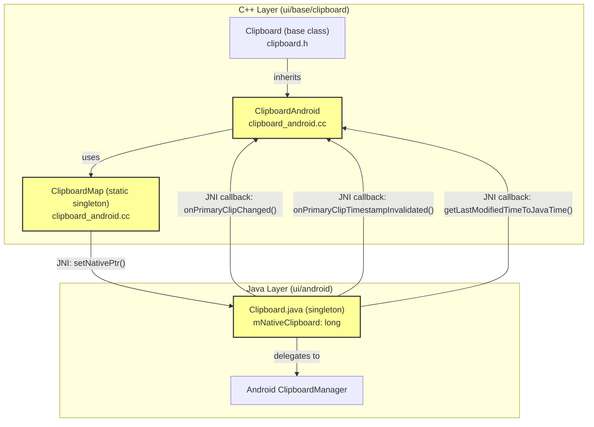
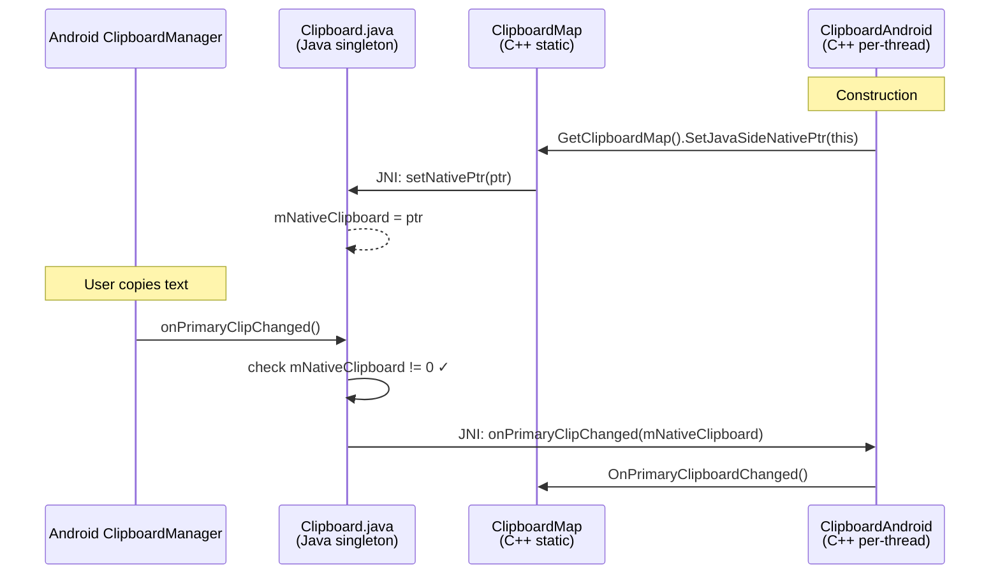

# High-Level Design: CL 7596858

**[Clipboard] Clear Java native ptr on ClipboardAndroid destruction**

**CL URL:** https://chromium-review.googlesource.com/c/chromium/src/+/7596858
**Author:** Hewro Hewei (ihewro@chromium.org)
**Status:** NEW
**Changed Files:** `ui/base/clipboard/clipboard_android.cc` (+1/-0)

---

## 1. Executive Summary

This CL adds a single line to the `~ClipboardAndroid()` destructor to clear the native pointer (`mNativeClipboard`) stored in the Java `Clipboard` singleton by calling `GetClipboardMap().SetJavaSideNativePtr(nullptr)`. Without this fix, when a `ClipboardAndroid` instance is destroyed (e.g., via `Clipboard::DestroyClipboardForCurrentThread()`), the Java-side `Clipboard` singleton retains a stale native pointer. Subsequent Java-to-native callbacks (`notifyPrimaryClipChanged`, `notifyPrimaryClipTimestampInvalidated`, `getLastModifiedTimeToJavaTime`) would dereference a dangling pointer, leading to use-after-free crashes. This is a targeted safety fix with minimal risk and high impact for Android clipboard stability.

---

## 2. Architecture Overview

### Affected Components

This CL touches the **UI Base Clipboard** subsystem, specifically the Android platform implementation. The change lives entirely within the C++ layer that bridges Chromium's cross-platform clipboard API to the Android system clipboard via JNI.

### Key Components

| Component | Role |
|-----------|------|
| `ClipboardAndroid` (C++) | Platform-specific `Clipboard` implementation for Android |
| `ClipboardMap` (C++) | Process-wide singleton managing clipboard data and Java interop |
| `Clipboard.java` (Java) | Java-side singleton wrapping Android `ClipboardManager`; holds `mNativeClipboard` |
| `Clipboard` base class (C++) | Cross-platform clipboard interface; manages per-thread clipboard lifetime |

### Component Diagram



### How It Fits

The `Clipboard` base class (`/workspace/cr2/src/ui/base/clipboard/clipboard.h`) manages clipboard instances per-thread via `Clipboard::Create()` and `Clipboard::DestroyClipboardForCurrentThread()`. On Android, `Clipboard::Create()` instantiates `ClipboardAndroid`, whose constructor registers `this` as the native pointer in the Java `Clipboard` singleton via `GetClipboardMap().SetJavaSideNativePtr(this)` (`/workspace/cr2/src/ui/base/clipboard/clipboard_android.cc#L509`). The Java singleton is **not** destroyed when the C++ object is destroyed — it persists for the lifetime of the process. This asymmetry is what necessitates explicit cleanup of the native pointer.

---

## 3. Design Goals & Non-Goals

### Goals

1. **Prevent dangling pointer dereference**: Ensure that after `ClipboardAndroid` is destroyed, the Java `Clipboard` singleton does not hold a stale native pointer that would be dereferenced in JNI callbacks.
2. **Maintain symmetry**: The constructor sets the native pointer; the destructor should clear it — following RAII principles.
3. **Minimal change**: Achieve the fix with the smallest possible code change (one line).

### Non-Goals

- **Redesigning the clipboard lifecycle**: The CL does not change how `Clipboard` instances are created/destroyed or how the Java singleton is managed.
- **Adding null-safety on the Java side**: The Java `Clipboard` already guards its JNI callbacks with `if (mNativeClipboard == 0) return;` checks (see `/workspace/cr2/src/ui/android/java/src/org/chromium/ui/base/Clipboard.java#L411-L422`). This CL complements those guards from the C++ side.
- **Thread-safety improvements**: No changes to locking or thread-checking logic.
- **Test additions**: The CL does not include new tests (see Testing Strategy section for analysis).

---

## 4. System Interactions

### Lifecycle Flow

The critical interaction is the lifecycle mismatch between the C++ `ClipboardAndroid` (per-thread, destroyable) and the Java `Clipboard` singleton (process-lifetime). The Java singleton receives system clipboard change notifications from Android and forwards them to the C++ layer via JNI using the stored native pointer.

### Sequence Diagram: Normal Operation (Before Fix)



### Sequence Diagram: Crash Scenario (Without Fix)

```mermaid
sequenceDiagram
    participant ACM as Android ClipboardManager
    participant JC as Clipboard.java<br/>(Java singleton)
    participant CA as ClipboardAndroid<br/>(C++ per-thread)

    Note over CA: ~ClipboardAndroid() called
    CA->>CA: DCHECK(CalledOnValidThread())
    destroy CA
    Note over CA: C++ object destroyed<br/>mNativeClipboard still set!

    Note over ACM: User copies text
    ACM->>JC: onPrimaryClipChanged()
    JC->>JC: check mNativeClipboard != 0 ✓<br/>(stale ptr!)
    JC->>CA: JNI: onPrimaryClipChanged(mNativeClipboard)
    Note over CA: 💥 USE-AFTER-FREE<br/>Dangling pointer dereference
```

### Sequence Diagram: Fixed Behavior (With This CL)

```mermaid
sequenceDiagram
    participant ACM as Android ClipboardManager
    participant JC as Clipboard.java<br/>(Java singleton)
    participant CM as ClipboardMap<br/>(C++ static)
    participant CA as ClipboardAndroid<br/>(C++ per-thread)

    Note over CA: ~ClipboardAndroid() called
    CA->>CM: GetClipboardMap().SetJavaSideNativePtr(nullptr)
    CM->>JC: JNI: setNativePtr(0)
    JC-->>JC: mNativeClipboard = 0
    destroy CA

    Note over ACM: User copies text
    ACM->>JC: onPrimaryClipChanged()
    JC->>JC: check mNativeClipboard != 0 ✗
    JC-->>JC: return (safe no-op)
```

### IPC/Mojo Interactions

This CL does not involve IPC or Mojo. All interactions are within the browser process via JNI (Java Native Interface) between C++ and Java layers.

---

## 5. API & Interface Changes

### New Public Interfaces

None.

### Modified Interfaces

None. The change is purely in the implementation of the existing `~ClipboardAndroid()` destructor. The `SetJavaSideNativePtr()` method already exists and is already called in the constructor (`/workspace/cr2/src/ui/base/clipboard/clipboard_android.cc#L509`).

### Deprecated Interfaces

None.

### Changed Code

**File:** `/workspace/cr2/src/ui/base/clipboard/clipboard_android.cc#L512-L515`

```cpp
// BEFORE:
ClipboardAndroid::~ClipboardAndroid() {
  DCHECK(CalledOnValidThread());
}

// AFTER:
ClipboardAndroid::~ClipboardAndroid() {
  DCHECK(CalledOnValidThread());
  GetClipboardMap().SetJavaSideNativePtr(nullptr);
}
```

The added line calls `ClipboardMap::SetJavaSideNativePtr(nullptr)` which in turn calls `Java_Clipboard_setNativePtr(env, clipboard_manager_, 0)` via JNI, setting `mNativeClipboard = 0` on the Java `Clipboard` singleton (`/workspace/cr2/src/ui/android/java/src/org/chromium/ui/base/Clipboard.java#L357-L358`).

---

## 6. Dependencies

### What This Code Depends On

| Dependency | Location | Nature |
|------------|----------|--------|
| `ClipboardMap::SetJavaSideNativePtr()` | `/workspace/cr2/src/ui/base/clipboard/clipboard_android.cc#L189-L193` | Existing internal method |
| `GetClipboardMap()` | `/workspace/cr2/src/ui/base/clipboard/clipboard_android.cc#L175-L178` | Static singleton accessor |
| `Java_Clipboard_setNativePtr()` | JNI-generated binding to `Clipboard.java#setNativePtr()` | JNI bridge |
| `Clipboard.java` singleton | `/workspace/cr2/src/ui/android/java/src/org/chromium/ui/base/Clipboard.java` | Java-side clipboard |

### What Depends On This Code

| Dependent | Impact |
|-----------|--------|
| Java `Clipboard.notifyPrimaryClipChanged()` | Will now correctly no-op when native is destroyed (guards at line 411) |
| Java `Clipboard.notifyPrimaryClipTimestampInvalidated()` | Will now correctly no-op when native is destroyed (guards at line 416) |
| Java `Clipboard.getLastModifiedTimeToJavaTime()` | Will now correctly return 0 when native is destroyed (guards at line 421) |
| `Clipboard::DestroyClipboardForCurrentThread()` | Callers of this method now get safe cleanup of the Java-side pointer |
| `JNI_Clipboard_CleanupForTesting()` | Test cleanup path (`/workspace/cr2/src/ui/base/clipboard/clipboard_android.cc#L468`) now safely clears the native pointer |

### Version/Compatibility

No compatibility concerns. The `ClipboardMap` singleton (`base::NoDestructor`) outlives `ClipboardAndroid`, so calling `SetJavaSideNativePtr(nullptr)` in the destructor is always safe. The Java-side null guards already exist and handle the `mNativeClipboard == 0` case.

---

## 7. Risks & Mitigations

### Risk Assessment

| Risk | Severity | Likelihood | Mitigation |
|------|----------|------------|------------|
| **Re-creation after destruction**: If a new `ClipboardAndroid` is created after one is destroyed, the constructor will set a new pointer — working correctly | Low | Medium | Already handled: constructor calls `SetJavaSideNativePtr(this)` |
| **Race condition**: Java callback arrives between C++ destructor start and `setNativePtr(0)` completion | Low | Very Low | `DCHECK(CalledOnValidThread())` ensures single-thread access; Java guards (`mNativeClipboard == 0`) provide additional safety |
| **`GetClipboardMap()` availability in destructor**: The `ClipboardMap` is a `base::NoDestructor` static singleton, guaranteed to outlive `ClipboardAndroid` | None | None | By design — `NoDestructor` never runs its destructor |
| **JNI env availability in destructor**: Attaching to the JNI thread in a destructor could theoretically fail | Very Low | Very Low | Same pattern is already used in the constructor and throughout `ClipboardMap` methods |

### Backward Compatibility

No backward compatibility concerns. This is a purely additive change to a destructor. No public API is modified. The behavior change (clearing the native pointer) only affects the window between `ClipboardAndroid` destruction and Java singleton use, which was previously a bug.

### Migration Strategy

Not applicable — this is a one-line bugfix, not a migration.

---

## 8. Testing Strategy

### Existing Test Coverage

The existing test infrastructure exercises clipboard lifecycle:

- `JNI_Clipboard_CleanupForTesting()` (`/workspace/cr2/src/ui/base/clipboard/clipboard_android.cc#L468`) calls `Clipboard::DestroyClipboardForCurrentThread()`, which will now trigger the new destructor cleanup. This means all existing Android clipboard tests implicitly exercise the new code path.
- `clipboard_test_template.h` provides cross-platform clipboard tests that cover create/destroy cycles.

### What Should Be Tested

| Test Scenario | Priority | How |
|---------------|----------|-----|
| Native pointer is cleared on ClipboardAndroid destruction | High | Verify `mNativeClipboard == 0` after `DestroyClipboardForCurrentThread()` |
| Java callbacks are safe after native destruction | High | Trigger `onPrimaryClipChanged` after destroying the native clipboard; verify no crash |
| Re-creation after destruction works | Medium | Destroy and re-create clipboard; verify new pointer is set correctly |

### Test Coverage Assessment

The CL does not include explicit new tests. Given the one-line nature of the fix and the existing Java-side null guards, this is acceptable. The fix eliminates undefined behavior (use-after-free), which is inherently difficult to test deterministically. The existing `CleanupForTesting` path provides implicit coverage. Adding a dedicated test that verifies `mNativeClipboard == 0` after destruction would strengthen coverage but is not strictly necessary for a fix of this scope.

### CI Status

The CL has passed the LUCI CQ dry run (patch set 4), confirming no existing tests are broken by this change.

---

## Appendix: Code References

| File | Lines | Description |
|------|-------|-------------|
| `/workspace/cr2/src/ui/base/clipboard/clipboard_android.cc` | L507-L515 | Constructor and destructor (modified) |
| `/workspace/cr2/src/ui/base/clipboard/clipboard_android.cc` | L116-L178 | `ClipboardMap` class and `GetClipboardMap()` singleton |
| `/workspace/cr2/src/ui/base/clipboard/clipboard_android.cc` | L189-L193 | `ClipboardMap::SetJavaSideNativePtr()` |
| `/workspace/cr2/src/ui/base/clipboard/clipboard_android.h` | L24-L137 | `ClipboardAndroid` class declaration |
| `/workspace/cr2/src/ui/android/java/src/org/chromium/ui/base/Clipboard.java` | L36 | `mNativeClipboard` field |
| `/workspace/cr2/src/ui/android/java/src/org/chromium/ui/base/Clipboard.java` | L357-L358 | `setNativePtr()` method |
| `/workspace/cr2/src/ui/android/java/src/org/chromium/ui/base/Clipboard.java` | L410-L423 | Null-guarded JNI callback methods |
