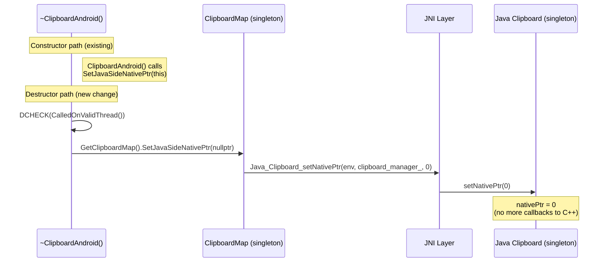
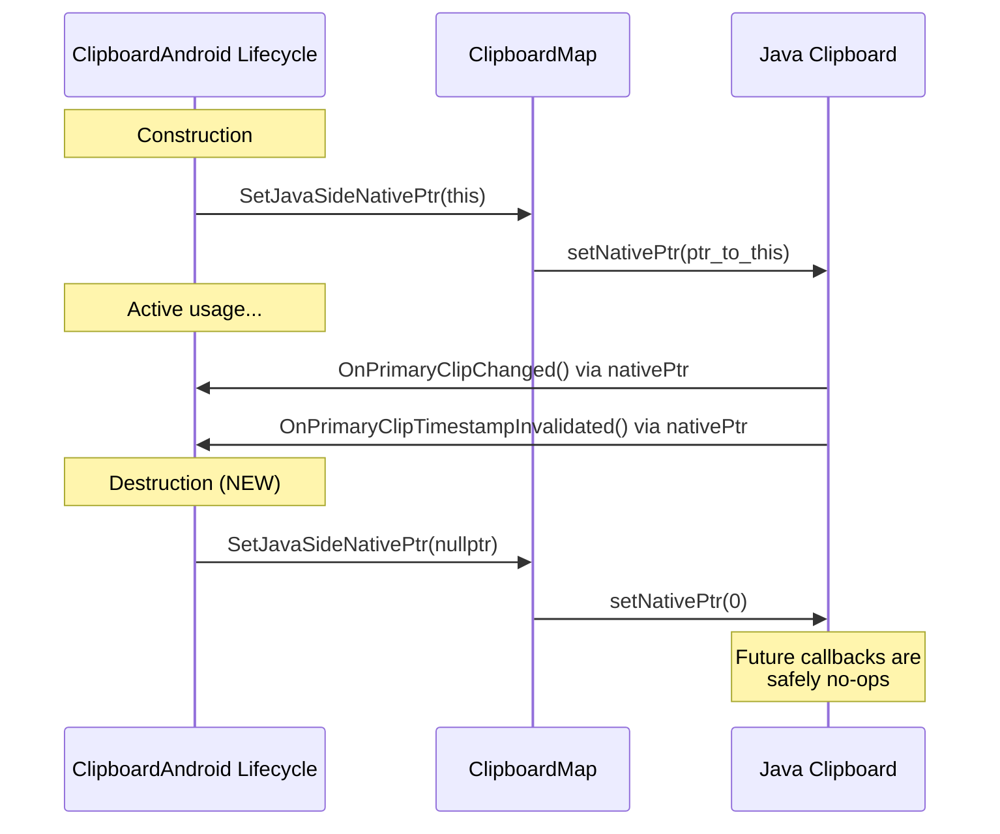
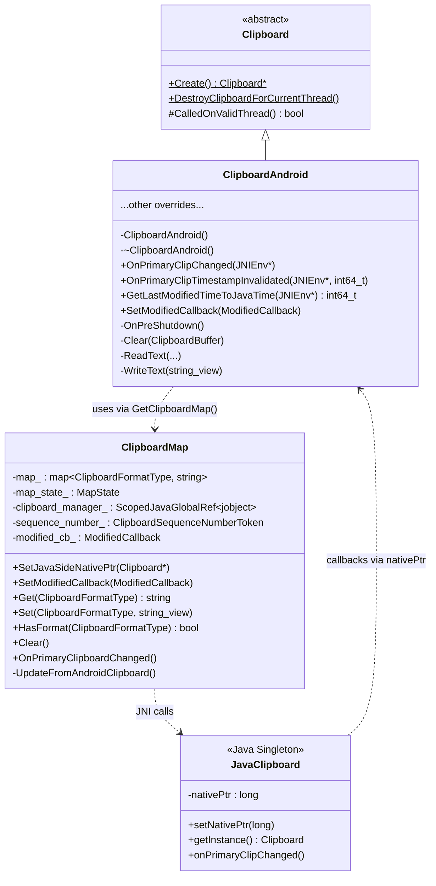

# Low-Level Design: CL 7596858

## [Clipboard] Clear Java native ptr on ClipboardAndroid destruction

**CL URL:** https://chromium-review.googlesource.com/c/chromium/src/+/7596858
**Author:** Hewro Hewei (ihewro@chromium.org)
**Status:** NEW

---

## 1. File-by-File Analysis

### `ui/base/clipboard/clipboard_android.cc`

**Purpose of changes:**
Prevent a dangling native pointer on the Java side when `ClipboardAndroid` is destroyed. The Java `Clipboard` singleton holds a native pointer (`nativePtr`) to the C++ `ClipboardAndroid` instance. Previously, when `~ClipboardAndroid()` ran, this pointer was never cleared, leaving the Java singleton with a stale reference. Any subsequent Java-to-native callbacks (e.g., `OnPrimaryClipChanged`, `OnPrimaryClipTimestampInvalidated`, `GetLastModifiedTimeToJavaTime`) would invoke methods through a dangling pointer, causing undefined behavior or crashes.

**Key modifications:**
- Added a single line in `~ClipboardAndroid()` to clear the native pointer stored on the Java side by calling `GetClipboardMap().SetJavaSideNativePtr(nullptr)`.

**Diff:**
```diff
 ClipboardAndroid::~ClipboardAndroid() {
   DCHECK(CalledOnValidThread());
+  GetClipboardMap().SetJavaSideNativePtr(nullptr);
 }
```

**New/Modified Functions:**

No new functions were added. The change adds a call to an existing function within an existing destructor.

| Function | Purpose | Parameters | Returns |
|----------|---------|------------|---------|
| `~ClipboardAndroid()` (modified) | Destructor — now also clears the Java-side native pointer to prevent dangling pointer callbacks | None | N/A (destructor) |

**Existing functions involved in the change:**

| Function | Purpose | Parameters | Returns |
|----------|---------|------------|---------|
| `GetClipboardMap()` | Returns the process-wide singleton `ClipboardMap` instance (backed by `base::NoDestructor`) | None | `ClipboardMap&` |
| `ClipboardMap::SetJavaSideNativePtr()` | Calls `Java_Clipboard_setNativePtr()` to store/clear the native pointer on the Java Clipboard singleton | `Clipboard* clipboard` | `void` |

**Data Flow:**



**Symmetry with Constructor:**



---

## 2. Class Diagram



---

## 3. State Diagram

```mermaid
stateDiagram-v2
    [*] --> Constructed : Clipboard::Create()
    
    Constructed --> Active : SetJavaSideNativePtr(this)
    
    Active --> Active : Java callbacks via nativePtr<br/>(OnPrimaryClipChanged, etc.)
    Active --> Active : Read/Write operations
    
    Active --> Destroying : ~ClipboardAndroid() called
    
    Destroying --> NativePtrCleared : SetJavaSideNativePtr(nullptr) [NEW]
    
    NativePtrCleared --> [*] : Object destroyed

    state "Before This CL" as DanglingBug {
        Active --> DestroyedWithoutClearing : ~ClipboardAndroid() [OLD]
        DestroyedWithoutClearing --> DanglingPtr : Java still has stale nativePtr
        DanglingPtr --> UndefinedBehavior : Java callback hits freed memory
    }
```

---

## 4. Implementation Concerns

### Memory Management

- **Dangling pointer prevention (the fix):** This CL directly addresses a dangling pointer bug. The `ClipboardMap` singleton (backed by `base::NoDestructor`) outlives `ClipboardAndroid`. Without this fix, the Java `Clipboard` singleton retains a stale pointer to the destroyed `ClipboardAndroid` object, and any subsequent JNI callback would dereference freed memory.

- **ClipboardMap lifetime:** `ClipboardMap` uses `base::NoDestructor`, so it persists for the entire process lifetime. This is safe—the map itself never dangles. The issue was solely the native pointer stored on the Java side.

- **Null safety on Java side:** The effectiveness of this fix depends on the Java `Clipboard.setNativePtr(0)` implementation correctly guarding against callbacks when `nativePtr == 0`. This is standard practice in Chromium JNI code—generated JNI bindings typically check for a null native pointer before dispatching. However, this should be verified.

### Thread Safety

- The destructor already has `DCHECK(CalledOnValidThread())`, ensuring it runs on the correct thread. Since `SetJavaSideNativePtr` calls JNI (`AttachCurrentThread()`), this is appropriate—JNI calls should be made from the thread that owns the Java environment.

- **Race condition window:** There is a theoretical race between the `SetJavaSideNativePtr(nullptr)` call and a concurrent Java callback arriving on a different thread. If a Java callback is already in flight (past the null-check) while the destructor clears the pointer, the callback could still hit a dangling pointer. However, the `DCHECK(CalledOnValidThread())` guard on both the destructor and the callback methods (`OnPrimaryClipChanged`, etc.) implies these all run on the same thread, making this race impossible under correct usage.

### Performance Implications

- **Negligible:** The added code is a single JNI call during object destruction—an infrequent operation. No performance impact.

### Maintainability

- **Good symmetry:** The destructor now mirrors the constructor. Constructor calls `SetJavaSideNativePtr(this)`, destructor calls `SetJavaSideNativePtr(nullptr)`. This is a clean, idiomatic RAII pattern.
- **Minimal change:** One line added, clear intent, easy to review.

---

## 5. Suggestions for Improvement

### 5.1 Minor: Commit message formatting
The commit message has a minor formatting issue: `singleton.Clear it` is missing a space after the period. Should be `singleton. Clear it`.

### 5.2 Consider: DCHECK on re-registration
The constructor could `DCHECK` that the Java-side native pointer is currently null before setting it, to catch cases where a new `ClipboardAndroid` is created before the old one is destroyed:

```cpp
ClipboardAndroid::ClipboardAndroid() {
  DCHECK(CalledOnValidThread());
  // Ensure no other ClipboardAndroid is registered.
  GetClipboardMap().SetJavaSideNativePtr(this);
}
```

This is low-priority since `Clipboard::Create()` should only be called once per thread, but a DCHECK would make violations more visible.

### 5.3 Consider: Verify Java-side null guard
Ensure the Java `Clipboard` class checks `nativePtr != 0` before making native calls. For example:

```java
// In Clipboard.java
private void onPrimaryClipChanged() {
    if (mNativePtr != 0) {
        nativeOnPrimaryClipChanged(mNativePtr);
    }
}
```

If this guard is missing on the Java side, setting the pointer to `nullptr` won't fully prevent the use-after-free—it would merely convert a dangling-pointer dereference into a null-pointer dereference. This should be verified as part of the review.

### 5.4 Overall Assessment

This is a **correct and well-scoped fix** for a real dangling pointer bug. The change is minimal (1 line), follows established patterns in the codebase, and creates proper RAII symmetry between construction and destruction. No concerns with the implementation itself.

---

## Summary

| Aspect | Assessment |
|--------|-----------|
| **Correctness** | ✅ Fixes a genuine dangling pointer bug |
| **Completeness** | ✅ Sufficient for the C++ side; Java null-guard should be verified |
| **Thread safety** | ✅ Protected by `CalledOnValidThread()` DCHECK |
| **Performance** | ✅ No impact |
| **Style** | ✅ Clean, minimal, symmetric with constructor |
| **Risk** | Low — single-line addition to destructor |
