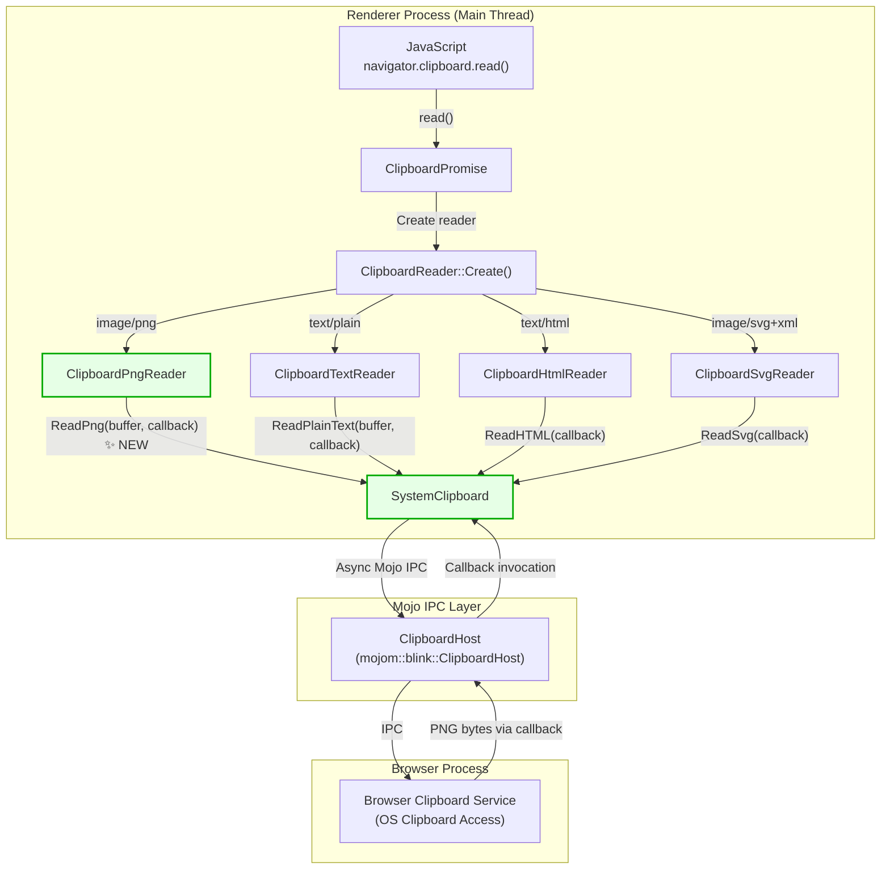
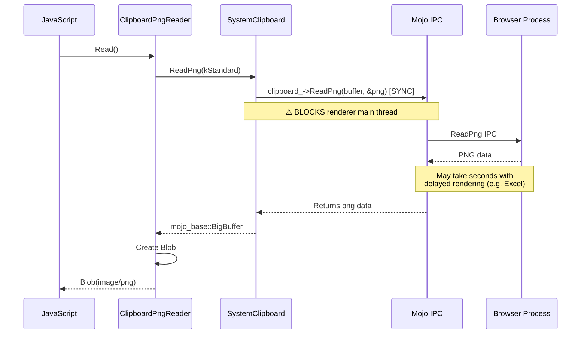
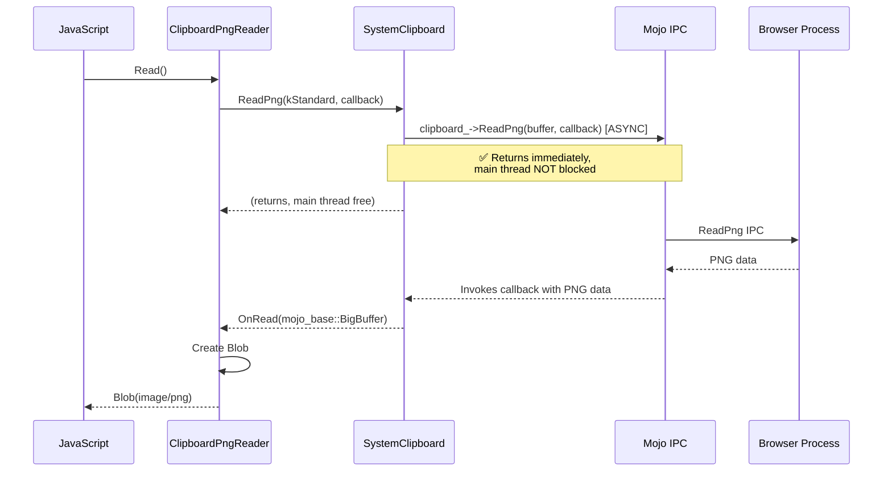

# High-Level Design: Make ClipboardPngReader Use Async ReadPng

**CL:** [7600033](https://chromium-review.googlesource.com/c/chromium/src/+/7600033)
**Author:** Rohan Raja \<roraja@microsoft.com\>
**Bug:** [474131935](https://crbug.com/474131935)
**Status:** NEW
**Files Changed:** 4 (+93/−3 lines)

---

## 1. Executive Summary

This CL converts `ClipboardPngReader::Read()` from a **synchronous** Mojo IPC call to an **asynchronous** callback-based call, bringing it in line with every other Async Clipboard API reader (`ReadPlainText`, `ReadHTML`, `ReadSvg`). Previously, `ClipboardPngReader` was the sole reader that used the synchronous `ReadPng` binding on `SystemClipboard`, which blocked the renderer's main thread until the browser process responded. When the clipboard contained data from applications that use delayed rendering (e.g., Microsoft Excel), this synchronous call could freeze the browser UI for several seconds. By adding an async `ReadPng` overload to `SystemClipboard` and wiring `ClipboardPngReader` to use it, the CL eliminates this main-thread blocking without requiring any Mojo IDL (`.mojom`) changes — the `[Sync]` annotation already generates both synchronous and asynchronous C++ stubs.

---

## 2. Architecture Overview

### Affected Components

| Component | Layer | Role |
|-----------|-------|------|
| `SystemClipboard` | Blink Core (`renderer/core/clipboard/`) | Abstraction over the Mojo `ClipboardHost` interface; provides read/write clipboard methods to the rest of Blink |
| `ClipboardPngReader` | Blink Modules (`renderer/modules/clipboard/`) | Implements `ClipboardReader` for `image/png` MIME type; used by the Async Clipboard API (`navigator.clipboard.read()`) |
| `ClipboardHost` (mojom) | Mojo IPC boundary | Defines the IPC interface between the renderer and the browser process for clipboard operations |
| Browser Clipboard Service | Browser process | Handles actual OS clipboard access; processes `ReadPng` requests |

### How It Fits Into Existing Architecture

The Async Clipboard API in Blink uses a **reader pattern**: `ClipboardReader::Create()` dispatches to a concrete reader class based on MIME type. Each reader calls a corresponding `SystemClipboard::ReadXxx()` method. Before this CL, all readers except `ClipboardPngReader` used the async (callback-based) overloads. This CL closes that gap.

No new architectural patterns are introduced — the CL follows the exact same async callback pattern already established by `ReadPlainText`, `ReadHTML`, and `ReadSvg`.

### Component Diagram



---

## 3. Design Goals & Non-Goals

### Goals

1. **Eliminate main-thread blocking:** Convert `ClipboardPngReader` from synchronous to asynchronous Mojo IPC to prevent the renderer's main thread from stalling during PNG clipboard reads.
2. **Consistency:** Align `ReadPng` with the async pattern already used by `ReadPlainText`, `ReadHTML`, and `ReadSvg`.
3. **Minimal surface area:** Achieve the fix with the smallest possible code change — no `.mojom` modifications, no new abstractions.
4. **Fix delayed rendering hangs:** Specifically address the bug where applications like Excel use delayed clipboard rendering, causing multi-second freezes.

### Non-Goals

- **Removing the synchronous `ReadPng` overload:** The synchronous variant is still used by `ReadImageAsImageMarkup()` and other internal callers. It is intentionally preserved.
- **Making other synchronous clipboard methods async:** Methods like `ReadRTF()`, `ReadFiles()`, `ReadDataTransferCustomData()`, `IsFormatAvailable()`, and `SequenceNumber()` remain synchronous. Converting those is out of scope.
- **Modifying the Mojo IDL:** The `[Sync]` annotation on `ReadPng` in `clipboard.mojom` already generates both sync and async C++ bindings. No mojom changes are needed or made.
- **Snapshot integration for async ReadPng:** The async overload bypasses the `Snapshot` cache (same as other async overloads like `ReadPlainText(callback)` and `ReadHTML(callback)`). This is by design — async reads are used by the Async Clipboard API which doesn't use snapshots.

---

## 4. System Interactions

### Sequence Diagram: Before (Synchronous — Blocked)



### Sequence Diagram: After (Asynchronous — Non-Blocking)



### IPC Details

- **Mojo Interface:** `mojom::blink::ClipboardHost::ReadPng`
- **IDL Definition:** [`/workspace/cr2/src/third_party/blink/public/mojom/clipboard/clipboard.mojom#L138-139`](/workspace/cr2/src/third_party/blink/public/mojom/clipboard/clipboard.mojom#L138-139)
- **Annotation:** `[Sync]` — Mojo generates both `ReadPng(buffer, &out_png)` (synchronous) and `ReadPng(buffer, callback)` (asynchronous) C++ bindings
- **No wire-format change:** The Mojo message on the wire is identical for both sync and async calls; the difference is purely in how the renderer-side stub handles the response

---

## 5. API & Interface Changes

### New Public Interface

**`SystemClipboard::ReadPng` (async overload)**

```cpp
// File: third_party/blink/renderer/core/clipboard/system_clipboard.h, Line 92-93
void ReadPng(mojom::blink::ClipboardBuffer buffer,
             mojom::blink::ClipboardHost::ReadPngCallback callback);
```

- **Purpose:** Asynchronous version of `ReadPng` that takes a callback instead of returning the result directly.
- **Parameters:**
  - `buffer` — Which clipboard buffer to read from (`kStandard` or `kSelection`)
  - `callback` — `base::OnceCallback<void(mojo_base::BigBuffer)>` invoked with PNG data (or empty buffer on failure)
- **Error handling:** If the buffer type is invalid or the clipboard remote is unbound, the callback is invoked synchronously with an empty `mojo_base::BigBuffer`.
- **Pattern:** Identical to existing async overloads:
  - `ReadPlainText(buffer, callback)` — [`system_clipboard.h#L70-71`](/workspace/cr2/src/third_party/blink/renderer/core/clipboard/system_clipboard.h#L70-71)
  - `ReadHTML(callback)` — [`system_clipboard.h#L81`](/workspace/cr2/src/third_party/blink/renderer/core/clipboard/system_clipboard.h#L81)
  - `ReadSvg(callback)` — [`system_clipboard.h#L86`](/workspace/cr2/src/third_party/blink/renderer/core/clipboard/system_clipboard.h#L86)

### Modified (Internal) Interface

**`ClipboardPngReader::Read()`** — [`clipboard_reader.cc#L45-50`](/workspace/cr2/src/third_party/blink/renderer/modules/clipboard/clipboard_reader.cc#L45-50)

Changed from:
```cpp
void Read() override {
    mojo_base::BigBuffer data =
        system_clipboard()->ReadPng(mojom::blink::ClipboardBuffer::kStandard);
    // ... process data synchronously ...
}
```

Changed to:
```cpp
void Read() override {
    system_clipboard()->ReadPng(
        mojom::blink::ClipboardBuffer::kStandard,
        BindOnce(&ClipboardPngReader::OnRead, WrapPersistent(this)));
}

void OnRead(mojo_base::BigBuffer data) {
    // ... process data in callback ...
}
```

### Preserved Interface (No Change)

**`SystemClipboard::ReadPng` (synchronous overload)** — [`system_clipboard.h#L91`](/workspace/cr2/src/third_party/blink/renderer/core/clipboard/system_clipboard.h#L91)

```cpp
mojo_base::BigBuffer ReadPng(mojom::blink::ClipboardBuffer);
```

This remains unchanged and continues to be used by `ReadImageAsImageMarkup()` and any other callers that require synchronous access (e.g., drag-and-drop, `document.execCommand('paste')`).

### No Deprecated Interfaces

No interfaces are deprecated by this CL.

---

## 6. Dependencies

### What This Code Depends On

| Dependency | Type | Notes |
|-----------|------|-------|
| `mojom::blink::ClipboardHost` | Mojo interface | The `ReadPng` method with `[Sync]` annotation generates both sync/async bindings |
| `mojo_base::BigBuffer` | Data type | Used to transfer PNG byte data across IPC boundaries |
| `base::OnceCallback` | Callback type | Standard Chromium callback mechanism (`ReadPngCallback`) |
| `WrapPersistent` / `BindOnce` | Blink GC utilities | Ensure the `ClipboardPngReader` GC-root is held alive until the async callback fires |
| `HeapMojoRemote<ClipboardHost>` | Mojo remote | The bound connection from `SystemClipboard` to the browser's clipboard service |

### What Depends On This Code

| Dependent | Impact |
|-----------|--------|
| `ClipboardPngReader` | **Modified in this CL** — now uses the new async overload |
| `ReadImageAsImageMarkup()` | **No change** — continues using the synchronous overload |
| Any future caller needing async PNG clipboard reads | Can use the new `ReadPng(buffer, callback)` overload |

### Compatibility

- **Binary compatibility:** Fully backward compatible. The synchronous `ReadPng` overload is preserved; existing callers are unaffected.
- **Wire compatibility:** No Mojo IDL changes. The IPC message format is identical for sync and async calls.
- **ABI:** C++ function overloading — no ABI break since this is a new overload, not a modification of an existing signature.

---

## 7. Risks & Mitigations

### Risk 1: Object Lifetime (GC) During Async Callback

**Risk:** `ClipboardPngReader` is garbage-collected. If it is collected before the async Mojo callback fires, the callback would invoke a dangling reference.

**Mitigation:** The CL uses `WrapPersistent(this)` in the `BindOnce` call, which creates a persistent GC root that prevents collection until the callback fires. This is the **standard Blink pattern** used identically by `ClipboardTextReader`, `ClipboardHtmlReader`, and `ClipboardSvgReader`.

### Risk 2: Callback Not Called (Mojo Pipe Disconnection)

**Risk:** If the Mojo pipe to the browser process disconnects before the response arrives, the callback might never fire, leaving the `ClipboardPromise` unresolved.

**Mitigation:** Mojo's `HeapMojoRemote` guarantees that when the pipe disconnects, all pending callbacks are invoked with default-constructed response values (empty `BigBuffer`). The `OnRead` method handles empty data correctly by passing `nullptr` blob to `promise_->OnRead(blob)`.

### Risk 3: Unbound Clipboard Remote

**Risk:** If `SystemClipboard::clipboard_` is not bound, the async call could crash.

**Mitigation:** The async `ReadPng` overload explicitly checks `!clipboard_.is_bound()` and immediately invokes the callback with an empty `BigBuffer`. This matches the pattern in all other async overloads and is covered by `ReadPngAsyncWithUnboundClipboardHost` test.

### Risk 4: Behavioral Change Observable to Web Developers

**Risk:** Switching from sync to async could change the observable timing of the Async Clipboard API's `read()` promise resolution.

**Mitigation:** The Async Clipboard API is already specified as asynchronous (returns a `Promise`). Web developers cannot observe whether the underlying IPC is sync or async — the promise resolution timing is non-deterministic by spec. The only observable difference is **improved responsiveness** (no UI freezes).

### Risk 5: Snapshot Cache Bypass

**Risk:** The async overload does not integrate with `SystemClipboard::Snapshot`, meaning concurrent reads during a snapshot could get inconsistent data.

**Mitigation:** This is a non-issue because:
1. The Async Clipboard API (`navigator.clipboard.read()`) does not use snapshots.
2. Snapshots are used by `DataTransfer` (paste events, drag-and-drop), which uses the synchronous `ReadPng` overload (unchanged).
3. All other async overloads (`ReadPlainText(callback)`, `ReadHTML(callback)`, `ReadSvg(callback)`) also bypass snapshots.

### Backward Compatibility

- **Fully backward compatible.** No existing interfaces are modified or removed.
- **No migration needed.** The synchronous overload remains available.

---

## 8. Testing Strategy

### Tests Added in This CL

Three new unit tests in [`system_clipboard_test.cc`](/workspace/cr2/src/third_party/blink/renderer/core/clipboard/system_clipboard_test.cc):

| Test | Purpose | Verification |
|------|---------|-------------|
| `ReadPngAsync` | Happy path — reads a bitmap from clipboard asynchronously | Verifies callback is invoked, PNG data is non-empty, and decoded image has correct dimensions (4×3) |
| `ReadPngAsyncEmpty` | Empty clipboard — async ReadPng returns empty buffer | Verifies callback is invoked with zero-size buffer |
| `ReadPngAsyncWithUnboundClipboardHost` | Error path — clipboard remote is unbound | Verifies callback is invoked **synchronously** with empty data (no Mojo call made) |

### Test Coverage Assessment

| Scenario | Covered? |
|----------|----------|
| Async ReadPng with valid image data | ✅ `ReadPngAsync` |
| Async ReadPng with empty clipboard | ✅ `ReadPngAsyncEmpty` |
| Async ReadPng with unbound Mojo remote | ✅ `ReadPngAsyncWithUnboundClipboardHost` |
| Integration with `ClipboardPngReader::Read()` | ⚠️ Implicit — `ClipboardPngReader` is the only caller of the async overload; existing Async Clipboard API integration tests cover end-to-end |
| Sync `ReadPng` still works | ✅ Pre-existing tests are unmodified and continue to pass |
| Invalid buffer type (kSelection on non-Linux) | ✅ Handled by `IsValidBufferType()` guard; shares test coverage with sync overload |

### CI Validation

The CL passed the LUCI dry run (`Patch Set 1: This CL has passed the run`), confirming that:
- All existing tests continue to pass
- The new tests pass
- No build breakage on any platform

### Recommended Additional Testing (Future)

- **Web Platform Tests (WPT):** Consider adding/verifying WPT coverage for `navigator.clipboard.read()` with `image/png` to ensure the async behavior is spec-compliant across browsers.
- **Performance test:** A targeted performance test measuring main-thread jank during clipboard read of delayed-render content (e.g., mock delayed clipboard provider) would validate the performance improvement.

---

## Appendix: File-Level Summary

| File | Lines Changed | Description |
|------|:---:|-------------|
| [`system_clipboard.h`](/workspace/cr2/src/third_party/blink/renderer/core/clipboard/system_clipboard.h#L92-93) | +2/−0 | Declares new async `ReadPng` overload |
| [`system_clipboard.cc`](/workspace/cr2/src/third_party/blink/renderer/core/clipboard/system_clipboard.cc#L267-275) | +10/−0 | Implements async `ReadPng` with validity checks and Mojo forwarding |
| [`system_clipboard_test.cc`](/workspace/cr2/src/third_party/blink/renderer/core/clipboard/system_clipboard_test.cc) | +74/−0 | Adds 3 unit tests covering happy path, empty clipboard, and unbound remote |
| [`clipboard_reader.cc`](/workspace/cr2/src/third_party/blink/renderer/modules/clipboard/clipboard_reader.cc#L45-62) | +7/−3 | Converts `ClipboardPngReader::Read()` from sync to async, adds `OnRead` callback |
