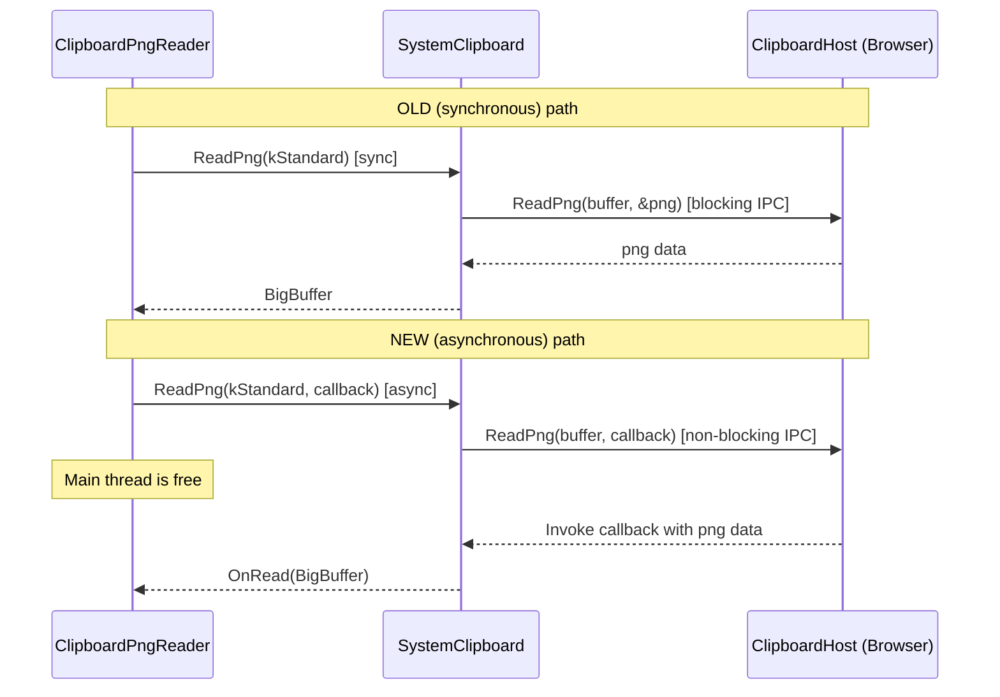
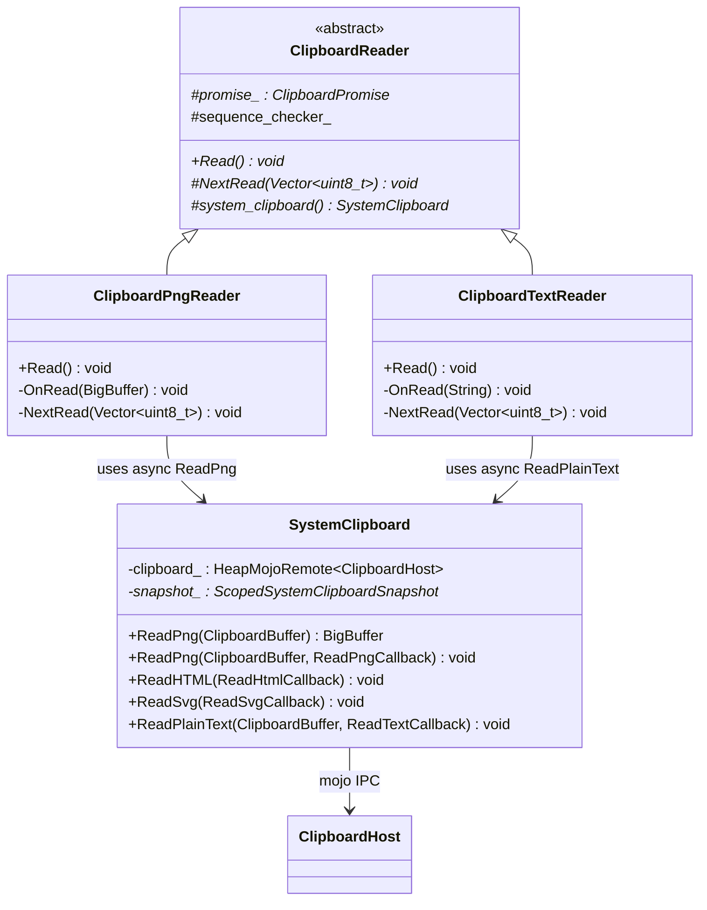

# Low-Level Design: CL 7600033

## Make ClipboardPngReader use async ReadPng to avoid blocking renderer

**CL URL:** https://chromium-review.googlesource.com/c/chromium/src/+/7600033
**Bug:** 474131935

---

## Summary

`ClipboardPngReader::Read()` was the only Async Clipboard API reader that called the **synchronous** mojo IPC `ReadPng`, blocking the renderer's main thread until the browser process responded. With delayed clipboard writes (e.g., Excel), this could freeze the browser UI for several seconds.

This CL adds an **asynchronous overload** of `SystemClipboard::ReadPng()` that accepts a callback, and updates `ClipboardPngReader` to use it. No mojom changes are needed because `[Sync]` IDL annotations already generate both sync and async C++ bindings.

---

## 1. File-by-File Analysis

### 1.1 `third_party/blink/renderer/core/clipboard/system_clipboard.h`

**Purpose of changes:** Declare the new async `ReadPng` overload on `SystemClipboard`.

**Key modifications:**
- Added a second `ReadPng` declaration that takes a `ClipboardBuffer` and a `ReadPngCallback` (returns `void` instead of `BigBuffer`).

**New/Modified Functions:**

| Function | Purpose | Parameters | Returns |
|----------|---------|------------|---------|
| `ReadPng` (async overload) | Non-blocking PNG read that delivers result via callback | `mojom::blink::ClipboardBuffer buffer`, `mojom::blink::ClipboardHost::ReadPngCallback callback` | `void` |

**API Changes:**
- New public method overload on `SystemClipboard`. The existing synchronous `ReadPng(ClipboardBuffer) -> BigBuffer` is preserved unchanged. This follows the same overload pattern already used by `ReadHTML` and `ReadSvg`.

---

### 1.2 `third_party/blink/renderer/core/clipboard/system_clipboard.cc`

**Purpose of changes:** Implement the async `ReadPng` overload.

**Key modifications:**
- Added a 10-line method body for the new async `ReadPng`.
- Validates buffer type and binding state; on failure, immediately invokes callback with an empty `BigBuffer`.
- On success, forwards the call to the mojo remote `clipboard_->ReadPng(buffer, std::move(callback))`.

**New/Modified Functions:**

| Function | Purpose | Parameters | Returns |
|----------|---------|------------|---------|
| `SystemClipboard::ReadPng` (async) | Validates inputs and forwards to mojo async IPC | `ClipboardBuffer buffer`, `ReadPngCallback callback` | `void` |

**Implementation detail — sync vs. async:**

```
Sync path (existing, unchanged):
  mojo_base::BigBuffer png;
  clipboard_->ReadPng(buffer, &png);   // blocks until browser responds
  return png;

Async path (new):
  clipboard_->ReadPng(buffer, std::move(callback));  // returns immediately
```

**Data Flow:**



**Error Handling:**
- Invalid buffer type → callback invoked immediately with empty `BigBuffer`.
- Unbound clipboard remote → callback invoked immediately with empty `BigBuffer` (synchronously, no event loop needed).
- These match the error handling pattern of the sync overload and of `ReadHTML`/`ReadSvg` async overloads.

**Notable difference from sync overload:**
The async path does **not** interact with `snapshot_` (the `ScopedSystemClipboardSnapshot` cache). The sync overload checks `snapshot_->HasPng()` and populates it via `snapshot_->SetPng()`. This is acceptable because:
1. The async path is only used by the Async Clipboard API (`ClipboardPngReader`), not by clipboard paste operations that use snapshots.
2. The existing async overloads (`ReadHTML`, `ReadSvg`) also skip snapshot interaction.

---

### 1.3 `third_party/blink/renderer/modules/clipboard/clipboard_reader.cc`

**Purpose of changes:** Convert `ClipboardPngReader` from sync to async clipboard reading.

**Key modifications:**
- `Read()` no longer calls the sync `ReadPng` and processes the result inline.
- `Read()` now calls the async `ReadPng` overload, passing `OnRead` as the callback.
- Blob creation logic moved from `Read()` into a new private method `OnRead(BigBuffer)`.
- The `private:` access specifier moved up to accommodate the new method placement.

**New/Modified Functions:**

| Function | Purpose | Parameters | Returns |
|----------|---------|------------|---------|
| `ClipboardPngReader::Read()` | Initiates async PNG read from system clipboard | — | `void` |
| `ClipboardPngReader::OnRead()` | Callback; creates Blob from PNG data and resolves promise | `mojo_base::BigBuffer data` | `void` |

**Before (sync):**
```cpp
void Read() override {
    DCHECK_CALLED_ON_VALID_SEQUENCE(sequence_checker_);
    mojo_base::BigBuffer data =
        system_clipboard()->ReadPng(mojom::blink::ClipboardBuffer::kStandard);

    Blob* blob = nullptr;
    if (data.size()) {
      blob = Blob::Create(data, ui::kMimeTypePng);
    }
    promise_->OnRead(blob);
}
```

**After (async):**
```cpp
void Read() override {
    DCHECK_CALLED_ON_VALID_SEQUENCE(sequence_checker_);
    system_clipboard()->ReadPng(
        mojom::blink::ClipboardBuffer::kStandard,
        BindOnce(&ClipboardPngReader::OnRead, WrapPersistent(this)));
}

void OnRead(mojo_base::BigBuffer data) {
    DCHECK_CALLED_ON_VALID_SEQUENCE(sequence_checker_);
    Blob* blob = nullptr;
    if (data.size()) {
      blob = Blob::Create(data, ui::kMimeTypePng);
    }
    promise_->OnRead(blob);
}
```

**Lifecycle / GC considerations:**
- `WrapPersistent(this)` ensures the garbage collector keeps `ClipboardPngReader` alive until the callback fires. This is the standard Blink pattern for preventing premature GC of GarbageCollected objects bound to mojo callbacks.
- `BindOnce` ensures the callback is invoked at most once, matching mojo's single-response semantics.

---

### 1.4 `third_party/blink/renderer/core/clipboard/system_clipboard_test.cc`

**Purpose of changes:** Add unit tests for the new async `ReadPng` overload.

**Key modifications:**
- Added 3 new test cases under `SystemClipboardTest`:

| Test | Scenario | Key Assertions |
|------|----------|----------------|
| `ReadPngAsync` | Normal read with image data on clipboard | Callback invoked, non-empty PNG returned, valid dimensions (4×3) after decode |
| `ReadPngAsyncEmpty` | Read when clipboard is empty | Callback invoked, buffer size is 0 |
| `ReadPngAsyncWithUnboundClipboardHost` | Read when mojo remote is disconnected | Callback invoked **synchronously** (no `RunUntilIdle` needed), empty buffer |

**Test patterns:**
- All tests use `base::BindLambdaForTesting` with captured booleans/buffers for verification.
- `RunUntilIdle()` is used for the happy-path and empty-clipboard tests to pump the mojo message loop.
- The unbound-host test verifies **synchronous** callback invocation (no `RunUntilIdle`), confirming the early-return error path.

---

## 2. Class Diagram



---

## 3. State Diagram — ClipboardPngReader Lifecycle

```mermaid
stateDiagram-v2
    [*] --> Created : ClipboardReader::Create("image/png")

    Created --> Reading : Read() called
    Reading --> WaitingForMojo : async ReadPng dispatched

    state WaitingForMojo {
        [*] --> PendingCallback
        PendingCallback --> CallbackReceived : mojo responds
    }

    WaitingForMojo --> BlobCreated : OnRead(data) with data.size() > 0
    WaitingForMojo --> EmptyResult : OnRead(data) with data.size() == 0

    BlobCreated --> PromiseResolved : promise_->OnRead(blob)
    EmptyResult --> PromiseResolved : promise_->OnRead(nullptr)

    PromiseResolved --> [*]

    note right of Reading
        Main thread is NOT blocked.
        Previously, this state was
        a synchronous blocking IPC.
    end note
```

---

## 4. Implementation Concerns

### 4.1 Memory Management
- **GC Safety:** `WrapPersistent(this)` prevents GC of the `ClipboardPngReader` during the async gap. This is correct and follows Blink conventions (e.g., `ClipboardTextReader` uses the same pattern). Once the callback fires, the persistent handle is released.
- **BigBuffer:** `mojo_base::BigBuffer` uses shared memory for large payloads. The `std::move` chain ensures no unnecessary copies.

### 4.2 Thread Safety
- Both `Read()` and `OnRead()` include `DCHECK_CALLED_ON_VALID_SEQUENCE(sequence_checker_)`, ensuring they run on the same (main) thread.
- No cross-thread data sharing is introduced.

### 4.3 Snapshot Cache Bypass
- The async `ReadPng` overload does **not** consult or populate `snapshot_`. This is consistent with `ReadHTML(callback)` and `ReadSvg(callback)`, which also bypass the snapshot. The snapshot mechanism is designed for synchronous DataTransfer paste operations, not for the Async Clipboard API.

### 4.4 Performance Implications
- **Positive:** Removes a synchronous IPC that could block the renderer for seconds when the browser has delayed clipboard data (e.g., Excel OLE clipboard). The renderer main thread is now free during the browser-side PNG encoding.
- **No regression:** The sync overload is preserved for callers like `ReadImageAsImageMarkup()` that still need synchronous semantics.

### 4.5 Backwards Compatibility
- No mojom changes. The `[Sync]` annotation on `ReadPng` in `clipboard.mojom` already generates both sync and async C++ bindings.
- The sync `ReadPng` overload is unchanged; existing callers are unaffected.

---

## 5. Suggestions for Improvement

### 5.1 Snapshot Integration for Async Path (Minor)
The async `ReadPng` does not populate the `snapshot_` cache. If a caller reads PNG both async and sync in the same snapshot scope, the sync path will re-fetch from the browser. This is unlikely in practice (the two code paths have different callers), but could be addressed by wrapping the callback to populate the snapshot:
```cpp
void SystemClipboard::ReadPng(ClipboardBuffer buffer, ReadPngCallback callback) {
  // ... validation ...
  clipboard_->ReadPng(buffer,
    base::BindOnce([](SystemClipboard* self, ClipboardBuffer buf,
                      ReadPngCallback cb, mojo_base::BigBuffer png) {
      if (self->snapshot_) self->snapshot_->SetPng(buf, png);
      std::move(cb).Run(std::move(png));
    }, base::Unretained(this), buffer, std::move(callback)));
}
```
**Verdict:** Not needed for this bug fix; the async path is only used by the Async Clipboard API.

### 5.2 Consider Deprecating the Sync Overload (Future)
The sync `ReadPng` is still called by `ReadImageAsImageMarkup()`. Long-term, converting that caller to async would allow removing the sync overload entirely, eliminating the last synchronous clipboard IPC in the renderer. This is out of scope for this CL.

### 5.3 Test Coverage (Good as-is)
The three tests cover:
- Happy path (image data present)
- Empty clipboard
- Unbound mojo remote (error path)

These match the test patterns used for `ReadPlainText` and other async clipboard methods. No additional tests are needed.

---

## 6. Overall Assessment

This is a **clean, minimal, well-structured change** that follows established Chromium/Blink patterns:
- Overload pattern matches `ReadHTML`/`ReadSvg` async variants.
- GC safety via `WrapPersistent` + `BindOnce`.
- Sequence checking on both sides of the async boundary.
- Comprehensive test coverage for normal, empty, and error paths.
- No mojom or IPC protocol changes required.

The change directly addresses the reported bug (renderer freeze during delayed clipboard reads) with no architectural risks.
