# High-Level Design: [Clipboard] Make Clipboard a singleton with thread affinity

**CL:** [7602194](https://chromium-review.googlesource.com/c/chromium/src/+/7602194)
**Author:** Hewro Hewei (ihewro@chromium.org)
**Reviewer:** Sky Malice (skym@chromium.org)
**Bug:** [487117770](https://crbug.com/487117770)
**Status:** NEW (Code-Review +1)

---

## 1. Executive Summary

This CL converts `ui::Clipboard` from a per-thread instance map (protected by a global lock) to a single process-wide singleton bound to the first thread that accesses it. On all desktop platforms, the system clipboard is inherently process-wide, so maintaining per-thread instances was an unnecessary abstraction that complicated lifetime management and obscured cross-thread misuse. The change introduces new singleton-based APIs (`Get()`, `Take()`, `DestroyClipboard()`, `OnPreShutdownClipboard()`, `SetClipboardForOverride()`) while keeping the legacy per-thread APIs as thin wrappers marked `DEPRECATED` for incremental migration in follow-up CLs. This simplifies the threading model, reduces lock contention, eliminates the thread allowlist machinery, and makes cross-thread access violations immediately visible via `CHECK_EQ` rather than silently producing per-thread clipboard instances that diverge from the system state.

---

## 2. Architecture Overview

### 2.1 Affected Components/Modules

| Component | Role | Impact |
|---|---|---|
| `ui/base/clipboard/clipboard.{h,cc}` | Core clipboard abstraction | **Major** — Storage model, thread model, and public API all changed |
| `ui/base/clipboard/test/test_clipboard.{h,cc}` | Test mock for clipboard | **Moderate** — New `Create()` factory; handles singleton replacement |
| `ui/base/clipboard/test/test_clipboard_unittest.cc` | Unit tests | **Minor** — Updated to use new APIs |
| `ui/android/.../ClipboardAndroidTest.java` | Android integration test | **Minor** — Moved cleanup call into UI thread block |
| `content/browser/browser_main_loop.cc` | Browser startup/shutdown | **Future** — Calls `SetAllowedThreads`, `OnPreShutdownForCurrentThread`, `DestroyClipboardForCurrentThread` |
| `content/public/test/browser_test_utils.cc` | Test infrastructure | **Future** — Uses `CreateForCurrentThread`, `DestroyClipboardForCurrentThread` |
| `ash/login/ui/lock_screen.cc` | Lock screen clipboard swap | **Future** — Uses `TakeForCurrentThread`, `SetClipboardForCurrentThread` |

### 2.2 Architectural Fit

The `ui::Clipboard` class is a platform abstraction layer in Chromium's `//ui/base` module. It provides a unified C++ API over platform-specific clipboard implementations (Win32, macOS `NSPasteboard`, X11/Wayland, Android). Before this CL, the class maintained a `base::flat_map<PlatformThreadId, unique_ptr<Clipboard>>` guarded by a `base::Lock`, allowing multiple threads to each own a separate clipboard instance. In practice, only one real clipboard exists per OS process, making this per-thread map an over-abstraction inherited from the now-removed Mash/Mus architecture.

### 2.3 Component Diagram

```mermaid
graph TB
    subgraph "ui/base/clipboard (this CL)"
        Clipboard["Clipboard (singleton)"]
        GlobalClipboard["GlobalClipboard()<br/>static NoDestructor&lt;unique_ptr&lt;Clipboard&gt;&gt;"]
        ValidateThreadID["ValidateThreadID()<br/>static thread affinity check"]
        TestClipboard["TestClipboard<br/>(test override)"]
    end

    subgraph "Deprecated APIs (wrappers)"
        GetForCurrentThread["GetForCurrentThread()"]
        SetClipboardForCurrentThread["SetClipboardForCurrentThread()"]
        DestroyClipboardForCurrentThread["DestroyClipboardForCurrentThread()"]
        TakeForCurrentThread["TakeForCurrentThread()"]
        OnPreShutdownForCurrentThread["OnPreShutdownForCurrentThread()"]
        SetAllowedThreads["SetAllowedThreads() → no-op"]
    end

    subgraph "New APIs"
        Get["Get()"]
        Take["Take()"]
        DestroyClipboard["DestroyClipboard()"]
        OnPreShutdownClipboard["OnPreShutdownClipboard()"]
        SetClipboardForOverride["SetClipboardForOverride()"]
    end

    subgraph "Callers (downstream)"
        ClipboardHostImpl["content::ClipboardHostImpl"]
        BrowserMainLoop["content::BrowserMainLoop"]
        OmniboxClipboard["chrome::ClipboardUtils"]
        ViewsTestBase["ui::ViewsTestBase"]
        LockScreen["ash::LockScreen"]
    end

    subgraph "Removed Infrastructure"
        ClipboardMap["❌ ClipboardMap<br/>(flat_map per-thread)"]
        ClipboardMapLock["❌ ClipboardMapLock<br/>(base::Lock)"]
        AllowedThreadsVec["❌ AllowedThreads<br/>(vector)"]
    end

    Get --> ValidateThreadID
    Get --> GlobalClipboard
    Take --> ValidateThreadID
    Take --> GlobalClipboard
    SetClipboardForOverride --> ValidateThreadID
    SetClipboardForOverride --> GlobalClipboard
    DestroyClipboard --> ValidateThreadID
    DestroyClipboard --> GlobalClipboard
    OnPreShutdownClipboard --> ValidateThreadID
    OnPreShutdownClipboard --> GlobalClipboard

    GetForCurrentThread -.->|"delegates"| Get
    SetClipboardForCurrentThread -.->|"delegates"| SetClipboardForOverride
    DestroyClipboardForCurrentThread -.->|"delegates"| DestroyClipboard
    TakeForCurrentThread -.->|"delegates"| Take
    OnPreShutdownForCurrentThread -.->|"delegates"| OnPreShutdownClipboard

    TestClipboard -->|"installs via"| SetClipboardForOverride

    ClipboardHostImpl -->|"reads/writes"| Get
    BrowserMainLoop -->|"lifecycle"| DestroyClipboardForCurrentThread
    OmniboxClipboard -->|"reads"| GetForCurrentThread
    LockScreen -->|"swaps"| TakeForCurrentThread

    style ClipboardMap fill:#ffcccc,stroke:#cc0000
    style ClipboardMapLock fill:#ffcccc,stroke:#cc0000
    style AllowedThreadsVec fill:#ffcccc,stroke:#cc0000
    style GetForCurrentThread fill:#fff3cd,stroke:#856404
    style SetClipboardForCurrentThread fill:#fff3cd,stroke:#856404
    style DestroyClipboardForCurrentThread fill:#fff3cd,stroke:#856404
    style TakeForCurrentThread fill:#fff3cd,stroke:#856404
    style OnPreShutdownForCurrentThread fill:#fff3cd,stroke:#856404
    style SetAllowedThreads fill:#fff3cd,stroke:#856404
```

**Legend:** 🔴 Red = Removed infrastructure · 🟡 Yellow = Deprecated wrappers (kept for migration)

---

## 3. Design Goals & Non-Goals

### 3.1 Goals

| # | Goal | Rationale |
|---|---|---|
| G1 | Replace the per-thread `ClipboardMap` with a single `GlobalClipboard()` singleton | Reflects the reality that the OS clipboard is process-wide |
| G2 | Bind the singleton to a single thread via `ValidateThreadID()` | Prevents silent cross-thread misuse; fails fast with `CHECK_EQ` |
| G3 | Eliminate `base::Lock` from the clipboard hot path | Reduces contention; single-thread model makes locking unnecessary |
| G4 | Remove the `AllowedThreads` allowlist mechanism | Was only used by `content::BrowserMainLoop`; no longer needed |
| G5 | Introduce clean singleton APIs (`Get()`, `Take()`, etc.) | Clear semantics without "ForCurrentThread" misnomer |
| G6 | Keep deprecated APIs as wrappers for incremental migration | Avoids a massive multi-module atomic change |

### 3.2 Non-Goals (Explicit Follow-ups)

| # | Non-Goal | Planned CL |
|---|---|---|
| NG1 | Migrate callers of `TakeForCurrentThread` / `SetClipboardForCurrentThread` / `OnPreShutdownForCurrentThread` / `SetAllowedThreads` | Follow-up CL 1 |
| NG2 | Migrate callers of `DestroyClipboardForCurrentThread` | Follow-up CL 2 |
| NG3 | Migrate callers of `GetForCurrentThread` (~80+ call sites) | Follow-up CL 3 |
| NG4 | Migrate callers of `TestClipboard::CreateForCurrentThread` (~26 call sites) | Follow-up CL 4 |
| NG5 | Remove deprecated wrapper methods entirely | After all migration CLs land |

---

## 4. System Interactions

### 4.1 Interaction Model

The clipboard is accessed from the browser's UI thread (main thread on most platforms). Key interaction paths:

1. **Browser startup** (`content::BrowserMainLoop`): Calls `SetAllowedThreads()` (now a no-op), then first access via `GetForCurrentThread()` lazily creates the singleton.
2. **Renderer clipboard access** (`content::ClipboardHostImpl`): Mojo IPC from renderer → browser process, then `GetForCurrentThread()` on the IO/UI thread.
3. **Browser shutdown** (`content::BrowserMainLoop`): Calls `OnPreShutdownForCurrentThread()` → `DestroyClipboardForCurrentThread()`.
4. **Test setup/teardown**: `TestClipboard::Create()` takes ownership of any existing singleton, installs a mock; `DestroyClipboard()` cleans up.
5. **Lock screen** (`ash::LockScreen`): `TakeForCurrentThread()` swaps out the clipboard during lock; `SetClipboardForCurrentThread()` restores it.

### 4.2 Sequence Diagram — Singleton Lifecycle

### 4.3 Sequence Diagram — Test Override Flow

---

## 5. API & Interface Changes

### 5.1 New Public Interfaces

| Method | Signature | Description |
|---|---|---|
| `Clipboard::Get()` | `static Clipboard* Get()` | Returns the process-wide singleton; lazily creates via `Clipboard::Create()` if absent. Thread-affinity-checked. |
| `Clipboard::Take()` | `static std::unique_ptr<Clipboard> Take()` | Transfers singleton ownership to caller; returns `nullptr` if uninitialized. |
| `Clipboard::DestroyClipboard()` | `static void DestroyClipboard()` | Resets the global singleton. |
| `Clipboard::OnPreShutdownClipboard()` | `static void OnPreShutdownClipboard()` | Pre-shutdown hook on the singleton. |
| `Clipboard::SetClipboardForOverride()` | `static void SetClipboardForOverride(std::unique_ptr<Clipboard>)` | Installs an override (e.g., `TestClipboard`). DCHECKs if singleton already exists. |
| `TestClipboard::Create()` | `static TestClipboard* Create()` | Creates a `TestClipboard`, safely replacing any existing singleton. |

**Defined in:**
- `/workspace/cr2/src/ui/base/clipboard/clipboard.h#L113-L129`
- `/workspace/cr2/src/ui/base/clipboard/test/test_clipboard.h#L34-L39`

### 5.2 Deprecated Interfaces (Retained as Wrappers)

| Method | Now Delegates To | Notes |
|---|---|---|
| `GetForCurrentThread()` | `Get()` | ~80+ callers across content/, chrome/, components/, ash/ |
| `SetClipboardForCurrentThread()` | `SetClipboardForOverride()` | ~7 callers |
| `TakeForCurrentThread()` | `Take()` | ~3 callers |
| `OnPreShutdownForCurrentThread()` | `OnPreShutdownClipboard()` | ~3 callers |
| `DestroyClipboardForCurrentThread()` | `DestroyClipboard()` | ~29 callers |
| `SetAllowedThreads()` | *no-op* | ~3 callers |
| `TestClipboard::CreateForCurrentThread()` | `TestClipboard::Create()` | ~26 callers |

### 5.3 Removed Private Infrastructure

| Removed | Type | Replacement |
|---|---|---|
| `ClipboardMap` (`flat_map<PlatformThreadId, unique_ptr<Clipboard>>`) | Type alias + static storage | `GlobalClipboard()` (`NoDestructor<unique_ptr<Clipboard>>`) |
| `ClipboardMapLock()` (`base::Lock`) | Static accessor | Removed; single-thread model needs no locking |
| `AllowedThreads()` (`vector<PlatformThreadId>`) | Static accessor | Removed; `ValidateThreadID()` with `CHECK_EQ` replaces allowlist |
| `GetAndValidateThreadID()` | Static method | `ValidateThreadID()` (void; binds on first call, CHECKs on subsequent) |

### 5.4 Removed Include

`base/synchronization/lock.h` is no longer included in `clipboard.h`, since locking is no longer needed.

---

## 6. Dependencies

### 6.1 What This Code Depends On

| Dependency | Usage |
|---|---|
| `base::NoDestructor` | Leaky singleton storage for `GlobalClipboard()` |
| `base::PlatformThread::CurrentId()` | Thread affinity binding in `ValidateThreadID()` |
| `base::WrapUnique` | Wrapping raw `Clipboard::Create()` return |
| `base::ThreadChecker` | Base class for `Clipboard` (pre-existing) |
| Platform clipboard implementations | `ClipboardWin`, `ClipboardMac`, `ClipboardAura`, `ClipboardAndroid` |

### 6.2 What Depends On This Code (Downstream Impact)

| Module | Files | Impact |
|---|---|---|
| `content/browser` | `browser_main_loop.cc`, `clipboard_host_impl.cc` | Primary lifecycle management; uses `SetAllowedThreads`, `GetForCurrentThread`, shutdown APIs |
| `content/public/test` | `browser_test_utils.cc` | Test infrastructure; uses `CreateForCurrentThread`, `DestroyClipboardForCurrentThread` |
| `chrome/browser` | Various UI controllers, enterprise DLP | Heavy use of `GetForCurrentThread` |
| `ash/login` | `lock_screen.cc` | Clipboard swap via `Take`/`Set` during lock screen |
| `components/exo` | `data_offer.cc` | Exosphere clipboard bridging |
| `ui/views/test` | `scoped_views_test_helper.cc`, `views_test_base.cc` | Test helpers using `CreateForCurrentThread` |
| `remoting/host` | `clipboard_aura.cc` | Remote desktop clipboard sync |

### 6.3 Compatibility

- **Binary compatibility:** No ABI break. All existing public methods are retained. New methods are additive.
- **Source compatibility:** Fully backward-compatible. Deprecated methods compile and work identically.
- **Behavioral change:** The only observable difference is that `SetAllowedThreads()` is now a no-op, and cross-thread access to any clipboard API will `CHECK`-fail rather than creating a per-thread instance.

---

## 7. Risks & Mitigations

### 7.1 Risk Matrix

| # | Risk | Severity | Likelihood | Mitigation |
|---|---|---|---|---|
| R1 | Cross-thread clipboard access crashes in production | **High** | **Low** | `ValidateThreadID()` uses `CHECK_EQ`, which crashes intentionally. This is *desired behavior* — it surfaces bugs that were previously silently wrong. The old `CHECK(AllowedThreads().empty() \|\| contains())` already crashed for unallowed threads. |
| R2 | `TestClipboard::Create()` fails due to pre-existing singleton in browser tests | **Medium** | **Medium** | Addressed in the CL: `Create()` calls `Take()` first to destroy any pre-existing singleton. Detailed comment explains the browser test scenario. |
| R3 | `ValidateThreadID()` uses `static` locals — cannot be reset between tests | **Medium** | **Low** | In unit tests, all clipboard access happens on the same test-runner thread, so the bound TID matches. In browser tests, the UI thread is consistent across test cases. If a test framework needs to reset thread binding, a dedicated test-only reset method can be added in a follow-up. |
| R4 | `SetAllowedThreads()` no-op may mask a bug in new callers that rely on it | **Low** | **Very Low** | The allowlist was only used in `BrowserMainLoop`. It's already effectively unused since all platforms share one clipboard. The no-op is safe. |
| R5 | Incomplete migration leaves deprecated + new APIs coexisting indefinitely | **Low** | **Medium** | Commit message explicitly lists 4 follow-up CLs for systematic migration. Deprecated markers provide IDE/grep visibility. |

### 7.2 Backward Compatibility

- **Full backward compatibility** is maintained. No caller changes are required to adopt this CL.
- Legacy APIs are thin forwarding wrappers with zero behavioral difference from the caller's perspective.
- The `DEPRECATED` comments serve as documentation for incremental migration.

### 7.3 Migration Strategy

The commit message outlines a phased approach across 4 follow-up CLs:

Each follow-up CL is scoped to a single deprecated API, enabling focused review and minimizing risk per change.

---

## 8. Testing Strategy

### 8.1 Tests Modified in This CL

| Test File | Changes | Purpose |
|---|---|---|
| `ui/base/clipboard/test/test_clipboard_unittest.cc` | Updated to use `TestClipboard::Create()`, `Clipboard::Get()`, `Clipboard::DestroyClipboard()` | Validates the new singleton lifecycle in the canonical clipboard test suite |
| `ui/android/.../ClipboardAndroidTest.java` | Moved `cleanupNativeForTesting()` into `runOnUiThreadBlocking` lambda | Ensures cleanup runs on the UI thread (required by thread affinity enforcement) |

### 8.2 Existing Test Coverage

The `test_clipboard_unittest.cc` pulls in `clipboard_test_template.h`, which is a comprehensive parameterized test template covering all clipboard read/write operations. By updating the traits class (`TestClipboardTraits`) to use the new APIs, **all existing clipboard tests automatically validate the singleton model**.

### 8.3 CI Validation

- **Patch Set 1:** Failed `android-arm64-rel` — `ClipboardAndroidTest#testNativeWriteToClipboardFiresNativeNotification` (cleanup was running off-thread).
- **Patch Set 2:** Passed CQ dry run — fix moved `cleanupNativeForTesting()` into the UI thread block.
- **Patch Set 4:** Passed CQ dry run — final version.

### 8.4 Additional Test Coverage Considerations

| Scenario | Coverage |
|---|---|
| Lazy singleton creation via `Get()` | ✅ Covered by `TestClipboardTraits::Create()` → tests that call `Get()` |
| `Take()` + `SetClipboardForOverride()` replacement flow | ✅ Covered by `TestClipboard::Create()` |
| Cross-thread access detection (`CHECK_EQ`) | ⚠️ Not explicitly tested (would require a death test). Could be added in a follow-up. |
| `SetAllowedThreads()` no-op behavior | ✅ Implicitly tested — callers still call it; no crash confirms no-op works |
| `DestroyClipboard()` followed by `Get()` re-creation | ✅ Covered by test setup/teardown cycle in `clipboard_test_template.h` |

---

## Appendix: Key Code References

| File | Lines | Description |
|---|---|---|
| `/workspace/cr2/src/ui/base/clipboard/clipboard.h#L111-L174` | New + deprecated public API declarations |
| `/workspace/cr2/src/ui/base/clipboard/clipboard.h#L512` | `ValidateThreadID()` declaration |
| `/workspace/cr2/src/ui/base/clipboard/clipboard.h#L521` | `GlobalClipboard()` declaration |
| `/workspace/cr2/src/ui/base/clipboard/clipboard.cc#L95-L170` | All static method implementations |
| `/workspace/cr2/src/ui/base/clipboard/clipboard.cc#L369-L383` | `ValidateThreadID()` implementation |
| `/workspace/cr2/src/ui/base/clipboard/clipboard.cc#L404-L407` | `GlobalClipboard()` implementation |
| `/workspace/cr2/src/ui/base/clipboard/test/test_clipboard.cc#L51-L68` | `TestClipboard::Create()` with Take-then-install pattern |
| `/workspace/cr2/src/ui/base/clipboard/test/test_clipboard_unittest.cc#L19-L33` | Updated test traits using new APIs |
