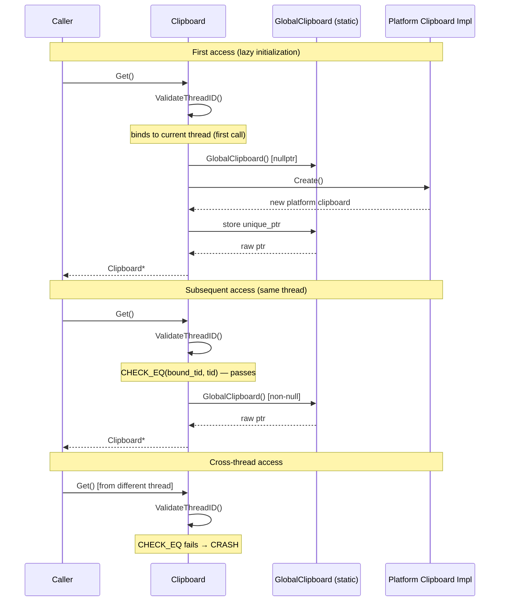
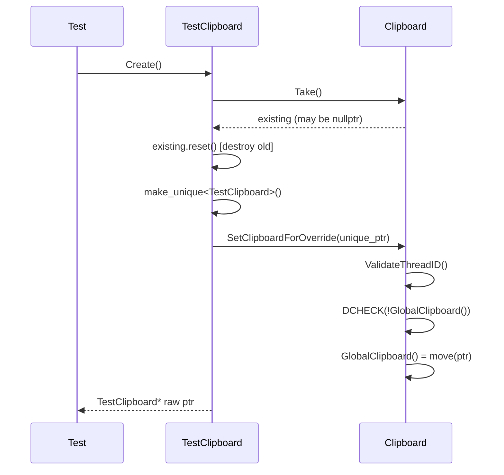
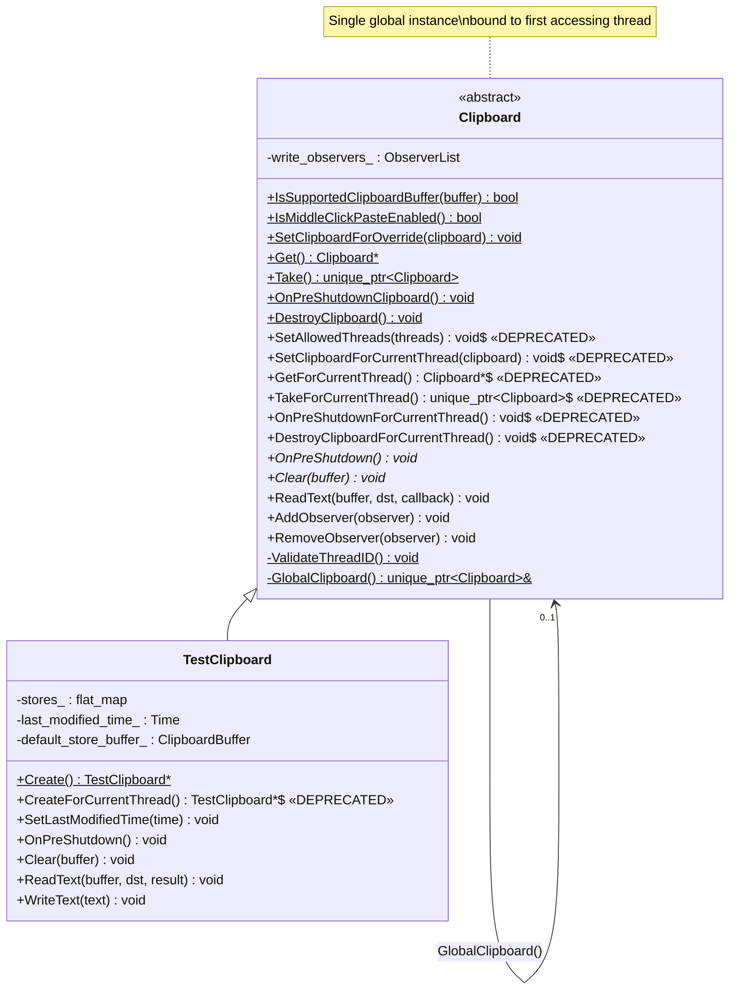
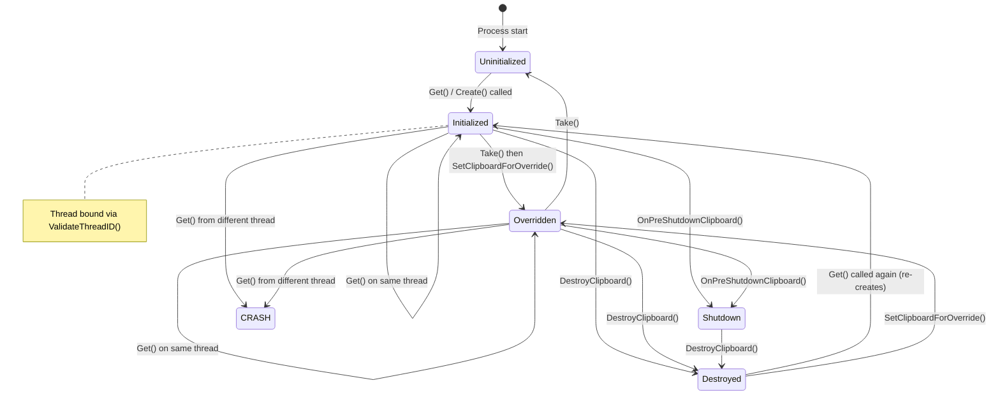

# Low-Level Design: CL 7602194 — [Clipboard] Make Clipboard a singleton with thread affinity

**CL URL:** https://chromium-review.googlesource.com/c/chromium/src/+/7602194
**Owner:** Hewro Hewei (ihewro@chromium.org)
**Status:** NEW (Code-Review +1 from skym@chromium.org)
**Bug:** 487117770

---

## 1. File-by-File Analysis

---

### 1.1 `ui/base/clipboard/clipboard.h`

**Purpose of changes**: Convert the `Clipboard` class API from a per-thread map model to a process-wide singleton with thread affinity. Introduces new singleton APIs and marks legacy per-thread APIs as deprecated.

**Key modifications**:
- Removed `#include "base/synchronization/lock.h"` (no longer needed — no lock-based synchronization).
- Added five new public static methods: `SetClipboardForOverride()`, `Get()`, `Take()`, `OnPreShutdownClipboard()`, `DestroyClipboard()`.
- Marked existing per-thread methods (`SetAllowedThreads`, `SetClipboardForCurrentThread`, `GetForCurrentThread`, `TakeForCurrentThread`, `OnPreShutdownForCurrentThread`, `DestroyClipboardForCurrentThread`) as `DEPRECATED`.
- Replaced private `GetAndValidateThreadID()` (returning `PlatformThreadId`) with `ValidateThreadID()` (returning `void`).
- Removed three private static helpers: `AllowedThreads()`, `ClipboardMapPtr()`, `ClipboardMapLock()` and the `ClipboardMap` type alias.
- Added single private static helper `GlobalClipboard()` returning `std::unique_ptr<Clipboard>&`.

**New/Modified Functions**:

| Function | Purpose | Parameters | Returns |
|----------|---------|------------|---------|
| `SetClipboardForOverride()` | Install a custom clipboard singleton (e.g. for testing) | `std::unique_ptr<Clipboard>` | `void` |
| `Get()` | Lazy-create and return the process-wide singleton | none | `Clipboard*` |
| `Take()` | Move-return ownership of the singleton to caller | none | `std::unique_ptr<Clipboard>` |
| `OnPreShutdownClipboard()` | Pre-shutdown hook for the singleton | none | `void` |
| `DestroyClipboard()` | Reset/destroy the singleton | none | `void` |
| `ValidateThreadID()` | Bind to first thread, CHECK on subsequent cross-thread access | none | `void` |
| `GlobalClipboard()` | Accessor for the `NoDestructor<unique_ptr<Clipboard>>` static | none | `std::unique_ptr<Clipboard>&` |

**Removed declarations**:

| Removed | Was |
|---------|-----|
| `GetAndValidateThreadID()` | `static PlatformThreadId` — validated thread against allowlist |
| `AllowedThreads()` | `static vector<PlatformThreadId>&` — per-thread allowlist |
| `ClipboardMapPtr()` | `static ClipboardMap*` — per-thread map of clipboard instances |
| `ClipboardMapLock()` | `static base::Lock&` — mutex guarding the map |
| `ClipboardMap` typedef | `base::flat_map<PlatformThreadId, unique_ptr<Clipboard>>` |

---

### 1.2 `ui/base/clipboard/clipboard.cc`

**Purpose of changes**: Replace the per-thread `ClipboardMap` + lock implementation with a single `NoDestructor<unique_ptr<Clipboard>>` global and bind-once thread affinity enforcement.

**Key modifications**:
- `SetAllowedThreads()` → body replaced with a no-op comment.
- `SetClipboardForCurrentThread()` → delegates to `SetClipboardForOverride()`.
- New `SetClipboardForOverride()` → validates thread, DCHECKs singleton is null, then moves the clipboard in.
- New `Get()` → validates thread, lazy-creates via `Clipboard::Create()` if null, returns raw pointer.
- `GetForCurrentThread()` → delegates to `Get()`.
- New `Take()` → validates thread, `std::move`s the singleton out.
- `TakeForCurrentThread()` → delegates to `Take()`.
- New `OnPreShutdownClipboard()` → validates thread, calls `OnPreShutdown()` if singleton exists.
- `OnPreShutdownForCurrentThread()` → delegates to `OnPreShutdownClipboard()`.
- New `DestroyClipboard()` → validates thread, `reset()`s the singleton.
- `DestroyClipboardForCurrentThread()` → delegates to `DestroyClipboard()`.
- `GetAndValidateThreadID()` replaced by `ValidateThreadID()`:
  - Uses two file-scope `static` locals (`bound_tid`, `is_bound`) to bind to the first accessing thread.
  - On first call: records `CurrentId()` as `bound_tid`, sets `is_bound = true`.
  - On subsequent calls: `CHECK_EQ(bound_tid, tid)` — crashes on cross-thread access.
- Removed `AllowedThreads()`, `ClipboardMapPtr()`, `ClipboardMapLock()` implementations.
- New `GlobalClipboard()` → `static base::NoDestructor<std::unique_ptr<Clipboard>>`.

**New/Modified Functions**:

| Function | Purpose | Parameters | Returns |
|----------|---------|------------|---------|
| `SetAllowedThreads()` | No-op for migration compatibility | `const vector<PlatformThreadId>&` | `void` |
| `SetClipboardForOverride()` | Install override singleton, DCHECKs not already set | `unique_ptr<Clipboard>` | `void` |
| `Get()` | Lazy-init + return singleton | none | `Clipboard*` |
| `Take()` | Move-return singleton, leaves null | none | `unique_ptr<Clipboard>` |
| `OnPreShutdownClipboard()` | Calls `OnPreShutdown()` on singleton if present | none | `void` |
| `DestroyClipboard()` | Resets singleton to null | none | `void` |
| `ValidateThreadID()` | Bind-once thread check with `CHECK_EQ` | none | `void` |
| `GlobalClipboard()` | Returns ref to static `NoDestructor<unique_ptr>` | none | `unique_ptr<Clipboard>&` |

**Data Flow**:



---

### 1.3 `ui/base/clipboard/test/test_clipboard.h`

**Purpose of changes**: Add new `TestClipboard::Create()` static method and mark `CreateForCurrentThread()` as deprecated.

**Key modifications**:
- Added `static TestClipboard* Create()` declaration with documentation.
- Added `DEPRECATED` comment above `CreateForCurrentThread()`.

**New/Modified Functions**:

| Function | Purpose | Parameters | Returns |
|----------|---------|------------|---------|
| `Create()` | Creates and installs a `TestClipboard` as the singleton override | none | `TestClipboard*` |

---

### 1.4 `ui/base/clipboard/test/test_clipboard.cc`

**Purpose of changes**: Implement `TestClipboard::Create()` using the new singleton API, and have `CreateForCurrentThread()` delegate to it.

**Key modifications**:
- New `TestClipboard::Create()`:
  1. Calls `Clipboard::Take()` to remove any existing singleton (handles browser test pre-initialization).
  2. Resets the taken pointer immediately.
  3. Creates `std::make_unique<TestClipboard>()`.
  4. Stores raw pointer for return.
  5. Calls `Clipboard::SetClipboardForOverride()` to install.
- `CreateForCurrentThread()` → now delegates to `Create()`.
- Removed direct access to `ClipboardMapLock()` and `ClipboardMapPtr()` (former `friend` access).

**Data Flow**:



---

### 1.5 `ui/base/clipboard/test/test_clipboard_unittest.cc`

**Purpose of changes**: Update test traits to use the new singleton APIs instead of deprecated per-thread APIs.

**Key modifications**:
- `TestClipboardTraits::Create()`: Changed from `TestClipboard::CreateForCurrentThread()` → `TestClipboard::Create()`.
- `TestClipboardTraits::Destroy()`: Changed from `Clipboard::GetForCurrentThread()` → `Clipboard::Get()`, and `Clipboard::DestroyClipboardForCurrentThread()` → `Clipboard::DestroyClipboard()`.

**New/Modified Functions**:

| Function | Purpose | Parameters | Returns |
|----------|---------|------------|---------|
| `TestClipboardTraits::Create()` | Test factory using new API | none | `Clipboard*` |
| `TestClipboardTraits::Destroy()` | Test teardown using new API | `Clipboard*` | `void` |

---

### 1.6 `ui/android/javatests/src/org/chromium/ui/base/ClipboardAndroidTest.java`

**Purpose of changes**: Move `Clipboard.cleanupNativeForTesting()` to run on the UI thread, consistent with the new single-thread affinity requirement.

**Key modifications**:
- Moved `Clipboard.cleanupNativeForTesting()` from outside the `runOnUiThreadBlocking` lambda into the beginning of the lambda.
- This ensures the native clipboard cleanup runs on the UI thread (the thread bound to the singleton) rather than the test thread.

**Before**:
```java
public void tearDown() throws Exception {
    Clipboard.cleanupNativeForTesting();  // Called on test thread

    ThreadUtils.runOnUiThreadBlocking(() -> {
        // clipboard manager cleanup
    });
}
```

**After**:
```java
public void tearDown() throws Exception {
    ThreadUtils.runOnUiThreadBlocking(() -> {
        Clipboard.cleanupNativeForTesting();  // Now on UI thread
        // clipboard manager cleanup
    });
}
```

---

## 2. Class Diagram



---

## 3. State Diagram



---

## 4. Implementation Concerns

### 4.1 Thread Safety

| Concern | Analysis | Severity |
|---------|----------|----------|
| **`ValidateThreadID()` uses function-local statics** | `bound_tid` and `is_bound` are plain (non-atomic) `static` locals inside `ValidateThreadID()`. If two threads race to call `ValidateThreadID()` before either observes `is_bound == true`, both could bind, or one could read a torn `bound_tid`. The C++ standard guarantees thread-safe *initialization* of block-scope statics, but subsequent reads/writes to `is_bound` and `bound_tid` are **not** synchronized. | **Medium** — In practice the first call typically happens on the UI thread during startup, but the old code used a `base::Lock` precisely for this. A `std::atomic<bool>` + `std::atomic<PlatformThreadId>` or a single `std::once_flag` would be safer. |
| **`GlobalClipboard()` access is unsynchronized** | `NoDestructor<unique_ptr<Clipboard>>` is a single static. With the lock removed, if two threads theoretically reached `Get()` concurrently (bypassing the `ValidateThreadID` CHECK), they could both try to create the clipboard. The thread-affinity CHECK is the safety net but see above. | **Low** — guarded by `ValidateThreadID()` CHECK. |
| **`static bool is_bound` is never reset** | Once the clipboard thread is bound, there is no way to unbind. `DestroyClipboard()` does not reset `is_bound`. This means in tests that destroy and re-create the clipboard on a different thread, the `CHECK_EQ` will fire. | **Low** — Test infrastructure (e.g., `TestClipboard::Create()`) typically runs on the same thread. But could cause issues in complex test fixtures that switch threads between setup and teardown. |

### 4.2 Memory Management

| Concern | Analysis | Severity |
|---------|----------|----------|
| **`Take()` leaves `GlobalClipboard()` as nullptr** | After `Take()`, `Get()` will re-create via `Clipboard::Create()`. Callers of `Take()` must be aware that the singleton is gone. | **Low** — Intentional design. |
| **`TestClipboard::Create()` does `Take()` then `reset()` on separate lines** | `std::unique_ptr<Clipboard> existing = Clipboard::Take(); existing.reset();` — the `existing.reset()` is redundant since `existing` will be destroyed at scope exit. However, this is harmless and makes intent explicit. | **Informational** |
| **NoDestructor wrapping** | `NoDestructor<unique_ptr<Clipboard>>` means the `unique_ptr` itself is never destroyed, but its pointee can be `reset()`. This is the standard Chromium pattern for intentional leaks. | **None** — correct usage. |

### 4.3 Performance

| Concern | Analysis | Severity |
|---------|----------|----------|
| **Lock removal** | Removes `base::AutoLock` acquisition on every clipboard access. This is a minor performance improvement, especially on hot paths that read from the clipboard frequently. | **Positive** |
| **Static local branch** | `ValidateThreadID()` adds a branch (`if (!is_bound)`) on every call. This is trivially cheap. | **None** |

### 4.4 Maintainability

| Concern | Analysis | Severity |
|---------|----------|----------|
| **API duplication** | Six deprecated methods remain alongside six new methods, doubling the API surface. The commit message outlines follow-up CLs to migrate callers. | **Medium** — Acceptable for incremental migration but should be tracked to completion. |
| **`DEPRECATED` comments without `[[deprecated]]`** | The deprecated methods use comment-based deprecation markers rather than the C++ `[[deprecated]]` attribute. This means the compiler won't warn callers. | **Low** — Chromium style typically uses comments + planned removal rather than `[[deprecated]]` attribute. |

---

## 5. Suggestions for Improvement

### 5.1 Thread Safety of `ValidateThreadID()`

The bind-once logic in `ValidateThreadID()` uses non-atomic statics:

```cpp
static base::PlatformThreadId bound_tid;
static bool is_bound = false;
```

If two threads race to call `ValidateThreadID()` before `is_bound` is set to `true`, both could succeed. While the old code had a `base::Lock`, consider using `std::atomic<PlatformThreadId>` with a sentinel value (e.g., `kInvalidThreadId`) to make the bind-once pattern lock-free and race-free:

```cpp
void Clipboard::ValidateThreadID() {
  static std::atomic<base::PlatformThreadId> bound_tid{kInvalidThreadId};
  const auto tid = base::PlatformThread::CurrentId();
  auto expected = kInvalidThreadId;
  if (bound_tid.compare_exchange_strong(expected, tid)) {
    return;  // Successfully bound.
  }
  CHECK_EQ(expected, tid);
}
```

### 5.2 Redundant `existing.reset()` in `TestClipboard::Create()`

```cpp
std::unique_ptr<Clipboard> existing = Clipboard::Take();
existing.reset();  // Redundant — destroyed at end of scope anyway
```

This line can be simplified to:

```cpp
// Discard any existing singleton so SetClipboardForOverride() succeeds.
(void)Clipboard::Take();
```

### 5.3 Consider Adding a Reset Mechanism for `ValidateThreadID()` in Tests

Since `is_bound` is a function-local static that is never reset, tests that destroy the singleton and re-create it on a different thread will crash. Consider adding a test-only reset:

```cpp
// In clipboard.h (private, friend TestClipboard):
static void ResetThreadBindingForTesting();

// In clipboard.cc:
void Clipboard::ResetThreadBindingForTesting() {
  // Reset the bind-once state (test-only).
  // Implementation would require the statics to be file-scope rather than
  // function-local, or use a struct with a Reset method.
}
```

This would be useful for browser tests that initialize the clipboard on the browser UI thread but run test setup/teardown on a different thread.

### 5.4 Follow-Up Migration Tracking

The commit message lists four follow-up migration steps:

1. `TakeForCurrentThread` / `SetClipboardForCurrentThread` / `OnPreShutdownForCurrentThread` / `SetAllowedThreads`
2. `DestroyClipboardForCurrentThread`
3. `GetForCurrentThread`
4. `TestClipboard::CreateForCurrentThread`

**Recommendation**: File individual tracking bugs for each migration step with a clear owner and timeline. The duplicated API surface is a maintenance burden.

### 5.5 Documentation of Thread Binding Semantics

The class-level documentation should be updated to describe the new singleton + thread-affinity model explicitly, clarifying:
- That the clipboard binds to the first thread that accesses it.
- That cross-thread access will `CHECK`-fail (crash).
- That `DestroyClipboard()` does not unbind the thread (the same thread must be used for re-creation).

---

## 6. Summary of Data Structure Changes

### Before (Per-Thread Map Model)

```
┌─────────────────────────────────────────────────┐
│                 Static State                     │
│                                                  │
│  ClipboardMapLock() → base::Lock                │
│  ClipboardMapPtr() → flat_map<ThreadId, unique_ptr<Clipboard>> │
│  AllowedThreads()  → vector<ThreadId>           │
│                                                  │
│  Thread A ──► map[A] = ClipboardImpl_A          │
│  Thread B ──► map[B] = ClipboardImpl_B          │
│  (Each thread gets its own instance)            │
└─────────────────────────────────────────────────┘
```

### After (Singleton with Thread Affinity)

```
┌─────────────────────────────────────────────────┐
│                 Static State                     │
│                                                  │
│  GlobalClipboard() → unique_ptr<Clipboard>      │
│  ValidateThreadID::bound_tid → PlatformThreadId │
│  ValidateThreadID::is_bound  → bool             │
│                                                  │
│  All threads ──► single ClipboardImpl           │
│  (Only bound thread may access)                 │
└─────────────────────────────────────────────────┘
```

### Net Change
- **Removed**: `base::Lock`, `base::flat_map<PlatformThreadId, unique_ptr<Clipboard>>`, `vector<PlatformThreadId>` allowlist
- **Added**: Single `unique_ptr<Clipboard>`, two scalar statics (`bound_tid`, `is_bound`)
- **Result**: Simpler state, lower memory overhead, no lock contention, stricter thread enforcement
