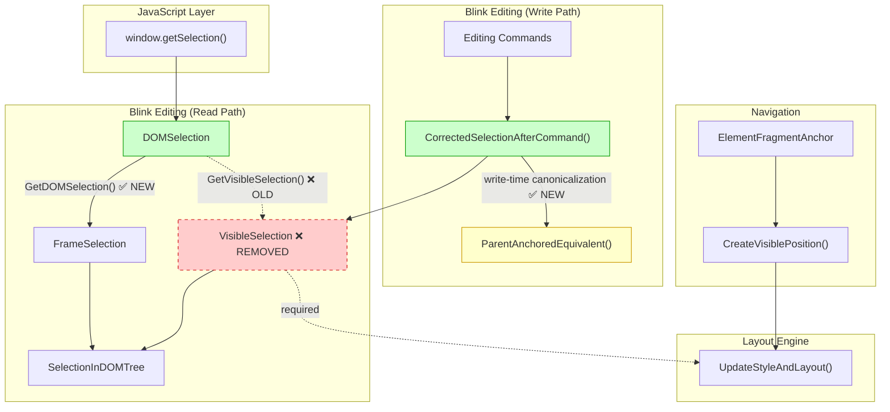
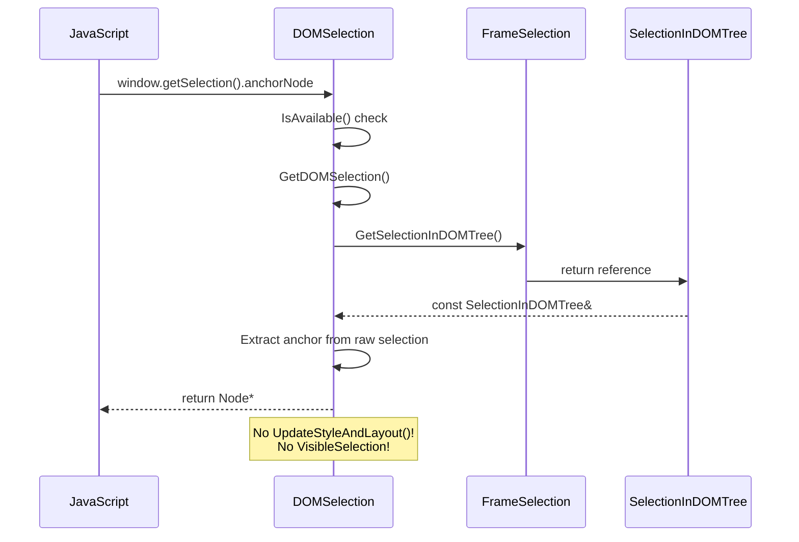
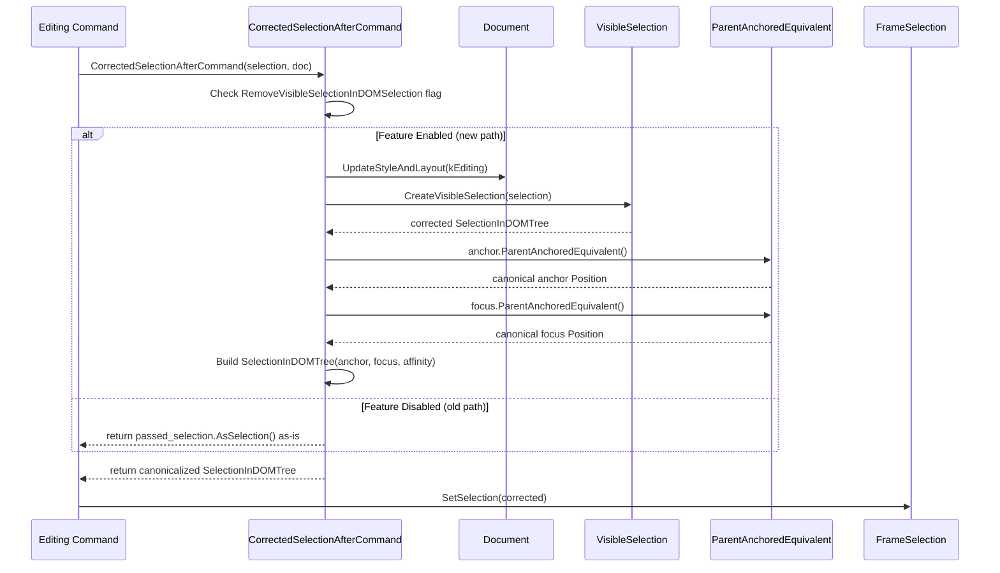
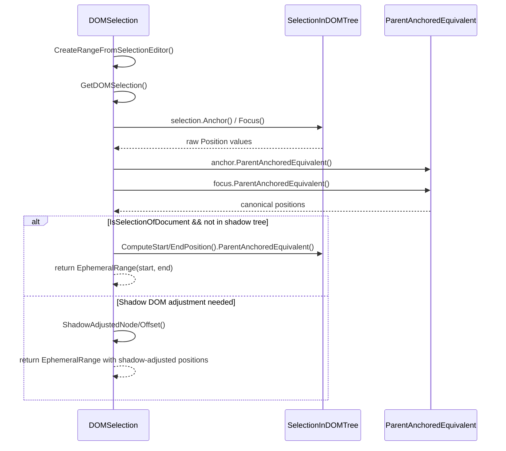
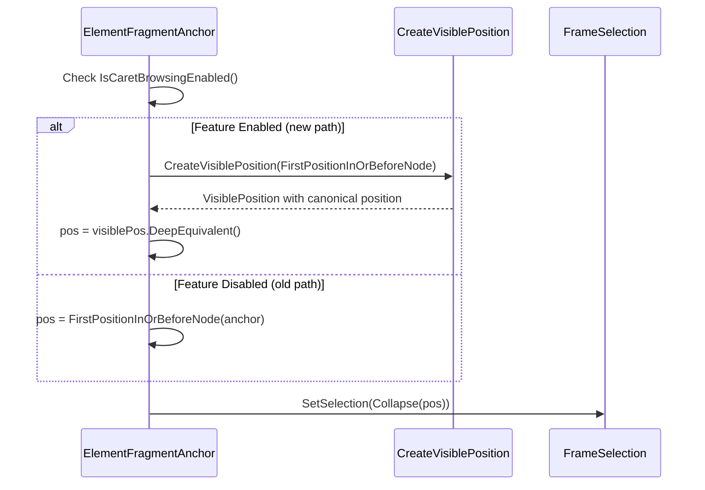

# High-Level Design: Make DOMSelection Not Use VisibleSelection

**CL:** [7602817](https://chromium-review.googlesource.com/c/chromium/src/+/7602817)
**Author:** Rohan Raja (roraja@microsoft.com)
**Status:** NEW (build failures on PS1)
**Bug:** [chromium:41311101](https://issues.chromium.org/issues/41311101)

---

## 1. Executive Summary

This CL refactors `DOMSelection` to eliminate its dependency on `VisibleSelection` for reading selection state. Previously, every access to selection properties (anchor, focus, range, type, etc.) through the `DOMSelection` API triggered `GetVisibleSelection()`, which called `UpdateStyleAndLayout()` — an expensive forced-layout operation — to canonicalize positions. This CL replaces that read-time canonicalization with a new `GetDOMSelection()` method that returns the raw `SelectionInDOMTree` directly, and moves the necessary position canonicalization (`ParentAnchoredEquivalent()`) to write-time inside `CorrectedSelectionAfterCommand()`. The change is gated behind the `RemoveVisibleSelectionInDOMSelection` feature flag (currently `status: "test"`) for safe rollback. This is expected to improve performance of JavaScript code that frequently queries `window.getSelection()` and fix an incorrect anchor-snapping behavior observed in the WPT `selection/anchor-removal` test.

---

## 2. Architecture Overview

### Affected Components

| Component | Path | Role |
|-----------|------|------|
| **DOMSelection** | `third_party/blink/renderer/core/editing/dom_selection.{h,cc}` | JavaScript-facing `Selection` API implementation |
| **Editing Commands Utilities** | `third_party/blink/renderer/core/editing/commands/editing_commands_utilities.cc` | Post-command selection correction logic |
| **Element Fragment Anchor** | `third_party/blink/renderer/core/page/scrolling/element_fragment_anchor.cc` | Caret browsing position for fragment navigation |
| **VisibleSelection** | `third_party/blink/renderer/core/editing/visible_selection.h` | Layout-dependent selection canonicalization (being removed from read path) |
| **FrameSelection** | `third_party/blink/renderer/core/editing/frame_selection.h` | Selection state manager for a frame |
| **SelectionInDOMTree** | `third_party/blink/renderer/core/editing/selection_template.h` | Layout-independent selection representation |

### Component Diagram



### Architectural Shift: Read-Time → Write-Time Canonicalization

**Before (Old Path):**
```
JS → DOMSelection.anchorNode()
  → GetVisibleSelection()
    → UpdateStyleAndLayout()          ← EXPENSIVE, on every read
    → ComputeVisibleSelectionInDOMTree()
      → VisibleSelection canonicalization
        → ParentAnchoredEquivalent()  ← position normalization
  → return canonicalized position
```

**After (New Path):**
```
JS → DOMSelection.anchorNode()
  → GetDOMSelection()                ← CHEAP, no layout
  → return raw SelectionInDOMTree position (already canonicalized at write time)

Editing Command completes →
  CorrectedSelectionAfterCommand()
    → CreateVisibleSelection()        ← layout here, at write time only
    → ParentAnchoredEquivalent()      ← canonicalize once
    → store canonicalized SelectionInDOMTree
```

---

## 3. Design Goals & Non-Goals

### Goals

1. **Eliminate forced layouts on selection reads:** Remove `UpdateStyleAndLayout()` calls from `DOMSelection` property accessors (`anchorNode`, `focusNode`, `type`, `rangeCount`, etc.) by not going through `VisibleSelection`.
2. **Fix anchor-snapping bug:** Correct the WPT `selection/anchor-removal` test failure where `anchorNode` was incorrectly snapping to a parent node due to `VisibleSelection` re-canonicalization at read time.
3. **Move canonicalization to write time:** Apply `ParentAnchoredEquivalent()` in `CorrectedSelectionAfterCommand()` so that stored selection positions are already in their canonical form.
4. **Safe rollback:** Gate all behavioral changes behind `RemoveVisibleSelectionInDOMSelection` feature flag.

### Non-Goals

- **Removing `VisibleSelection` entirely from Blink:** This CL only removes its use from `DOMSelection`; `VisibleSelection` is still used in many other editing subsystems.
- **Changing the Selection API contract:** The JavaScript-facing `Selection` API behavior should be unchanged (except for the bug fix).
- **Optimizing editing command execution:** The write-time canonicalization still uses `CreateVisibleSelection()` and `UpdateStyleAndLayout()`; this CL does not reduce work at write time.
- **Addressing all `UpdateStyleAndLayout` audit items:** The CL references `crbug.com/590369` but does not resolve all audit items — only those in `DOMSelection`.

---

## 4. System Interactions

### Main Flow: Selection Property Access (Read Path)



### Main Flow: Post-Command Selection Correction (Write Path)



### Range Creation Flow (CreateRangeFromSelectionEditor)



### Caret Browsing Fragment Navigation



---

## 5. API & Interface Changes

### Modified Interfaces

| Interface | Change | Details |
|-----------|--------|---------|
| `DOMSelection::GetVisibleSelection()` | **Replaced** → `GetDOMSelection()` | Returns `const SelectionInDOMTree&` instead of `VisibleSelection`. No layout forced. Private method. |
| `CorrectedSelectionAfterCommand()` | **Extended** | Now applies `ParentAnchoredEquivalent()` to anchor and focus when feature flag is enabled. |
| `DOMSelection::CreateRangeFromSelectionEditor()` | **Rewritten** | Uses `GetDOMSelection()` + `ParentAnchoredEquivalent()` instead of `GetVisibleSelection()` + `FirstEphemeralRangeOf()`. |

### Signature Changes

```cpp
// OLD (removed):
VisibleSelection DOMSelection::GetVisibleSelection() const;

// NEW (added):
const SelectionInDOMTree& DOMSelection::GetDOMSelection() const;
```

### No Public API Changes

The JavaScript-facing `Selection` API (`anchorNode`, `focusNode`, `getRangeAt()`, `type`, `rangeCount`, etc.) remains unchanged. All changes are internal to the Blink rendering engine.

---

## 6. Dependencies

### What This Code Depends On

| Dependency | Usage |
|------------|-------|
| `SelectionInDOMTree` / `SelectionTemplate` | Core selection representation returned by the new `GetDOMSelection()` |
| `Position::ParentAnchoredEquivalent()` | Position canonicalization moved to write-time |
| `CreateVisibleSelection()` | Still used in `CorrectedSelectionAfterCommand()` for initial canonicalization |
| `VisiblePosition` / `CreateVisiblePosition()` | Used in new caret browsing path in `element_fragment_anchor.cc` |
| `RuntimeEnabledFeatures::RemoveVisibleSelectionInDOMSelectionEnabled()` | Feature flag gating all behavioral changes |
| `FrameSelection::GetSelectionInDOMTree()` | Direct access to raw selection state |

### What Depends on This Code

| Dependent | Impact |
|-----------|--------|
| **All JavaScript code using `window.getSelection()`** | Performance improvement (fewer forced layouts) |
| **Editing commands** (e.g., `ApplyBlockElementCommand`, `InsertParagraphSeparatorCommand`) | Selection positions after commands may differ in their internal representation (before-table vs inside-table) |
| **WPT tests** (`selection/anchor-removal`) | Previously failing test now passes (expected-file deleted) |
| **Drag-and-drop handling** | Selection text position changes slightly (`'Dragme|'` → `'Dragme</span>|'`) |
| **Caret browsing** | Fragment anchor navigation canonicalizes differently when flag is enabled |

### Version/Compatibility

- Feature flag `RemoveVisibleSelectionInDOMSelection` is set to `status: "test"` — enabled only in testing, not in stable/beta.
- Changes are backward compatible when the flag is disabled (old code paths preserved).

---

## 7. Risks & Mitigations

### Risk 1: Build Failures (ACTIVE)

**Status:** ⚠️ CL currently fails to compile on both Mac and Windows trybots.

**Root Cause:** Linker errors for `CorrectedSelectionAfterCommand` and `SelectionForUndoStep::From` — the test file `editing_commands_utilities_test.cc` references these symbols but the test target's BUILD.gn does not link the necessary object files.

**Error:**
```
ld64.lld: error: undefined symbol: blink::CorrectedSelectionAfterCommand(...)
lld-link: error: undefined symbol: blink::SelectionForUndoStep::From(...)
```

**Mitigation:** Add the missing dependency (`selection_for_undo_step.cc` or its corresponding build target) to the test's `BUILD.gn` deps. This is a build configuration issue, not a design issue.

### Risk 2: Position Canonicalization Correctness

**Risk:** Moving canonicalization from read-time to write-time means that if any write path fails to canonicalize, the stored position may be incorrect. The old design was resilient because canonicalization happened at every read.

**Mitigation:**
- `CorrectedSelectionAfterCommand()` applies `ParentAnchoredEquivalent()` after `CreateVisibleSelection()`.
- `CreateRangeFromSelectionEditor()` applies `ParentAnchoredEquivalent()` directly on raw positions.
- `element_fragment_anchor.cc` uses `CreateVisiblePosition()` to canonicalize caret-browsing positions.
- All changes gated behind feature flag for rollback.

### Risk 3: Shadow DOM Edge Cases

**Risk:** The rewritten `CreateRangeFromSelectionEditor()` handles shadow DOM differently — it now checks both anchor and focus for shadow tree membership before taking the "simple" path.

**Mitigation:** The shadow-adjusted path still uses `ShadowAdjustedNode()` / `ShadowAdjustedOffset()` for positions crossing shadow boundaries. New null checks added for `focus_node` in the shadow path.

### Risk 4: Behavioral Changes in Selection Position Reporting

**Risk:** Three existing tests change expected output:
- `ApplyBlockElementCommandTest`: Caret position moves from inside `<table>` to before it (`<table>|</table>` → `|<table></table>`)
- `InsertParagraphSeparatorCommandTest`: Same pattern
- `drag_and_drop_into_removed_on_focus.html`: Caret moves from inside `<span>` to after it

These indicate observable behavior changes in where the caret is reported after editing commands.

**Mitigation:** The new positions are arguably more correct (caret before a block element rather than inside it). The WPT `anchor-removal` test fix confirms the new behavior matches the spec. Feature flag enables rollback if regressions are found.

### Risk 5: Missing Write-Time Canonicalization Paths

**Risk:** Not all selection-setting code paths go through `CorrectedSelectionAfterCommand()`. Direct calls to `FrameSelection::SetSelection()` from non-editing-command code would store uncanonicalized positions.

**Mitigation:** `DOMSelection::CreateRangeFromSelectionEditor()` applies its own `ParentAnchoredEquivalent()` as a safety net. However, property accessors like `anchorNode()` return the raw position — if a non-command path sets a position like `Position(table, 0)`, `anchorNode()` would return the `table` element directly rather than the parent.

---

## 8. Testing Strategy

### Unit Tests Added

| Test File | Test Name | What It Tests |
|-----------|-----------|---------------|
| `editing_commands_utilities_test.cc` | `CorrectedSelectionAppliesParentAnchoredEquivalent` | Verifies `CorrectedSelectionAfterCommand()` converts `Position(table, 0)` to `Position(parent, tableIndex)` via `ParentAnchoredEquivalent()` |
| `editing_commands_utilities_test.cc` | `CorrectedSelectionAtEndOfTable` | Verifies position at end of table (`Position(table, childCount)`) is converted to `Position(parent, tableIndex+1)` |
| `dom_selection_test.cc` | `RangeCountForNoneSelection` | `rangeCount()` returns 0 for cleared selection via new path |
| `dom_selection_test.cc` | `RangeCountForCaretSelection` | `rangeCount()` returns 1 for caret selection |
| `dom_selection_test.cc` | `TypeReturnsCaret` | `type()` returns "Caret" via `GetDOMSelection().IsCaret()` |
| `dom_selection_test.cc` | `TypeReturnsRange` | `type()` returns "Range" for range selection |
| `dom_selection_test.cc` | `TypeReturnsNone` | `type()` returns "None" for cleared selection |
| `dom_selection_test.cc` | `ContainsNodeWithRangeSelection` | `containsNode()` works via `GetDOMSelection().ComputeRange()` |
| `dom_selection_test.cc` | `DeleteFromDocumentWithRangeSelection` | `deleteFromDocument()` works via new path |
| `dom_selection_test.cc` | `GetRangeAtWithSimpleSelection` | `getRangeAt()` works through rewritten `CreateRangeFromSelectionEditor()` |
| `dom_selection_test.cc` | `CaretPositionBeforeTableAfterEditCommand` | Caret near table is correctly reported via write-time canonicalization |

### Updated Test Expectations

| Test File | Change |
|-----------|--------|
| `apply_block_element_command_test.cc` | Expected caret position changes: inside table → before table (2 tests) |
| `insert_paragraph_separator_command_test.cc` | Expected caret position changes: inside table → before table |
| `drag_and_drop_into_removed_on_focus.html` | Expected caret moves from inside `<span>` to after it |

### WPT Test Fix

| File | Change |
|------|--------|
| `selection/anchor-removal-expected.txt` | **Deleted** — the previously-failing WPT test now passes, so the failure expectation file is removed |

### Test Coverage Gaps

1. **⚠️ Build not passing:** The new tests in `editing_commands_utilities_test.cc` cause linker errors (missing deps in BUILD.gn). This must be fixed before the tests can run.
2. **Shadow DOM interactions:** No new tests for cross-shadow-boundary selection with the new `CreateRangeFromSelectionEditor()` path.
3. **Performance benchmarks:** No performance tests to quantify the expected layout-avoidance improvement. Would benefit from a Blink perf test measuring `getSelection()` property access cost.
4. **Caret browsing:** No tests for the new `element_fragment_anchor.cc` path with the feature flag enabled.

---

## Appendix: File-by-File Change Summary

| File | Lines | Summary |
|------|-------|---------|
| [`dom_selection.h`](/workspace/cr/src/third_party/blink/renderer/core/editing/dom_selection.h) | +3/-1 | Replace `GetVisibleSelection()` declaration with `GetDOMSelection()` returning `const SelectionInDOMTree&` |
| [`dom_selection.cc`](/workspace/cr/src/third_party/blink/renderer/core/editing/dom_selection.cc) | +41/-31 | Replace all `GetVisibleSelection()` and `Selection().GetSelectionInDOMTree()` calls with `GetDOMSelection()`; rewrite `CreateRangeFromSelectionEditor()`; use `ComputeRange()` instead of `ToNormalizedEphemeralRange()` |
| [`editing_commands_utilities.cc`](/workspace/cr/src/third_party/blink/renderer/core/editing/commands/editing_commands_utilities.cc) | +17/-1 | Extend `CorrectedSelectionAfterCommand()` to apply `ParentAnchoredEquivalent()` on anchor/focus when flag enabled |
| [`editing_commands_utilities_test.cc`](/workspace/cr/src/third_party/blink/renderer/core/editing/commands/editing_commands_utilities_test.cc) | +83/-0 | Add 2 tests for write-time `ParentAnchoredEquivalent()` canonicalization |
| [`dom_selection_test.cc`](/workspace/cr/src/third_party/blink/renderer/core/editing/dom_selection_test.cc) | +175/-0 | Add 9 tests covering DOMSelection methods through the new `GetDOMSelection()` path |
| [`element_fragment_anchor.cc`](/workspace/cr/src/third_party/blink/renderer/core/page/scrolling/element_fragment_anchor.cc) | +11/-1 | Add `CreateVisiblePosition()` canonicalization for caret browsing when flag enabled |
| [`apply_block_element_command_test.cc`](/workspace/cr/src/third_party/blink/renderer/core/editing/commands/apply_block_element_command_test.cc) | +2/-2 | Update expected caret positions (before table instead of inside) |
| [`insert_paragraph_separator_command_test.cc`](/workspace/cr/src/third_party/blink/renderer/core/editing/commands/insert_paragraph_separator_command_test.cc) | +2/-2 | Update expected caret position (before table instead of inside) |
| [`drag_and_drop_into_removed_on_focus.html`](/workspace/cr/src/third_party/blink/web_tests/fast/events/drag_and_drop_into_removed_on_focus.html) | +1/-1 | Update expected selection text (after `</span>` instead of inside) |
| [`anchor-removal-expected.txt`](/workspace/cr/src/third_party/blink/web_tests/external/wpt/selection/anchor-removal-expected.txt) | -5 | Delete failure expectation — WPT test now passes |
