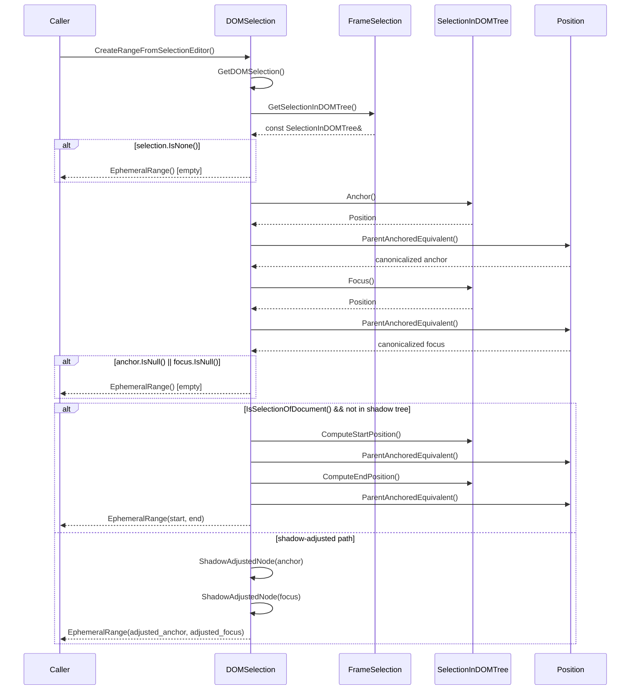
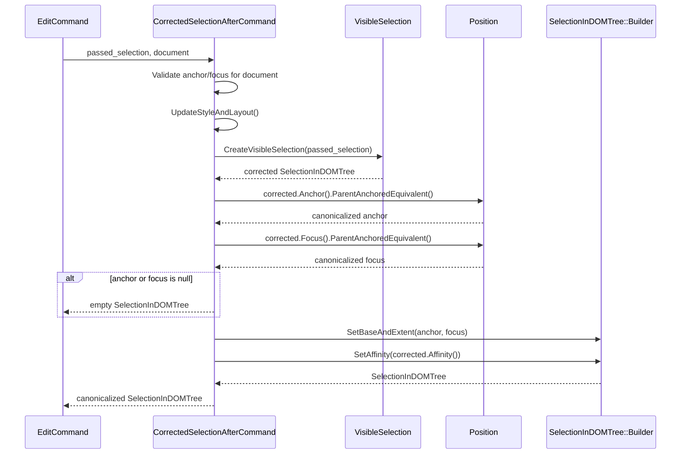
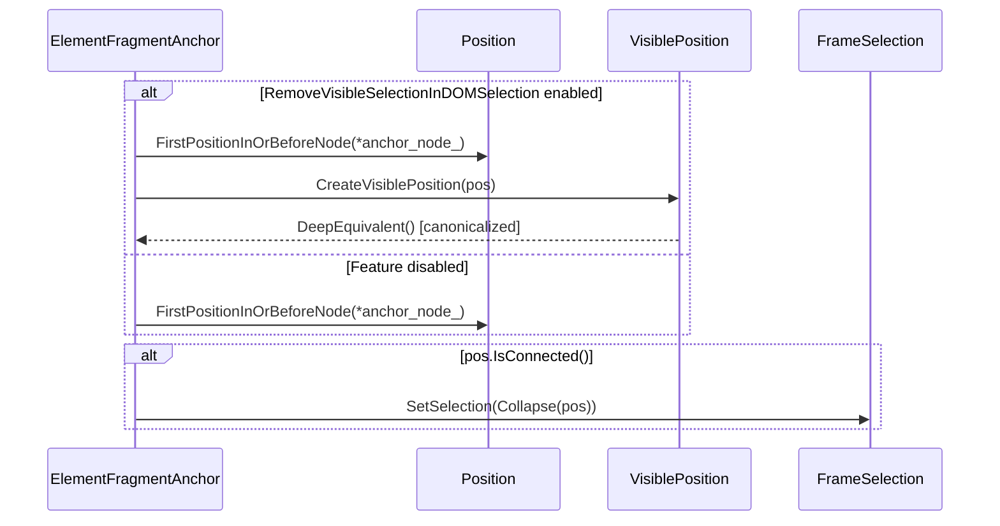
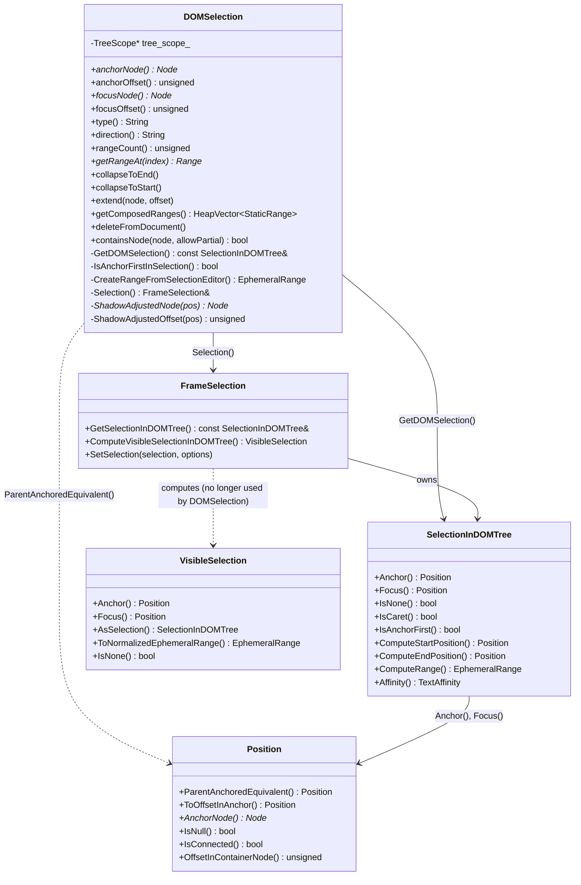
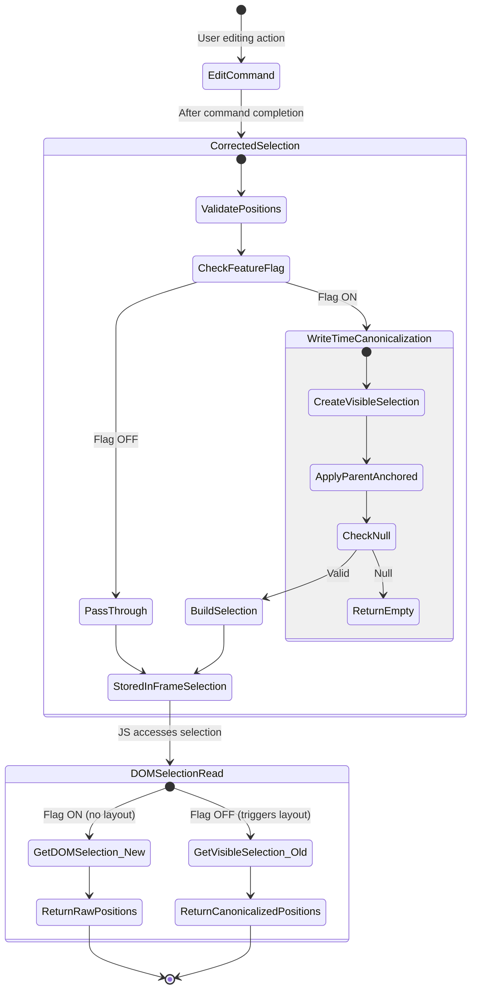

# Low-Level Design Document: CL 7602817

## CL: Make DOMSelection not use VisibleSelection

**CL URL:** https://chromium-review.googlesource.com/c/chromium/src/+/7602817  
**Author:** Rohan Raja (roraja@microsoft.com)  
**Status:** NEW (build failures on PS1)  
**Total Changes:** 10 files, +335/-44 lines  
**Feature Flag:** `RemoveVisibleSelectionInDOMSelection`

---

## Executive Summary

This CL refactors `DOMSelection` to eliminate its dependency on `VisibleSelection`, which performs expensive `UpdateStyleAndLayout` calls on every selection property access. The core architectural change moves **position canonicalization** from **read-time** (in `DOMSelection` via `GetVisibleSelection()`) to **write-time** (in `CorrectedSelectionAfterCommand()`). A new method `GetDOMSelection()` returns the raw `SelectionInDOMTree&` directly from `FrameSelection` without triggering layout.

---

## 1. File-by-File Analysis

### 1.1 dom_selection.h

**Purpose of changes:** Replace the `GetVisibleSelection()` private method with `GetDOMSelection()` returning a const reference to `SelectionInDOMTree` instead of a by-value `VisibleSelection`.

**Key modifications:**
- Removed: `VisibleSelection GetVisibleSelection() const;`
- Added: `const SelectionInDOMTree& GetDOMSelection() const;`
- Updated comment to document that raw positions are returned without canonicalization

**New/Modified Functions:**

| Function | Purpose | Parameters | Returns |
|----------|---------|------------|---------|
| `GetDOMSelection()` (new) | Returns raw selection without canonicalization or layout forcing | `const` (no params) | `const SelectionInDOMTree&` |
| `GetVisibleSelection()` (removed) | Was computing VisibleSelection with layout update | `const` (no params) | `VisibleSelection` (by value) |

**API Change Detail:**
- **Before:** `GetVisibleSelection()` returned `VisibleSelection` by value, triggering `UpdateStyleAndLayout()` internally.
- **After:** `GetDOMSelection()` returns `const SelectionInDOMTree&` by reference, no layout update, no canonicalization. This is a significant semantic change — callers now receive raw positions.

---

### 1.2 dom_selection.cc

**Purpose of changes:** Replace all internal uses of `GetVisibleSelection()` and `Selection().GetSelectionInDOMTree()` with the new `GetDOMSelection()`. Rewrite `CreateRangeFromSelectionEditor()` to work with raw positions. Replace `ComputeVisibleSelectionInDOMTree().ToNormalizedEphemeralRange()` with `GetDOMSelection().ComputeRange()`.

**Key modifications:**
- `GetDOMSelection()` implementation: simple delegation to `Selection().GetSelectionInDOMTree()`
- `IsAnchorFirstInSelection()`: now calls `GetDOMSelection().IsAnchorFirst()` instead of `Selection().GetSelectionInDOMTree().IsAnchorFirst()`
- `type()`: uses `GetDOMSelection().IsCaret()` instead of `Selection().GetSelectionInDOMTree().IsCaret()`; added braces for consistency
- `direction()`: uses `GetDOMSelection().IsCaret()` and `GetDOMSelection().IsNone()` instead of `Selection().GetSelectionInDOMTree().IsCaret()` and `Selection().ComputeVisibleSelectionInDOMTree().IsNone()`
- `rangeCount()`: uses `GetDOMSelection().IsNone()` instead of `Selection().ComputeVisibleSelectionInDOMTree().IsNone()` — **eliminates a layout-forcing call**
- `collapseToEnd()` / `collapseToStart()`: uses `GetDOMSelection().ComputeEndPosition()` / `GetDOMSelection().ComputeStartPosition()`
- `extend()`: uses `GetDOMSelection().Anchor().ToOffsetInAnchor()`
- `getComposedRanges()`: uses `GetDOMSelection()` instead of `Selection().GetSelectionInDOMTree()`
- `CreateRangeFromSelectionEditor()`: **completely rewritten** (see detailed analysis below)
- `deleteFromDocument()`: uses `GetDOMSelection().ComputeRange()` instead of `ComputeVisibleSelectionInDOMTree().ToNormalizedEphemeralRange()`
- `containsNode()`: uses `GetDOMSelection().ComputeRange()` instead of `ComputeVisibleSelectionInDOMTree().ToNormalizedEphemeralRange()`

**New/Modified Functions:**

| Function | Purpose | Parameters | Returns |
|----------|---------|------------|---------|
| `GetDOMSelection()` | Delegates to `Selection().GetSelectionInDOMTree()` | none | `const SelectionInDOMTree&` |
| `CreateRangeFromSelectionEditor()` | Creates EphemeralRange from raw positions with manual `ParentAnchoredEquivalent()` | `const` | `EphemeralRange` |
| `rangeCount()` | Now avoids layout-forcing VisibleSelection computation | `const` | `unsigned` |
| `deleteFromDocument()` | Uses `ComputeRange()` instead of `ToNormalizedEphemeralRange()` | none | `void` |
| `containsNode()` | Uses `ComputeRange()` instead of `ToNormalizedEphemeralRange()` | `const Node*, bool` | `bool` |

**Detailed Analysis of `CreateRangeFromSelectionEditor()` Rewrite:**

**Before (old code):**
```cpp
EphemeralRange DOMSelection::CreateRangeFromSelectionEditor() const {
  const VisibleSelection& selection = GetVisibleSelection();  // triggers layout
  const Position& anchor = selection.Anchor().ParentAnchoredEquivalent();
  if (IsSelectionOfDocument() && !anchor.AnchorNode()->IsInShadowTree())
    return FirstEphemeralRangeOf(selection);  // uses VisibleSelection canonicalization
  // shadow-adjusted path...
}
```

**After (new code):**
```cpp
EphemeralRange DOMSelection::CreateRangeFromSelectionEditor() const {
  const SelectionInDOMTree& selection = GetDOMSelection();  // no layout
  if (selection.IsNone()) return EphemeralRange();           // early out
  const Position anchor = selection.Anchor().ParentAnchoredEquivalent();
  const Position focus = selection.Focus().ParentAnchoredEquivalent();
  if (anchor.IsNull() || focus.IsNull()) return EphemeralRange();  // null safety
  if (IsSelectionOfDocument() && !anchor.AnchorNode()->IsInShadowTree()
      && !focus.AnchorNode()->IsInShadowTree()) {
    // Manual start/end computation with ParentAnchoredEquivalent
    const Position start = selection.ComputeStartPosition().ParentAnchoredEquivalent();
    const Position end = selection.ComputeEndPosition().ParentAnchoredEquivalent();
    if (start.IsNull() || end.IsNull()) return EphemeralRange();
    return EphemeralRange(start, end);
  }
  // shadow-adjusted path with focus_node null check added...
}
```

**Data Flow (CreateRangeFromSelectionEditor):**



---

### 1.3 editing_commands_utilities.cc

**Purpose of changes:** Add `ParentAnchoredEquivalent()` canonicalization at write time in `CorrectedSelectionAfterCommand()`, since `DOMSelection` no longer performs canonicalization at read time.

**Key modifications:**
- When `RemoveVisibleSelectionInDOMSelectionEnabled()`, the function now:
  1. Still creates a `VisibleSelection` for DOM-level canonicalization
  2. Extracts anchor/focus from the corrected selection
  3. **NEW:** Applies `ParentAnchoredEquivalent()` to both anchor and focus
  4. **NEW:** Checks for null positions after conversion
  5. Builds a new `SelectionInDOMTree` with the canonicalized positions

**New/Modified Functions:**

| Function | Purpose | Parameters | Returns |
|----------|---------|------------|---------|
| `CorrectedSelectionAfterCommand()` | Now applies `ParentAnchoredEquivalent()` at write time when feature flag is on | `const SelectionForUndoStep&, Document*` | `SelectionInDOMTree` |

**Before:**
```cpp
return CreateVisibleSelection(passed_selection.AsSelection()).AsSelection();
```

**After:**
```cpp
const SelectionInDOMTree& corrected =
    CreateVisibleSelection(passed_selection.AsSelection()).AsSelection();
const Position anchor = corrected.Anchor().ParentAnchoredEquivalent();
const Position focus = corrected.Focus().ParentAnchoredEquivalent();
if (anchor.IsNull() || focus.IsNull()) return SelectionInDOMTree();
return SelectionInDOMTree::Builder()
    .SetBaseAndExtent(anchor, focus)
    .SetAffinity(corrected.Affinity())
    .Build();
```

**Data Flow (CorrectedSelectionAfterCommand — feature enabled):**



---

### 1.4 editing_commands_utilities_test.cc

**Purpose of changes:** Add unit tests verifying that `CorrectedSelectionAfterCommand()` applies `ParentAnchoredEquivalent()` to table-internal positions.

**Key modifications:**
- Added include for `selection_for_undo_step.h`, `position.h`, `selection_template.h`
- Added test `CorrectedSelectionAppliesParentAnchoredEquivalent`: verifies `Position(table, 0)` → `Position(container, tableIndex)`
- Added test `CorrectedSelectionAtEndOfTable`: verifies `Position(table, childCount)` → `Position(container, tableIndex+1)`

**New/Modified Functions:**

| Test | Purpose | Validates |
|------|---------|-----------|
| `CorrectedSelectionAppliesParentAnchoredEquivalent` | Table-internal position at start is lifted to parent | anchor becomes container with offset = table's index |
| `CorrectedSelectionAtEndOfTable` | Table-internal position at end is lifted to parent | anchor becomes container with offset = table's index + 1 |

---

### 1.5 element_fragment_anchor.cc

**Purpose of changes:** Handle caret browsing position canonicalization at write time since the read path no longer performs it.

**Key modifications:**
- Added `#include "visible_position.h"`
- When `RemoveVisibleSelectionInDOMSelectionEnabled()`, wraps `Position::FirstPositionInOrBeforeNode()` in `CreateVisiblePosition().DeepEquivalent()` to canonicalize the position before storing it
- Without the feature flag, behavior is unchanged (uses raw `FirstPositionInOrBeforeNode`)

**New/Modified Functions:**

| Function | Purpose | Parameters | Returns |
|----------|---------|------------|---------|
| `ElementFragmentAnchor::InvokeSelector()` (modified block) | Caret browsing position now canonicalized at write time | n/a | n/a |

**Data Flow:**



---

### 1.6 apply_block_element_command_test.cc

**Purpose of changes:** Update expected test outputs to reflect the new write-time canonicalization behavior.

**Key modifications:**
- Test expectation changed from `<pre><table>|</table></pre>` to `<pre>|<table></table></pre>` — the caret position is now **before** the table (in parent) rather than **inside** the table element
- Test expectation changed from `<svg><foreignObject><table>| </table></foreignObject></svg>` to `<svg><foreignObject>|<table> </table></foreignObject></svg>` — same pattern, caret lifted to parent

**Behavioral Change:** With `ParentAnchoredEquivalent()` applied at write time, `Position(table, 0)` becomes `Position(parent, tableIndex)`, so the caret indicator `|` moves from inside the table to before it in the parent.

---

### 1.7 insert_paragraph_separator_command_test.cc

**Purpose of changes:** Update expected test output to reflect new caret position canonicalization.

**Key modifications:**
- Changed from `<table contenteditable>|` to `|<table contenteditable>` — caret moves from inside to before the table element

---

### 1.8 dom_selection_test.cc

**Purpose of changes:** Add comprehensive unit tests for the refactored `DOMSelection` methods using `GetDOMSelection()`.

**Key modifications:**
- Added `#include "position.h"`
- 8 new test cases covering:

| Test | Purpose |
|------|---------|
| `RangeCountForNoneSelection` | Verifies `rangeCount()` returns 0 for cleared selection using `GetDOMSelection()` path |
| `RangeCountForCaretSelection` | Verifies `rangeCount()` returns 1 for a caret selection |
| `TypeReturnsCaret` | Verifies `type()` returns `"Caret"` using `GetDOMSelection().IsCaret()` |
| `TypeReturnsRange` | Verifies `type()` returns `"Range"` for range selection |
| `TypeReturnsNone` | Verifies `type()` returns `"None"` for cleared selection |
| `ContainsNodeWithRangeSelection` | Verifies `containsNode()` works with `GetDOMSelection().ComputeRange()` |
| `DeleteFromDocumentWithRangeSelection` | Verifies `deleteFromDocument()` works with new code path |
| `GetRangeAtWithSimpleSelection` | Verifies `getRangeAt()` works through rewritten `CreateRangeFromSelectionEditor()` |
| `CaretPositionBeforeTableAfterEditCommand` | Verifies caret near table uses write-time canonicalization |

---

### 1.9 anchor-removal-expected.txt (Deleted)

**Purpose of changes:** Remove the WPT test expectation file that recorded a known failure. The `anchor-removal` test was failing because `anchorNode` was snapping incorrectly. With this CL's changes, the test now passes, so the failure expectation file is deleted.

**Behavioral Fix:** Previously, `GetVisibleSelection()` re-canonicalized positions at read time, causing `anchorNode` to snap to a child text node instead of the parent div. Now with raw positions from `GetDOMSelection()`, the correct parent node is returned.

---

### 1.10 drag_and_drop_into_removed_on_focus.html

**Purpose of changes:** Update expected selection text to reflect new caret position with `ParentAnchoredEquivalent()`.

**Key modifications:**
- Changed from `'<span>Dragme|</span>'` to `'<span>Dragme</span>|'` — caret moves from inside the span to after it in the parent

---

## 2. Class Diagram



---

## 3. State Diagram — Canonicalization Flow



---

## 4. Implementation Concerns

### 4.1 Memory Management Issues

- **Reference lifetime in `GetDOMSelection()`:** Returns `const SelectionInDOMTree&` — safe as long as `FrameSelection` outlives the usage. All current callers use the reference within method scope, so this is safe. However, storing this reference across operations that might modify the selection would be dangerous.
- **`Position` copies in `CreateRangeFromSelectionEditor()`:** `ParentAnchoredEquivalent()` returns by value, and positions are correctly stored as local `const Position` values. No lifetime issues.

### 4.2 Thread Safety Concerns

- No new threading concerns. All changes are on the main thread (Blink rendering). `DOMSelection` is main-thread-only.

### 4.3 Performance Implications

- **Positive:** Removing `UpdateStyleAndLayout()` calls from `GetVisibleSelection()` eliminates forced layouts on every `DOMSelection` property access (`anchorNode`, `anchorOffset`, `focusNode`, `focusOffset`, `type`, `rangeCount`, etc.). This is a significant performance win for JS-heavy selection APIs.
- **Neutral:** `CorrectedSelectionAfterCommand()` adds `ParentAnchoredEquivalent()` calls at write time, but this was already happening at read time and write time is less frequent than read time.
- **Concern — Double canonicalization:** In `CorrectedSelectionAfterCommand()`, the code creates a `VisibleSelection` (which internally canonicalizes) and then additionally applies `ParentAnchoredEquivalent()`. This is two levels of canonicalization. The `VisibleSelection` canonicalization was already present (the old code did `CreateVisibleSelection(...).AsSelection()`), but `ParentAnchoredEquivalent()` is additive. This should be verified for correctness with edge cases like positions inside replaced elements.
- **Concern — `CreateRangeFromSelectionEditor()` redundant computation:** When `IsSelectionOfDocument()` is true and not in shadow tree, the function calls `ParentAnchoredEquivalent()` four times (anchor, focus, start, end). Start/end are derived from anchor/focus via `ComputeStartPosition()`/`ComputeEndPosition()` which just orders them. The redundancy of computing `ParentAnchoredEquivalent()` on both the original and ordered positions could be optimized by reusing the already-computed anchor/focus values and ordering them manually.

### 4.4 Maintainability Concerns

- **Feature flag complexity:** The `RemoveVisibleSelectionInDOMSelection` flag creates dual code paths in `CorrectedSelectionAfterCommand()` and `element_fragment_anchor.cc`. Until the flag is permanently enabled and the old path removed, both paths must be maintained and tested.
- **Semantic shift is subtle:** The change from "canonicalize at read time" to "canonicalize at write time" is a fundamental architectural shift that affects how positions are stored. Any future code that writes selection positions must be aware that `ParentAnchoredEquivalent()` should be applied at write time, not read time. This invariant is not enforced by the type system.
- **`CreateRangeFromSelectionEditor()` complexity increased:** The function grew from ~15 lines to ~40 lines with multiple null checks and branching. The added null safety is good but increases cognitive load.

### 4.5 Build Failure

- **CL has compile errors** on both Mac and Windows: `CorrectedSelectionAfterCommand` and `SelectionForUndoStep::From` are undefined symbols in `editing_commands_utilities_test.cc`. The test file includes `selection_for_undo_step.h` but the test binary doesn't link against the necessary translation unit. The BUILD.gn for `unit_tests` likely needs to include `selection_for_undo_step.cc` or the test needs to be in a target that already links it. This is a blocking issue.

---

## 5. Suggestions for Improvement

### 5.1 Fix Build Failure (Critical)

The test `editing_commands_utilities_test.cc` uses `SelectionForUndoStep::From()` and calls `CorrectedSelectionAfterCommand()`, but the linker can't find these symbols. The BUILD.gn for the test target needs to be updated to include the necessary source files, or the function needs to be forward-declared/exported properly.

### 5.2 Reduce Redundant `ParentAnchoredEquivalent()` Calls

In `CreateRangeFromSelectionEditor()`, when `IsSelectionOfDocument()` is true:

```cpp
// Current: 4 calls to ParentAnchoredEquivalent()
const Position anchor = selection.Anchor().ParentAnchoredEquivalent();
const Position focus = selection.Focus().ParentAnchoredEquivalent();
// ... then later:
const Position start = selection.ComputeStartPosition().ParentAnchoredEquivalent();
const Position end = selection.ComputeEndPosition().ParentAnchoredEquivalent();
```

Could be optimized to:
```cpp
// Reuse already-computed anchor/focus
const Position start = selection.IsAnchorFirst() ? anchor : focus;
const Position end = selection.IsAnchorFirst() ? focus : anchor;
```

This assumes `ParentAnchoredEquivalent()` preserves ordering, which should be verified.

### 5.3 Add Shadow Tree Check for Focus in Old Code Path

The old `CreateRangeFromSelectionEditor()` only checked `anchor.AnchorNode()->IsInShadowTree()` for the document selection path. The new code correctly adds `!focus.AnchorNode()->IsInShadowTree()` — this is a good bug fix that should be called out explicitly in the CL description.

### 5.4 Consider DCHECK for Invariant

Since the architectural change introduces the invariant that "positions stored in FrameSelection are already canonicalized (ParentAnchoredEquivalent applied)", consider adding a DCHECK in `GetDOMSelection()` or at the point of selection storage to verify this invariant in debug builds.

### 5.5 Test Coverage for `element_fragment_anchor.cc`

The `element_fragment_anchor.cc` change adds a caret browsing canonicalization path but there are no corresponding tests for this change. Consider adding a test that verifies caret browsing fragment navigation produces correct selection positions when the feature flag is enabled.

### 5.6 Clarify Double Canonicalization Intent

In `CorrectedSelectionAfterCommand()`, the code does:
1. `CreateVisibleSelection()` → canonicalizes via VisibleSelection logic
2. `.ParentAnchoredEquivalent()` → additional position type conversion

A comment should clarify whether step 1 is still necessary or if it could be replaced with just `ParentAnchoredEquivalent()` on the raw positions. If `CreateVisibleSelection()` provides value beyond `ParentAnchoredEquivalent()` (e.g., handling disconnected nodes, adjusting across editing boundaries), that should be documented.

### 5.7 Test the Anchor-Removal WPT Fix

The deletion of `anchor-removal-expected.txt` implies the WPT test now passes. The CL description mentions this but doesn't explain the exact behavioral fix. Adding a comment or test annotation documenting *why* it now passes (raw positions don't re-snap) would improve long-term maintainability.
