# High-Level Design: Fix Null Dereference Crash in ClipboardChangeEventController

**CL:** [7603956](https://chromium-review.googlesource.com/c/chromium/src/+/7603956)
**Bug:** [crbug.com/487133768](https://crbug.com/487133768)
**Author:** roraja
**Files Changed:** 2 (+53/−0)

---

## 1. Executive Summary

This CL fixes a null pointer dereference crash in `ClipboardChangeEventController` that occurs during page destruction. When a page is being destroyed, `Page::WillBeDestroyed()` triggers frame detachment, which clears the focused frame via `FocusController::FrameDetached()`. This calls `NotifyFocusChangedObservers()`, which invokes `FocusedFrameChanged()` on the `ClipboardChangeEventController`. At this point the `LocalDOMWindow` is already detached, so `GetExecutionContext()` returns `nullptr`. Without null checks, casting `nullptr` via `To<LocalDOMWindow>(nullptr)` causes an immediate crash. The fix adds defensive null checks in two methods — `MaybeDispatchClipboardChangeEvent()` and `GetSystemClipboard()` — to gracefully early-return when the execution context is unavailable, consistent with the existing pattern already used in `OnClipboardChanged()`. A regression test verifies the fix by simulating frame detachment while a deferred clipboard change event is pending.

---

## 2. Architecture Overview

### Affected Components

The change is entirely within the **Blink Renderer**, specifically the **Clipboard module** under `third_party/blink/renderer/modules/clipboard/`. It touches the interaction between the clipboard event controller and the page lifecycle/focus management system.

| Component | Location | Role |
|-----------|----------|------|
| `ClipboardChangeEventController` | `modules/clipboard/` | Observes clipboard & focus changes, dispatches `clipboardchange` events |
| `FocusChangedObserver` | `core/page/` | Abstract interface for focus change notifications |
| `FocusController` | `core/page/` | Manages focus state across frames; notifies observers |
| `PlatformEventController` | `core/frame/` | Base for platform event subscription lifecycle |
| `Page` | `core/page/` | Page lifecycle management, owns FocusController |
| `LocalDOMWindow` | `core/frame/` | Execution context for a frame |

### Component Diagram


### How It Fits Into the Architecture

`ClipboardChangeEventController` is a multi-inheritance class combining three Blink patterns:
- **`Supplement<Navigator>`**: Attaches to a Navigator to extend its functionality.
- **`PlatformEventController`**: Manages registration/unregistration with the system clipboard dispatcher.
- **`FocusChangedObserver`**: Receives notifications when the focused frame changes.

The crash occurs at the intersection of the **page teardown path** and the **focus notification path**. The controller assumes its execution context is alive whenever `FocusedFrameChanged()` is called, but during teardown this invariant is violated.

---

## 3. Design Goals & Non-Goals

### Goals
| # | Goal |
|---|------|
| G1 | Prevent null dereference crash when `GetExecutionContext()` returns null during frame detachment |
| G2 | Follow existing defensive coding patterns already established in `OnClipboardChanged()` |
| G3 | Add a regression test that reproduces the exact crash scenario |
| G4 | Minimal, surgical fix — no architectural changes |

### Non-Goals
| # | Non-Goal |
|---|----------|
| NG1 | Restructuring the observer notification order during page teardown |
| NG2 | Preventing `FocusedFrameChanged()` from being called during detachment (would require FocusController changes) |
| NG3 | Removing the TODO comments about whether existing null checks are needed |
| NG4 | Addressing other potential null-context scenarios in other `FocusChangedObserver` implementations |

---

## 4. System Interactions

### Crash Sequence (Before Fix)

The crash occurs during page destruction when a deferred clipboardchange event is pending (`fire_clipboardchange_on_focus_ == true`).

```mermaid
sequenceDiagram
    participant Page
    participant LF as LocalFrame
    participant LDW as LocalDOMWindow
    participant FC as FocusController
    participant CCEC as ClipboardChangeEventController

    Note over Page: Page::WillBeDestroyed() called

    Page->>LF: Detach(kRemove)
    LF->>LF: DetachImpl()
    LF->>LDW: FrameWillBeDetached()
    Note over LDW: Window detached<br/>GetExecutionContext() → null

    LF->>FC: FrameDetached(this)
    Note over FC: detached_frame == focused_frame_

    FC->>FC: SetFocusedFrame(nullptr)
    FC->>CCEC: FocusedFrameChanged()

    Note over CCEC: fire_clipboardchange_on_focus_ == true
    CCEC->>CCEC: MaybeDispatchClipboardChangeEvent()
    CCEC->>CCEC: GetExecutionContext() → null

    alt Before Fix
        CCEC->>CCEC: To<LocalDOMWindow>(null) 💥 CRASH
    end

    alt After Fix
        CCEC->>CCEC: context == null → early return ✅
    end
```



### Normal Operation (No Crash Path)

```mermaid
sequenceDiagram
    participant SC as SystemClipboard
    participant CCEC as ClipboardChangeEventController
    participant LDW as LocalDOMWindow
    participant Doc as Document
    participant PS as PermissionService

    SC->>CCEC: DidUpdateData()
    CCEC->>CCEC: OnClipboardChanged()
    CCEC->>LDW: GetExecutionContext() → valid

    CCEC->>CCEC: MaybeDispatchClipboardChangeEvent()
    CCEC->>LDW: GetExecutionContext() → valid
    CCEC->>Doc: hasFocus()

    alt Page focused + Sticky activation
        CCEC->>CCEC: DispatchClipboardChangeEvent()
    end

    alt Page focused + No activation
        CCEC->>PS: HasPermission(CLIPBOARD_READ)
        PS-->>CCEC: OnPermissionResult(status)
        alt Permission GRANTED
            CCEC->>CCEC: DispatchClipboardChangeEvent()
        end
    end

    alt Page NOT focused
        Note over CCEC: Set fire_clipboardchange_on_focus_ = true
        Note over CCEC: Event deferred until focus regained
    end
```



### IPC/Mojo Interactions

The `PermissionService` interaction uses Mojo IPC (`mojom::blink::PermissionService::HasPermission`). This CL does **not** modify any Mojo interfaces or IPC paths. The null checks occur **before** any Mojo calls are made, so no IPC state is affected.

---

## 5. API & Interface Changes

### No API Changes

This CL introduces **no new public interfaces**, **no modified interfaces**, and **no deprecated interfaces**.

| Category | Changes |
|----------|---------|
| New public APIs | None |
| Modified public APIs | None |
| Changed method signatures | None |
| New Mojo interfaces | None |

The only changes are internal null-guard additions to two private methods:

| Method | Change |
|--------|--------|
| `MaybeDispatchClipboardChangeEvent()` | Added null check for `GetExecutionContext()` at entry |
| `GetSystemClipboard()` | Added null check for `GetExecutionContext()` at entry |

Both methods are `private` and not part of any public API surface.

---

## 6. Dependencies

### What This Code Depends On

| Dependency | Type | Notes |
|------------|------|-------|
| `FocusChangedObserver` | Base class | Provides `FocusedFrameChanged()` callback |
| `PlatformEventController` | Base class | Provides `DidUpdateData()` callback |
| `Supplement<Navigator>` | Base class | Provides access to `Navigator` → `DomWindow()` |
| `LocalDOMWindow` | Runtime | Obtained via `GetExecutionContext()`; may be null during teardown |
| `SystemClipboard` | Runtime | Obtained via `LocalFrame::GetSystemClipboard()` |
| `FocusController` | Caller | Triggers `FocusedFrameChanged()` during detachment |
| `Page` | Lifecycle owner | Initiates teardown via `WillBeDestroyed()` |

### What Depends on This Code

| Dependent | Relationship |
|-----------|-------------|
| `Navigator` (via Supplement) | Owns the controller as a supplement |
| `Document` event listeners | Receive `clipboardchange` events dispatched by this controller |
| `SystemClipboard` | Registers/unregisters the controller as a data change observer |

### Version/Compatibility

No compatibility concerns. This is a pure bugfix with no behavioral change for correctly-functioning code paths. The null checks only guard against an invalid state that previously caused a crash.

---

## 7. Risks & Mitigations

### Risk Assessment

| Risk | Severity | Likelihood | Mitigation |
|------|----------|------------|------------|
| **Silent event swallowing**: Null check causes legitimate clipboardchange events to be silently dropped | Low | Very Low | During frame detachment, dispatching events is undefined behavior anyway — the frame/window is being destroyed. No event listener could meaningfully process the event. |
| **Incomplete fix**: Other code paths may also hit null `GetExecutionContext()` | Low | Low | `OnClipboardChanged()` already has the same guard (line 81). `DispatchClipboardChangeEvent()` is only called from guarded paths. `FocusedFrameChanged()` now goes through guarded `MaybeDispatchClipboardChangeEvent()`. All entry points are covered. |
| **Regression in normal operation** | Low | Very Low | The null checks are no-ops when the context is valid. No behavioral change for normal page lifecycle. |

### Backward Compatibility

- **Fully backward compatible.** No API changes, no behavior changes for valid states.
- **No migration needed.** The fix is purely additive (null guards).

### Entry Point Coverage

All three entry points into `ClipboardChangeEventController` that could lead to the null dereference are now guarded:

```
FocusedFrameChanged() → MaybeDispatchClipboardChangeEvent() ← NEW null check
OnClipboardChanged() → MaybeDispatchClipboardChangeEvent() ← Already had null check in OnClipboardChanged()
                                                              ← NEW null check in MaybeDispatchClipboardChangeEvent()
GetSystemClipboard() ← NEW null check (called by DispatchClipboardChangeEvent,
                        RegisterWithDispatcher, UnregisterWithDispatcher)
```

---

## 8. Testing Strategy

### New Test Added

| Test Name | File | Purpose |
|-----------|------|---------|
| `NoCrashWhenFocusedFrameChangedAfterDetachment` | `clipboard_change_event_controller_unittest.cc#L255` | Regression test for [crbug.com/487158322](https://crbug.com/487158322) |

### Test Scenario

The test reproduces the exact crash sequence:

1. Create a `ClipboardChangeEventController` with a valid frame.
2. Simulate a clipboard change while the page is **unfocused** → sets `fire_clipboardchange_on_focus_ = true` internally.
3. **Detach the frame** via `GetFrame().Detach(FrameDetachType::kRemove)`.
4. During detachment, `FocusController::FrameDetached()` → `FocusedFrameChanged()` is called.
5. Since `fire_clipboardchange_on_focus_` is true, `MaybeDispatchClipboardChangeEvent()` is invoked with `GetExecutionContext()` returning null.
6. **Before fix**: crash. **After fix**: early return, test passes.

### Existing Test Coverage

The existing 5 tests continue to validate normal operation:

| Test | What It Validates |
|------|-------------------|
| `ClipboardChangeEventFiresWhenFocused` | Event fires with focus + sticky activation |
| `ClipboardChangeEventNotFiredWhenNotFocused` | Event deferred when unfocused, fires on refocus |
| `ClipboardChangeEventFiresWithStickyActivation` | Sticky activation triggers immediate dispatch |
| `ClipboardChangeEventNotFiredWithoutStickyActivationOrPermission` | No event without activation or permission |
| `StickyActivationTakesPrecedenceOverPermissionCheck` | Activation bypasses permission check |

### Coverage Assessment

| Code Path | Covered |
|-----------|---------|
| `MaybeDispatchClipboardChangeEvent()` null context | ✅ New test |
| `GetSystemClipboard()` null context | ✅ Implicitly (same detachment triggers both) |
| `OnClipboardChanged()` null context (pre-existing) | ✅ Existing pattern |
| Normal clipboard change dispatch | ✅ Existing tests |
| Focus-deferred dispatch | ✅ Existing tests |
| Permission-gated dispatch | ✅ Existing tests |

---

## Appendix: Changed Files Summary

### `clipboard_change_event_controller.cc` (+6/−0)

Two null-check additions:

**1. `GetSystemClipboard()` (line 64–66):**
```cpp
ExecutionContext* context = GetExecutionContext();
+ if (!context) {
+   return nullptr;
+ }
LocalFrame* local_frame = To<LocalDOMWindow>(context)->GetFrame();
```
*Path:* `/workspace/cr1/src/third_party/blink/renderer/modules/clipboard/clipboard_change_event_controller.cc#L64`

**2. `MaybeDispatchClipboardChangeEvent()` (line 107–109):**
```cpp
ExecutionContext* context = GetExecutionContext();
+ if (!context) {
+   return;
+ }
LocalDOMWindow& window = *To<LocalDOMWindow>(context);
```
*Path:* `/workspace/cr1/src/third_party/blink/renderer/modules/clipboard/clipboard_change_event_controller.cc#L107`

### `clipboard_change_event_controller_unittest.cc` (+47/−0)

One new regression test `NoCrashWhenFocusedFrameChangedAfterDetachment` plus one new include (`frame.h` for `FrameDetachType`).

*Path:* `/workspace/cr1/src/third_party/blink/renderer/modules/clipboard/clipboard_change_event_controller_unittest.cc#L255`
