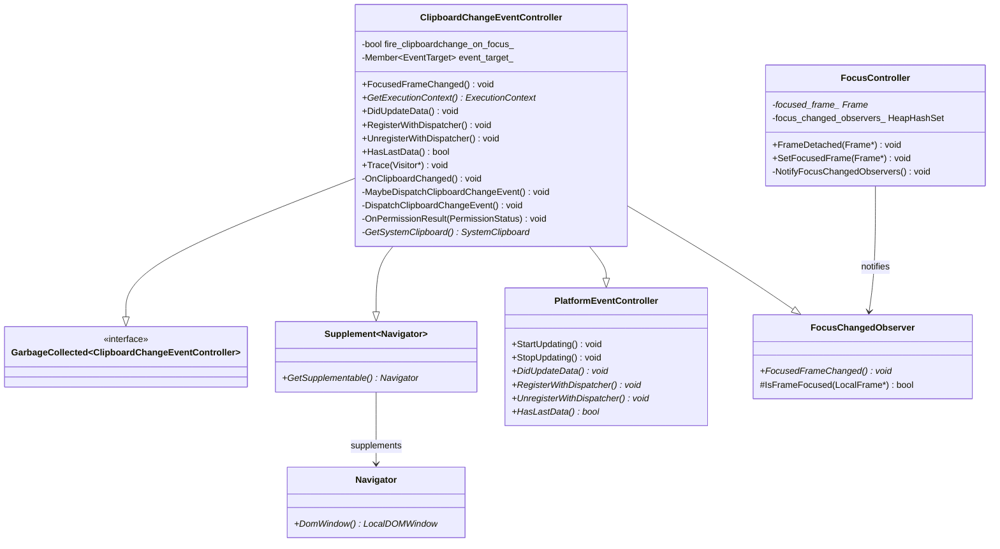
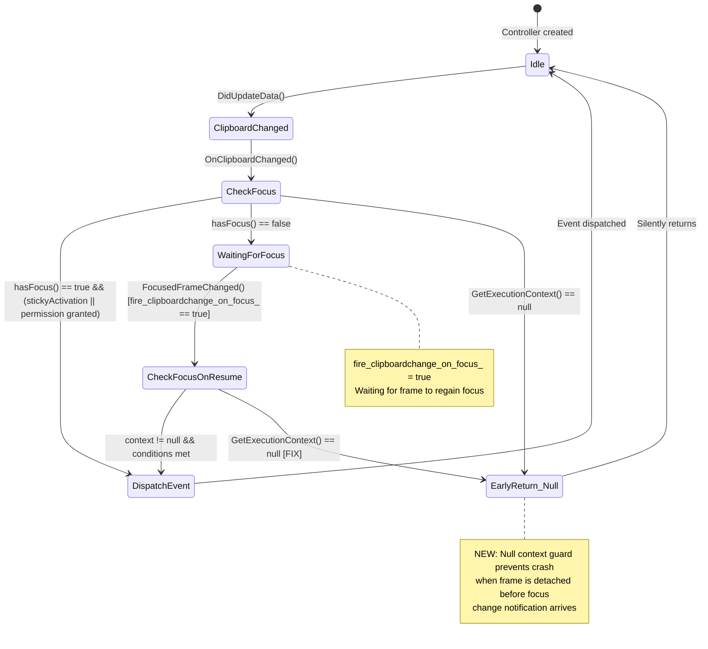
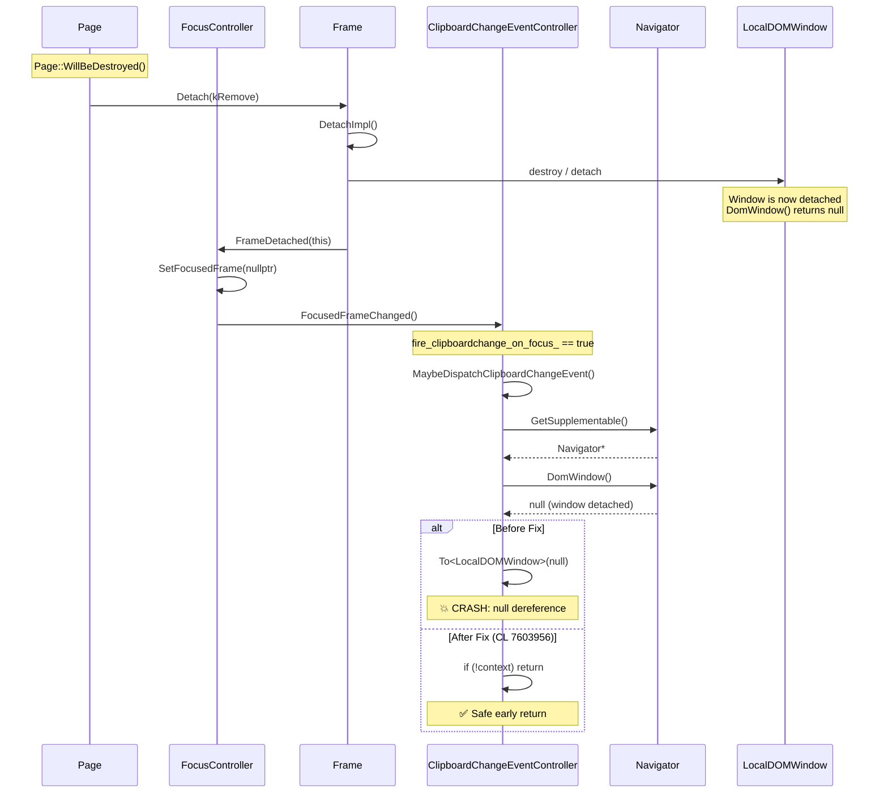

# Low-Level Design: CL 7603956 — Fix null dereference crash in ClipboardChangeEventController

**CL URL:** https://chromium-review.googlesource.com/c/chromium/src/+/7603956  
**Author:** Rohan Raja (roraja@microsoft.com)  
**Bug:** crbug.com/487133768  
**Status:** NEW  
**Files Changed:** 2 (+53/−0)

---

## 1. File-by-File Analysis

### 1.1 `clipboard_change_event_controller.cc`

**Purpose of changes:** Add null-safety guards for `GetExecutionContext()` in two methods (`GetSystemClipboard()` and `MaybeDispatchClipboardChangeEvent()`) to prevent null pointer dereference crashes when these methods are called after the frame has been detached and the `LocalDOMWindow` is destroyed.

**Key modifications:**
- Added early-return null check in `GetSystemClipboard()` (returns `nullptr` if context is null)
- Added early-return null check in `MaybeDispatchClipboardChangeEvent()` (returns void if context is null)

**New/Modified Functions:**

| Function | Purpose | Change | Return on null context |
|----------|---------|--------|----------------------|
| `GetSystemClipboard()` | Retrieves `SystemClipboard*` from the execution context's `LocalFrame` | Added `if (!context) return nullptr;` guard before `To<LocalDOMWindow>(context)` cast | `nullptr` |
| `MaybeDispatchClipboardChangeEvent()` | Conditionally dispatches a `clipboardchange` event based on focus and permission state | Added `if (!context) return;` guard before `To<LocalDOMWindow>(context)` dereference | early return (void) |

**Detailed Code Changes:**

#### `GetSystemClipboard()` (line 62–69)
```cpp
SystemClipboard* ClipboardChangeEventController::GetSystemClipboard() const {
  ExecutionContext* context = GetExecutionContext();
+ if (!context) {
+   return nullptr;
+ }
  LocalFrame* local_frame = To<LocalDOMWindow>(context)->GetFrame();
  return local_frame->GetSystemClipboard();
}
```

**Before fix:** If `context` is null, `To<LocalDOMWindow>(nullptr)` performs an unsafe downcast on a null pointer. Dereferencing the result (`->GetFrame()`) causes a null pointer crash.

**After fix:** Returns `nullptr` early, which is already handled by all callers:
- `RegisterWithDispatcher()` checks `if (clipboard)` at line 50
- `UnregisterWithDispatcher()` checks `if (clipboard)` at line 57
- `DispatchClipboardChangeEvent()` checks `if (!clipboard)` at line 146

#### `MaybeDispatchClipboardChangeEvent()` (line 105–110)
```cpp
void ClipboardChangeEventController::MaybeDispatchClipboardChangeEvent() {
  ExecutionContext* context = GetExecutionContext();
+ if (!context) {
+   return;
+ }
  LocalDOMWindow& window = *To<LocalDOMWindow>(context);
  // ...
}
```

**Before fix:** If `context` is null, `*To<LocalDOMWindow>(nullptr)` dereferences a null pointer, causing a crash.

**After fix:** Returns early without dispatching any event.

**Pattern consistency:** Both new null checks match the existing pattern already used in `OnClipboardChanged()` (line 79–83):
```cpp
void ClipboardChangeEventController::OnClipboardChanged() {
  ExecutionContext* context = GetExecutionContext();
  if (!context) {       // ← existing pattern
    return;
  }
  LocalDOMWindow& window = *To<LocalDOMWindow>(context);
  // ...
}
```

---

### 1.2 `clipboard_change_event_controller_unittest.cc`

**Purpose of changes:** Add a regression test that reproduces the exact crash scenario — `FocusedFrameChanged()` being called after frame detachment when `fire_clipboardchange_on_focus_` is `true`.

**Key modifications:**
- Added `#include "third_party/blink/renderer/core/frame/frame.h"` for `FrameDetachType` enum
- Added `NoCrashWhenFocusedFrameChangedAfterDetachment` test case (47 new lines)

**New Test:**

| Test Name | Purpose | Verifies |
|-----------|---------|----------|
| `NoCrashWhenFocusedFrameChangedAfterDetachment` | Regression test for crbug.com/487158322 | No crash occurs when `Frame::Detach()` triggers `FocusedFrameChanged()` with a null execution context while `fire_clipboardchange_on_focus_` is true |

**Test Logic Flow:**

1. **Setup:** Create execution context, set secure origin, focus the page, register a `clipboardchange` event listener, and create a `ClipboardChangeEventController`
2. **Arm the trigger:** Unfocus the page (`SetPageFocus(false)`) then trigger `DidUpdateData()` — this causes `MaybeDispatchClipboardChangeEvent()` to set `fire_clipboardchange_on_focus_ = true` (because `hasFocus()` returns false)
3. **Trigger the crash path:** Call `GetFrame().Detach(FrameDetachType::kRemove)` — this:
   - Calls `DetachImpl()` which destroys the `LocalDOMWindow` (making `GetExecutionContext()` return null)
   - Calls `FocusController::FrameDetached()` → `SetFocusedFrame(nullptr)` → `NotifyFocusChangedObservers()` → `FocusedFrameChanged()`
   - With `fire_clipboardchange_on_focus_ == true`, `FocusedFrameChanged()` calls `MaybeDispatchClipboardChangeEvent()`
4. **Verify:** Reaching the `EXPECT_EQ` assertion proves no crash occurred

---

## 2. Class Diagram



---

## 3. State Diagram



---

## 4. Crash Sequence (Before Fix)



---

## 5. Data Flow Analysis

### `GetExecutionContext()` Return Path

```
ClipboardChangeEventController::GetExecutionContext()
  → GetSupplementable()        // returns Navigator*
    → Navigator::DomWindow()   // returns LocalDOMWindow* (may be null after detach)
```

**When null:** After `Frame::Detach()` → `DetachImpl()` destroys the `LocalDOMWindow`. `Navigator::DomWindow()` returns `nullptr` because the navigator's associated window has been torn down.

### Callers of `GetExecutionContext()` — Null Safety Audit

| Caller | Null Check Before Fix | Null Check After Fix | Risk |
|--------|----------------------|---------------------|------|
| `FocusedFrameChanged()` | ❌ (calls `UseCounter::Count` directly) | ⚠️ Indirect (via `MaybeDispatchClipboardChangeEvent`) | `UseCounter::Count(null, ...)` is called before the null-checked path — see §6 Concern #1 |
| `OnClipboardChanged()` | ✅ Existing null check | ✅ | Safe |
| `MaybeDispatchClipboardChangeEvent()` | ❌ | ✅ **NEW** | Fixed |
| `GetSystemClipboard()` | ❌ | ✅ **NEW** | Fixed |
| `RegisterWithDispatcher()` | ✅ (via `GetSystemClipboard()` null return + `if (clipboard)`) | ✅ | Safe |
| `UnregisterWithDispatcher()` | ✅ (via `GetSystemClipboard()` null return + `if (clipboard)`) | ✅ | Safe |
| `DispatchClipboardChangeEvent()` | ❌ (line 154: `UseCounter::Count(GetExecutionContext(), ...)`) | ⚠️ No direct null check | See §6 Concern #2 |

---

## 6. Implementation Concerns

### Concern 1: `UseCounter::Count` with null context in `FocusedFrameChanged()`

```cpp
void ClipboardChangeEventController::FocusedFrameChanged() {
  if (fire_clipboardchange_on_focus_) {
    UseCounter::Count(GetExecutionContext(),  // ← Could be null!
                      WebFeature::kClipboardChangeEventFiredAfterFocusGain);
    fire_clipboardchange_on_focus_ = false;
    MaybeDispatchClipboardChangeEvent();  // ← This now has null check
  }
}
```

`UseCounter::Count()` is called with `GetExecutionContext()` **before** the null-checked `MaybeDispatchClipboardChangeEvent()`. If `GetExecutionContext()` returns null here (the exact scenario this CL fixes), `UseCounter::Count(nullptr, ...)` is called. This is likely safe because `UseCounter::Count` typically handles null gracefully (it's a common pattern in Blink), but it should be verified. The null check should ideally be lifted to the beginning of `FocusedFrameChanged()` itself.

**Severity:** Low — `UseCounter::Count` likely handles null, but the fix is incomplete in principle.

### Concern 2: `DispatchClipboardChangeEvent()` calls `UseCounter::Count(GetExecutionContext(), ...)` at line 154

```cpp
void ClipboardChangeEventController::DispatchClipboardChangeEvent() {
  SystemClipboard* clipboard = GetSystemClipboard();
  if (!clipboard) { return; }  // handles null context indirectly
  // ...
  UseCounter::Count(GetExecutionContext(),  // ← redundant call, could be null
                    WebFeature::kClipboardChangeEventFired);
}
```

The `GetSystemClipboard()` null check guards against the null context path, so `UseCounter::Count` will only be reached if context was non-null at `GetSystemClipboard()` time. However, there's theoretically a TOCTOU issue if the context becomes null between the two calls (extremely unlikely in practice since this is single-threaded).

**Severity:** Negligible — protected by single-threaded execution model.

### Concern 3: No null check on `local_frame` in `GetSystemClipboard()`

```cpp
SystemClipboard* ClipboardChangeEventController::GetSystemClipboard() const {
  ExecutionContext* context = GetExecutionContext();
  if (!context) { return nullptr; }
  LocalFrame* local_frame = To<LocalDOMWindow>(context)->GetFrame();
  return local_frame->GetSystemClipboard();  // ← What if GetFrame() returns null?
}
```

`To<LocalDOMWindow>(context)->GetFrame()` could theoretically return null if the window is in a partially-detached state where the execution context is still valid but the frame is already gone. However, in practice, `GetExecutionContext()` (which returns `Navigator::DomWindow()`) returns null when the window is detached, so this path is protected.

**Severity:** Low — the execution context null check covers this path in practice.

### Concern 4: Memory Management

No memory management concerns. All objects are garbage-collected (`GarbageCollected<>`, `Member<>`), and the fix only adds early returns without creating or destroying any objects.

### Concern 5: Thread Safety

No thread safety concerns. All Blink renderer code runs on the main thread. The focus change notification chain (`FrameDetached` → `SetFocusedFrame` → `NotifyFocusChangedObservers` → `FocusedFrameChanged`) is entirely synchronous and single-threaded.

---

## 7. Test Coverage Assessment

| Scenario | Covered | Test |
|----------|---------|------|
| Clipboardchange fires when focused with sticky activation | ✅ | `ClipboardChangeEventFiresWhenFocused` |
| Clipboardchange deferred when not focused | ✅ | `ClipboardChangeEventNotFiredWhenNotFocused` |
| Sticky activation path | ✅ | `ClipboardChangeEventFiresWithStickyActivation` |
| Permission denied path | ✅ | `ClipboardChangeEventNotFiredWithoutStickyActivationOrPermission` |
| Sticky activation precedence over permission | ✅ | `StickyActivationTakesPrecedenceOverPermissionCheck` |
| **Null context after frame detachment (regression)** | ✅ **NEW** | `NoCrashWhenFocusedFrameChangedAfterDetachment` |
| `GetSystemClipboard()` with null context | ⚠️ Indirect | Covered indirectly via the detachment test (since `GetSystemClipboard` is called from `DispatchClipboardChangeEvent` which is downstream) |
| Permission granted fires event | ❌ | Noted as omitted due to mock binding issues |

---

## 8. Suggestions for Improvement

### 8.1 Lift null check to `FocusedFrameChanged()` (Recommended)

The current fix protects `MaybeDispatchClipboardChangeEvent()` but leaves `UseCounter::Count(GetExecutionContext(), ...)` in `FocusedFrameChanged()` unguarded. A more complete fix:

```cpp
void ClipboardChangeEventController::FocusedFrameChanged() {
  if (fire_clipboardchange_on_focus_) {
    if (!GetExecutionContext()) {
      fire_clipboardchange_on_focus_ = false;
      return;
    }
    UseCounter::Count(GetExecutionContext(),
                      WebFeature::kClipboardChangeEventFiredAfterFocusGain);
    fire_clipboardchange_on_focus_ = false;
    MaybeDispatchClipboardChangeEvent();
  }
}
```

This ensures the `UseCounter::Count` call is also protected and the flag is properly reset.

### 8.2 Remove TODO comments

Lines 80–81 and 145 contain `TODO(roraja)` comments questioning whether null checks are needed. Given this CL demonstrates they are indeed required, consider removing the "revisit" TODOs or converting them to explanatory comments:

```cpp
// GetExecutionContext() can be null after frame detachment — see crbug.com/487133768
if (!context) {
  return;
}
```

### 8.3 Defensive null check for `GetFrame()` in `GetSystemClipboard()`

Consider adding a null check for `GetFrame()` return value for extra robustness:

```cpp
SystemClipboard* ClipboardChangeEventController::GetSystemClipboard() const {
  ExecutionContext* context = GetExecutionContext();
  if (!context) { return nullptr; }
  LocalFrame* local_frame = To<LocalDOMWindow>(context)->GetFrame();
  if (!local_frame) { return nullptr; }
  return local_frame->GetSystemClipboard();
}
```

### 8.4 Test improvement: Add direct `GetSystemClipboard()` null context test

The current test only covers the `MaybeDispatchClipboardChangeEvent()` path. A dedicated test that directly calls `GetSystemClipboard()` after detachment would strengthen coverage of the other fix.

---

## 9. Summary

This CL is a **minimal, well-targeted null-safety fix** that addresses a real crash occurring during frame detachment. The changes are:

1. **Correct:** They prevent the null dereference at the exact crash point
2. **Consistent:** They follow the existing null-check pattern already used in `OnClipboardChanged()`
3. **Well-tested:** The regression test accurately reproduces the crash scenario through the real `Frame::Detach()` code path
4. **Minimal:** Only 6 lines of production code added, with no behavioral changes for normal (non-detached) code paths

The main area for improvement is the unguarded `UseCounter::Count(GetExecutionContext(), ...)` call in `FocusedFrameChanged()`, which executes before the null-checked `MaybeDispatchClipboardChangeEvent()` in the same crash scenario.
