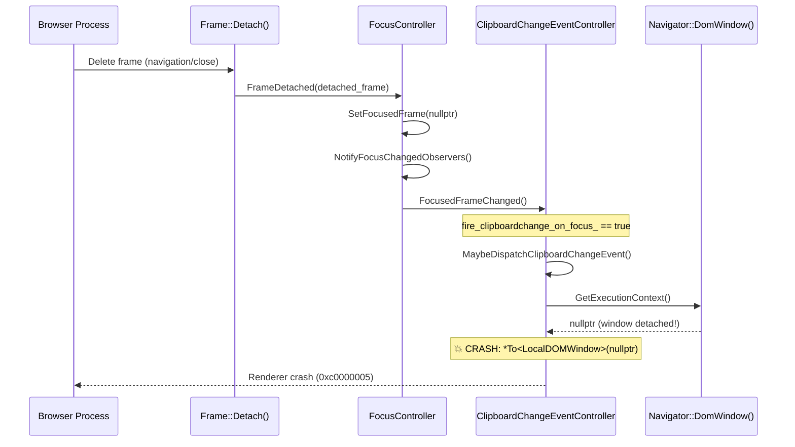

# Fix Assessment: details-1771962050-Clipboardchange-event-Fix-crash-caused-by-possible-null-dere

## Executive Summary
The crash is a null pointer dereference in `ClipboardChangeEventController::MaybeDispatchClipboardChangeEvent()` at line 104 of `clipboard_change_event_controller.cc`. During frame detachment, `GetExecutionContext()` returns null because the `LocalDOMWindow` has been detached, but the code unconditionally dereferences the result via `*To<LocalDOMWindow>(context)`. The recommended fix is to add null checks for `GetExecutionContext()` in all methods that access it within the controller class, following the defensive pattern already established in `OnClipboardChanged()` at line 78.

## Bug Analysis

### Problem Statement
A renderer crash occurs in `ClipboardChangeEventController::MaybeDispatchClipboardChangeEvent()` when the `ClipboardChangeEventController` (which is a `FocusChangedObserver`) receives a focus-change notification during frame detachment. At this point, the execution context (the `LocalDOMWindow`) has already been nullified, but the code dereferences it without a null check, causing a null pointer dereference crash (exception code `0xc0000005` on Windows).

### Expected Behavior
When a frame is being detached and `FocusController::FrameDetached()` triggers `FocusedFrameChanged()` on all observers, `ClipboardChangeEventController::MaybeDispatchClipboardChangeEvent()` should gracefully handle a null execution context by returning early, without attempting to dereference it.

### Actual Behavior
The code crashes with a null pointer dereference at [/third_party/blink/renderer/modules/clipboard/clipboard_change_event_controller.cc#L104](/third_party/blink/renderer/modules/clipboard/clipboard_change_event_controller.cc#L104):
```cpp
ExecutionContext* context = GetExecutionContext();
LocalDOMWindow& window = *To<LocalDOMWindow>(context);  // CRASH: context is null
```
This was a Top #5 Renderer crash on Windows Stable 133.0.6943.60 with 1,033 instances from 1,041 unique clients.

### Triggering Conditions
1. The `ClipboardChangeEvent` feature must be enabled
2. A `clipboardchange` event listener is registered on `navigator.clipboard`
3. The clipboard has been modified while the page did not have focus (setting `fire_clipboardchange_on_focus_ = true`)
4. A frame detachment occurs (via page close, navigation, or iframe removal)
5. `FocusController::FrameDetached()` calls `SetFocusedFrame(nullptr)`, which calls `NotifyFocusChangedObservers()`
6. `ClipboardChangeEventController::FocusedFrameChanged()` is invoked while the execution context is already null

The crash path from the stack trace:
```
Frame::Detach → FocusController::FrameDetached → SetFocusedFrame(nullptr) →
NotifyFocusChangedObservers → ClipboardChangeEventController::FocusedFrameChanged →
MaybeDispatchClipboardChangeEvent → null dereference
```

## Root Cause Analysis

### Code Investigation
Starting from the crash stack trace, I traced the execution path:

1. **Entry**: `blink::Frame::Detach(FrameDetachType)` at [/third_party/blink/renderer/core/frame/frame.cc#L130](/third_party/blink/renderer/core/frame/frame.cc#L130) begins frame teardown.

2. **Focus change during detach**: `FocusController::FrameDetached()` at [/third_party/blink/renderer/core/page/focus_controller.cc#L1701](/third_party/blink/renderer/core/page/focus_controller.cc#L1701) calls `SetFocusedFrame(nullptr)` when the detached frame is the currently focused frame.

3. **Observer notification**: `SetFocusedFrame()` calls `NotifyFocusChangedObservers()` at [/third_party/blink/renderer/core/page/focus_controller.cc#L1646](/third_party/blink/renderer/core/page/focus_controller.cc#L1646), which iterates all `FocusChangedObserver` instances.

4. **Crash site**: `ClipboardChangeEventController::FocusedFrameChanged()` at [/third_party/blink/renderer/modules/clipboard/clipboard_change_event_controller.cc#L27](/third_party/blink/renderer/modules/clipboard/clipboard_change_event_controller.cc#L27) calls `MaybeDispatchClipboardChangeEvent()` when `fire_clipboardchange_on_focus_` is true.

5. **Null dereference**: At [/third_party/blink/renderer/modules/clipboard/clipboard_change_event_controller.cc#L104](/third_party/blink/renderer/modules/clipboard/clipboard_change_event_controller.cc#L104), `GetExecutionContext()` returns null because the `Navigator`'s `DomWindow()` has been detached, and the null pointer is unconditionally dereferenced.

I verified that `GetExecutionContext()` delegates to `GetSupplementable()->DomWindow()` at line 37, and `Navigator::DomWindow()` returns null when the window is detached.

### Key Files Identified
- [/third_party/blink/renderer/modules/clipboard/clipboard_change_event_controller.cc](/third_party/blink/renderer/modules/clipboard/clipboard_change_event_controller.cc) - Contains all crash sites (the controller implementation)
- [/third_party/blink/renderer/modules/clipboard/clipboard_change_event_controller.h](/third_party/blink/renderer/modules/clipboard/clipboard_change_event_controller.h) - Controller class declaration
- [/third_party/blink/renderer/core/page/focus_controller.cc](/third_party/blink/renderer/core/page/focus_controller.cc) - Triggers the crash via `NotifyFocusChangedObservers()` during frame detach
- [/third_party/blink/renderer/core/page/focus_changed_observer.h](/third_party/blink/renderer/core/page/focus_changed_observer.h) - Observer interface that the controller implements
- [/third_party/blink/renderer/core/frame/navigator.h](/third_party/blink/renderer/core/frame/navigator.h) - `DomWindow()` returns null when detached

### Root Cause
**Location**: [/third_party/blink/renderer/modules/clipboard/clipboard_change_event_controller.cc#L104](/third_party/blink/renderer/modules/clipboard/clipboard_change_event_controller.cc#L104)
**Function**: `ClipboardChangeEventController::MaybeDispatchClipboardChangeEvent()`
**Issue**: `GetExecutionContext()` can return null when the `LocalDOMWindow` has been detached during frame teardown. The result is unconditionally dereferenced at line 104 via `*To<LocalDOMWindow>(context)`. The same pattern of unsafe dereference also exists in `GetSystemClipboard()` at line 64 (`To<LocalDOMWindow>(context)->GetFrame()`). The `OnClipboardChanged()` method at line 76–80 already has the correct null check pattern, but it was not applied to the other methods in the class.

**Additional null dereference risks in the same file:**
| Location | Code | Risk |
|----------|------|------|
| Line 29 | `UseCounter::Count(GetExecutionContext(), ...)` | Safe — `UseCounter::Count(UseCounter*, ...)` handles null |
| Line 64 | `To<LocalDOMWindow>(context)->GetFrame()` | **CRASH** — dereferences null context |
| Line 104 | `*To<LocalDOMWindow>(context)` | **CRASH** — dereferences null context |
| Line 148 | `UseCounter::Count(GetExecutionContext(), ...)` | Safe — pointer overload handles null |

### Code Flow Diagram


## Fix Options

### Option 1: Minimal null check in MaybeDispatchClipboardChangeEvent only
- **Description**: Add an early return if `GetExecutionContext()` returns null at the start of `MaybeDispatchClipboardChangeEvent()`, directly mirroring the pattern already used in `OnClipboardChanged()` at line 76–80.
- **Files to modify**: 
  - [/third_party/blink/renderer/modules/clipboard/clipboard_change_event_controller.cc#L102](/third_party/blink/renderer/modules/clipboard/clipboard_change_event_controller.cc#L102) — add null check before line 104
- **Complexity**: Low
- **Risk**: Low
- **Pros**: Minimal change (2 lines), directly fixes the reported crash site, identical to existing pattern in the same file
- **Cons**: Does not fix the same class of bug in `GetSystemClipboard()` (line 64) which has the same null dereference risk; another crash could occur via `DispatchClipboardChangeEvent()` → `GetSystemClipboard()`

### Option 2: Comprehensive null checks in ALL vulnerable methods ⭐ RECOMMENDED
- **Description**: Add null checks for `GetExecutionContext()` in all methods that access it without guards: `MaybeDispatchClipboardChangeEvent()`, `GetSystemClipboard()`, and `FocusedFrameChanged()`. This prevents null dereference crashes across all code paths in the controller.
- **Files to modify**: 
  - [/third_party/blink/renderer/modules/clipboard/clipboard_change_event_controller.cc#L27](/third_party/blink/renderer/modules/clipboard/clipboard_change_event_controller.cc#L27) — add null check in `FocusedFrameChanged()` before `UseCounter::Count` and `MaybeDispatchClipboardChangeEvent()`
  - [/third_party/blink/renderer/modules/clipboard/clipboard_change_event_controller.cc#L62](/third_party/blink/renderer/modules/clipboard/clipboard_change_event_controller.cc#L62) — add null check in `GetSystemClipboard()` before dereferencing context
  - [/third_party/blink/renderer/modules/clipboard/clipboard_change_event_controller.cc#L102](/third_party/blink/renderer/modules/clipboard/clipboard_change_event_controller.cc#L102) — add null check in `MaybeDispatchClipboardChangeEvent()` before dereferencing context
- **Complexity**: Low
- **Risk**: Low
- **Pros**: Comprehensively guards all crash paths; follows the defensive pattern already established in `OnClipboardChanged()` (line 78); prevents future crashes from alternate callers; each change is still a simple null guard
- **Cons**: Slightly more lines changed (6–8 lines across 3 methods); but all changes follow the same trivial pattern

### Option 3: Unregister FocusChangedObserver during frame detachment
- **Description**: Override a lifecycle callback (e.g., `ContextDestroyed()` or respond to the `PageVisibilityChanged()` from `PlatformEventController`) to unregister the `ClipboardChangeEventController` as a `FocusChangedObserver` from the `FocusController` before the execution context becomes null. This would prevent `FocusedFrameChanged()` from being called at all during teardown.
- **Files to modify**: 
  - [/third_party/blink/renderer/modules/clipboard/clipboard_change_event_controller.cc](/third_party/blink/renderer/modules/clipboard/clipboard_change_event_controller.cc) — add unregistration logic
  - [/third_party/blink/renderer/modules/clipboard/clipboard_change_event_controller.h](/third_party/blink/renderer/modules/clipboard/clipboard_change_event_controller.h) — declare new override
  - [/third_party/blink/renderer/core/page/focus_controller.h](/third_party/blink/renderer/core/page/focus_controller.h) — may need to expose `RemoveFocusChangedObserver()`
  - [/third_party/blink/renderer/core/page/focus_controller.cc](/third_party/blink/renderer/core/page/focus_controller.cc) — implement removal method
- **Complexity**: Medium-High
- **Risk**: Medium
- **Pros**: Addresses root cause (observer should not be notified after its context is gone); architecturally cleaner; prevents the observer from being called with stale state
- **Cons**: More complex, touches multiple files including core Blink code; risk of breaking observer registration lifecycle; `FocusController` doesn't currently expose a method to remove observers; timing of unregistration must be carefully coordinated with frame detach order

### Option 4: Add DCHECK + null check guard pattern
- **Description**: Add `DCHECK(GetExecutionContext())` at observer entry points (for debug build detection) combined with null-check early returns in release builds. This follows the belt-and-suspenders pattern used elsewhere in Blink.
- **Files to modify**: 
  - [/third_party/blink/renderer/modules/clipboard/clipboard_change_event_controller.cc#L27](/third_party/blink/renderer/modules/clipboard/clipboard_change_event_controller.cc#L27) — DCHECK + null check in `FocusedFrameChanged()`
  - [/third_party/blink/renderer/modules/clipboard/clipboard_change_event_controller.cc#L62](/third_party/blink/renderer/modules/clipboard/clipboard_change_event_controller.cc#L62) — DCHECK + null check in `GetSystemClipboard()`
  - [/third_party/blink/renderer/modules/clipboard/clipboard_change_event_controller.cc#L102](/third_party/blink/renderer/modules/clipboard/clipboard_change_event_controller.cc#L102) — DCHECK + null check in `MaybeDispatchClipboardChangeEvent()`
- **Complexity**: Low
- **Risk**: Low
- **Pros**: Catches the issue earlier in development; documents the expectation that context should normally be non-null; protects production
- **Cons**: DCHECKs would fire in debug builds during legitimate frame detachment scenarios, potentially causing confusion; the null state is actually expected during teardown, so a DCHECK is semantically incorrect here

### Option 5: Use WeakMember for execution context tracking
- **Description**: Store a `WeakMember<LocalDOMWindow>` directly in the controller and check its validity instead of going through `GetSupplementable()->DomWindow()`. This makes the lifetime dependency explicit and provides a clean null check without indirection.
- **Files to modify**: 
  - [/third_party/blink/renderer/modules/clipboard/clipboard_change_event_controller.h](/third_party/blink/renderer/modules/clipboard/clipboard_change_event_controller.h) — add `WeakMember<LocalDOMWindow>` field
  - [/third_party/blink/renderer/modules/clipboard/clipboard_change_event_controller.cc](/third_party/blink/renderer/modules/clipboard/clipboard_change_event_controller.cc) — initialize weak member in constructor, use it in all methods
- **Complexity**: Medium
- **Risk**: Medium
- **Pros**: Makes lifetime management explicit; idiomatic Oilpan pattern; `WeakMember` is automatically cleared when the object is garbage collected
- **Cons**: Over-engineering for this issue; adds redundancy with the existing `Supplement<Navigator>` pattern; introduces a second source of truth for the execution context; may interact unexpectedly with garbage collection cycles

## Recommended Approach

**Option 2: Comprehensive null checks in ALL vulnerable methods** is the recommended approach for the following reasons:

1. **Completeness**: It fixes not just the reported crash site (line 104) but also the identical vulnerability in `GetSystemClipboard()` (line 64) and the entry point `FocusedFrameChanged()` (line 29). This prevents the same crash from occurring via alternate code paths (e.g., `DispatchClipboardChangeEvent()` calling `GetSystemClipboard()`).

2. **Established Pattern**: The null-check-and-early-return pattern is already used in the same file at `OnClipboardChanged()` (lines 76–80), making this the natural and consistent defensive coding style for this controller.

3. **Low Risk**: Each change is a trivial null guard (2–3 lines), requiring no architectural changes and no modifications to other files. The null execution context is an expected state during frame teardown, not an error, so returning early is the correct behavior.

4. **Minimal Scope**: Unlike Option 3 (observer unregistration) or Option 5 (WeakMember refactor), this approach requires changes only to `clipboard_change_event_controller.cc`, keeping the review surface small and the change easy to verify.

5. **Production Safety**: Unlike Option 4 (DCHECK), this approach does not add assertions that would fire in debug builds during legitimate teardown scenarios. The null context is expected, not a bug in the observer lifecycle.

## Testing Strategy
- **Unit tests needed**: Add a test in [/third_party/blink/renderer/modules/clipboard/](/third_party/blink/renderer/modules/clipboard/) that verifies `MaybeDispatchClipboardChangeEvent()`, `GetSystemClipboard()`, and `FocusedFrameChanged()` handle a null/detached execution context gracefully (no crash). This can be done by creating a `ClipboardChangeEventController`, detaching the window, and then calling the methods.
- **Web tests needed**: Add a web platform test that creates an iframe with a `clipboardchange` listener, modifies the clipboard, then immediately removes the iframe to trigger frame detachment during focus change. Verify no crash occurs.
- **Manual verification**: 
  1. Launch Chrome with `--enable-features=ClipboardChangeEvent`
  2. Open a page that registers a `clipboardchange` listener
  3. Copy text to clipboard while the page doesn't have focus
  4. Navigate away or close the tab rapidly
  5. Verify no renderer crash (no "Aw, Snap!" page)

## Related Code References
- Similar fix: The existing null check pattern in `OnClipboardChanged()` at [/third_party/blink/renderer/modules/clipboard/clipboard_change_event_controller.cc#L76](/third_party/blink/renderer/modules/clipboard/clipboard_change_event_controller.cc#L76) is the exact model to follow
- Related Gerrit CL: [https://chromium-review.googlesource.com/c/chromium/src/+/6476304](https://chromium-review.googlesource.com/c/chromium/src/+/6476304) — Fixed a different crash in `FocusController::FocusHasChanged()` path (`focused_element_` crash) but did NOT fix this `ClipboardChangeEventController` crash
- Similar bugs: crbug/364927113, crbug/330765723 (closed, associated with same magic signature)
- Test examples: Existing clipboard tests in [/third_party/blink/renderer/modules/clipboard/](/third_party/blink/renderer/modules/clipboard/) and focus controller tests in [/third_party/blink/renderer/core/page/focus_controller_test.cc](/third_party/blink/renderer/core/page/focus_controller_test.cc)
