# High-Level Design: Clipboardchange Event — Null Dereference Crash

## 1. Executive Summary

The crash occurs in the **Clipboard Change Event** subsystem of the Blink renderer, specifically in `ClipboardChangeEventController::MaybeDispatchClipboardChangeEvent()`. This controller is a `FocusChangedObserver` that is notified during frame detachment when `FocusController::FrameDetached()` sets the focused frame to `nullptr` and notifies all observers. At this point, the `LocalDOMWindow` (execution context) has already been detached, so `GetExecutionContext()` returns null, and the code crashes on unconditional dereference. The fix requires adding null checks in all methods that access the execution context without guards.

## 2. System Context

### 2.1 Overview

The Clipboard Change Event feature implements the `clipboardchange` event from the emerging Clipboard API specification. It allows web pages to listen for system clipboard changes via `navigator.clipboard.addEventListener('clipboardchange', ...)`. The feature spans two Chrome processes:

- **Browser Process**: Monitors the OS clipboard for changes via `ui::ClipboardObserver` and notifies renderers through Mojo IPC.
- **Renderer Process**: Receives clipboard change notifications, checks focus/permissions, and dispatches DOM events to JavaScript.

The bug sits entirely within the **Renderer Process**, in the Blink modules layer (`third_party/blink/renderer/modules/clipboard/`), at the intersection of the clipboard event system and the focus management system.

### 2.2 Related Specs
- [W3C Clipboard API and Events](https://www.w3.org/TR/clipboard-apis/) — The `clipboardchange` event is an extension to this spec
- [WHATWG HTML — Focus](https://html.spec.whatwg.org/multipage/interaction.html#focus) — Document focus model used for determining when to fire events
- Chromium Feature Flag: `ClipboardChangeEvent` — gates the entire feature

## 3. Component Architecture

### 3.1 Major Components

| Component | Location | Responsibility |
|-----------|----------|----------------|
| `ClipboardHostImpl` | `content/browser/renderer_host/clipboard_host_impl.h` | Browser-side clipboard service; monitors OS clipboard, sends change notifications to renderer via Mojo |
| `SystemClipboard` | `third_party/blink/renderer/core/clipboard/system_clipboard.h` | Renderer-side clipboard abstraction; receives Mojo notifications, dispatches to `PlatformEventController` instances |
| `Clipboard` | `third_party/blink/renderer/modules/clipboard/clipboard.h` | Web API `navigator.clipboard` object; `EventTarget` + `Supplement<Navigator>`; owns `ClipboardChangeEventController` |
| `ClipboardChangeEventController` | `third_party/blink/renderer/modules/clipboard/clipboard_change_event_controller.h` | Orchestrates `clipboardchange` event dispatch; implements `PlatformEventController`, `FocusChangedObserver`, and `Supplement<Navigator>` |
| `ClipboardChangeEvent` | `third_party/blink/renderer/modules/clipboard/clipboard_change_event.h` | DOM event object dispatched to JavaScript |
| `FocusController` | `third_party/blink/renderer/core/page/focus_controller.h` | Manages page/frame focus state; notifies `FocusChangedObserver` instances on focus changes |
| `FocusChangedObserver` | `third_party/blink/renderer/core/page/focus_changed_observer.h` | Interface for observing focus changes; `ClipboardChangeEventController` implements this |
| `PlatformEventController` | `third_party/blink/renderer/core/frame/platform_event_controller.h` | Base class for controllers that register with platform event dispatchers; handles page visibility |
| `Navigator` | `third_party/blink/renderer/core/frame/navigator.h` | The `navigator` Web API object; supplementable host for `Clipboard` and `ClipboardChangeEventController` |
| `LocalDOMWindow` | `third_party/blink/renderer/core/frame/local_dom_window.h` | Execution context for the page; becomes null when the frame is detached |
| `LocalFrame` | `third_party/blink/renderer/core/frame/local_frame.h` | Represents a frame in the renderer; triggers detachment and focus changes |

### 3.2 Component Diagram

## 4. Process Architecture

### 4.1 Process Boundaries

| Process | Role | Key Classes |
|---------|------|-------------|
| **Browser Process** | Monitors OS clipboard; implements `blink::mojom::ClipboardHost`; sends change notifications | `ClipboardHostImpl`, `ui::Clipboard`, `ui::ClipboardObserver` |
| **Renderer Process** | Receives notifications; manages focus state; dispatches DOM events to JavaScript | `SystemClipboard`, `ClipboardChangeEventController`, `FocusController`, `Clipboard` |

The crash occurs entirely in the **Renderer Process**. No IPC boundary is crossed during the crash path — it is triggered internally by `Frame::Detach()` → `FocusController::FrameDetached()` → `NotifyFocusChangedObservers()`.

### 4.2 IPC Flow — Clipboard Change Notification

```mermaid
sequenceDiagram
    participant OS as OS Clipboard
    participant Browser as Browser Process<br/>(ClipboardHostImpl)
    participant Mojo as Mojo IPC
    participant SC as SystemClipboard<br/>(ClipboardListener)
    participant CCEC as ClipboardChangeEvent<br/>Controller
    participant JS as JavaScript

    OS->>Browser: Clipboard data changed
    Browser->>Browser: OnClipboardDataChanged()
    Browser->>Mojo: ClipboardListener::OnClipboardDataChanged(types, changeId)
    Mojo->>SC: OnClipboardDataChanged(types, changeId)
    SC->>SC: Store clipboard change data
    SC->>CCEC: DidUpdateData() → OnClipboardChanged()
    CCEC->>CCEC: MaybeDispatchClipboardChangeEvent()
    
    alt Document has focus + sticky activation
        CCEC->>JS: Dispatch 'clipboardchange' event
    else Document has focus + no activation
        CCEC->>Browser: Check clipboard-read permission
        Browser-->>CCEC: Permission result
        alt Permission granted
            CCEC->>JS: Dispatch 'clipboardchange' event
        end
    else Document does NOT have focus
        CCEC->>CCEC: Set fire_clipboardchange_on_focus_ = true
        Note over CCEC: Deferred until next focus gain
    end
```

### 4.3 IPC Flow — Crash Path (Frame Detachment)

```mermaid
sequenceDiagram
    participant Browser as Browser Process
    participant Mojo as Mojo IPC
    participant RF as RenderFrameImpl
    participant Frame as Frame::Detach()
    participant FC as FocusController
    participant CCEC as ClipboardChangeEvent<br/>Controller
    participant NAV as Navigator

    Browser->>Mojo: mojom::Frame::Delete()
    Mojo->>RF: Delete(FrameDeleteIntention)
    RF->>Frame: Detach(FrameDetachType::kRemove)
    Frame->>Frame: DetachImpl() — detaches LocalDOMWindow
    Frame->>FC: FrameDetached(this)
    
    alt Detached frame was focused
        FC->>FC: SetFocusedFrame(nullptr)
        FC->>FC: NotifyFocusChangedObservers()
        FC->>CCEC: FocusedFrameChanged()
        
        alt fire_clipboardchange_on_focus_ == true
            CCEC->>NAV: GetExecutionContext()
            NAV-->>CCEC: nullptr (window detached!)
            Note over CCEC: 💥 CRASH: *To<LocalDOMWindow>(nullptr)
        end
    end
```

## 5. Data Flow

### 5.1 Normal Flow (Expected — Focus Gained After Clipboard Change)

### 5.2 Buggy Flow (Current — Frame Detaches While Flag Set)

### 5.3 Fixed Flow (After Null Guard)

## 6. Key Interfaces

### 6.1 Public APIs (Web Platform)
- `navigator.clipboard` — Returns the `Clipboard` `EventTarget`
- `navigator.clipboard.addEventListener('clipboardchange', handler)` — Registers a listener; creates `ClipboardChangeEventController` as a supplement on `Navigator`
- `ClipboardChangeEvent` — DOM event with `types` (available MIME types) and `changeId`

### 6.2 Internal Interfaces

| Interface | Method | Description |
|-----------|--------|-------------|
| `FocusChangedObserver` | `FocusedFrameChanged()` | Called by `FocusController` when the focused frame changes (including during detachment) |
| `PlatformEventController` | `DidUpdateData()` | Called by `SystemClipboard` when clipboard data changes |
| `PlatformEventController` | `RegisterWithDispatcher()` / `UnregisterWithDispatcher()` | Manages registration with `SystemClipboard` |
| `Supplement<Navigator>` | `GetSupplementable()` | Returns the `Navigator` host object; used to access `DomWindow()` |
| `ClipboardChangeEventController` | `GetExecutionContext()` | Delegates to `Navigator::DomWindow()`; **returns null when window is detached** |
| `ClipboardChangeEventController` | `MaybeDispatchClipboardChangeEvent()` | Checks focus + permissions before dispatching; **crash site** |
| `ClipboardChangeEventController` | `GetSystemClipboard()` | Gets `SystemClipboard` via `LocalDOMWindow` → `LocalFrame`; **secondary crash site** |
| `FocusController` | `NotifyFocusChangedObservers()` | Iterates all `FocusChangedObserver` instances and calls `FocusedFrameChanged()` |
| `FocusController` | `FrameDetached(Frame*)` | Called by `Frame::Detach()` to clear focused frame |

### 6.3 Mojo Interfaces (IPC)
- `blink::mojom::ClipboardHost` — Browser → Renderer: clipboard read/write operations + `RegisterClipboardListener()`
- `blink::mojom::ClipboardListener` — Renderer → Browser (callback): `OnClipboardDataChanged(types, changeId)`

## 7. Threading Model

All affected code runs on the **main thread** of the Renderer Process:

- **Frame detachment** (`Frame::Detach()`) — main thread
- **Focus controller** (`FocusController::FrameDetached()`, `SetFocusedFrame()`, `NotifyFocusChangedObservers()`) — main thread
- **Clipboard change event controller** (`FocusedFrameChanged()`, `MaybeDispatchClipboardChangeEvent()`) — main thread
- **Mojo message dispatch** (`ClipboardListener::OnClipboardDataChanged()`) — main thread (via message pump)
- **DOM event dispatch** — main thread

There are no cross-thread synchronization concerns for this bug. The crash is a re-entrancy/lifecycle ordering issue within a single thread's call stack during frame teardown.

## 8. External Dependencies

### 8.1 Other Chrome Components
| Dependency | Role |
|-----------|------|
| `content/browser/renderer_host/clipboard_host_impl.h` | Browser-side Mojo service for clipboard operations |
| `ui/base/clipboard/clipboard.h` | Platform-abstracted clipboard access (OS clipboard) |
| `ui/base/clipboard/clipboard_observer.h` | Observer interface for OS clipboard change notifications |
| `third_party/blink/renderer/core/page/focus_controller.h` | Page focus management; triggers the crash path |
| `third_party/blink/renderer/core/frame/frame.h` | Frame lifecycle management; initiates detachment |
| `third_party/blink/renderer/core/frame/navigator.h` | Supplementable host; provides execution context access |
| `third_party/blink/renderer/core/frame/platform_event_controller.h` | Base class for platform event controllers |
| `third_party/blink/public/mojom/permissions/permission.mojom` | Permission service for checking clipboard-read permission |

### 8.2 Platform APIs
- OS clipboard APIs (via `ui::Clipboard`): Windows (`OpenClipboard`/`GetClipboardData`), macOS (`NSPasteboard`), Linux (`X11 selection` / `Wayland`)

### 8.3 Third-Party Libraries
- None directly involved in the crash path

## 9. Impact of Fix

### 9.1 Components Affected

Only one file needs modification:
- `third_party/blink/renderer/modules/clipboard/clipboard_change_event_controller.cc` — Add null checks for `GetExecutionContext()` in `MaybeDispatchClipboardChangeEvent()`, `GetSystemClipboard()`, and `FocusedFrameChanged()`

### 9.2 Risk Assessment
- **Scope**: Narrow — changes are confined to a single file in `modules/clipboard/`
- **Risk Level**: Low — each change is a simple null-check early return, matching the existing pattern in `OnClipboardChanged()` (line 76–80)
- **Testing Coverage**: Unit tests exist in `clipboard_change_event_controller_unittest.cc`; additional test for null execution context should be added. Web platform tests can verify no crash on rapid iframe removal with clipboardchange listener.

### 9.3 Regression Risk
- **Minimal** — The null check simply causes the controller to skip event dispatch when the execution context is already gone. No event should fire during frame teardown, so this is semantically correct.
- **No behavioral change** for the normal (non-teardown) case.

## 10. Top 5 Fix Approaches and Recommendation

### Approach 1: Minimal Null Check in `MaybeDispatchClipboardChangeEvent()` Only
- **What**: Add `if (!context) return;` at line 103, before the dereference at line 104.
- **Pros**: Smallest possible change (2 lines); directly fixes the crash.
- **Cons**: Does NOT fix the same null-dereference risk in `GetSystemClipboard()` (line 64) which can be reached via `DispatchClipboardChangeEvent()`. Another crash could surface.
- **Risk**: Low for the single crash, but incomplete.

### Approach 2: Comprehensive Null Checks in ALL Vulnerable Methods ⭐ RECOMMENDED
- **What**: Add null checks in `MaybeDispatchClipboardChangeEvent()`, `GetSystemClipboard()`, and `FocusedFrameChanged()` — all methods that call `GetExecutionContext()` without guards.
- **Pros**: Fixes all known crash paths; follows the existing defensive pattern in `OnClipboardChanged()` (line 78); minimal change (~6–8 lines across 3 methods in 1 file).
- **Cons**: Slightly more lines than Approach 1, but still trivial.
- **Risk**: Low. Each change is a standard null-guard-and-early-return.

### Approach 3: Unregister `FocusChangedObserver` During Frame Detachment
- **What**: Override `ContextDestroyed()` or add a lifecycle callback to unregister the controller from `FocusController` before the execution context becomes null, so `FocusedFrameChanged()` is never called during teardown.
- **Pros**: Architecturally correct — an observer should not be notified after its context is invalid. Prevents the call entirely rather than guarding against null.
- **Cons**: More complex (4+ files); `FocusController` does not currently expose `RemoveFocusChangedObserver()`; requires careful lifecycle coordination with frame detach ordering; risk of breaking other observers.
- **Risk**: Medium. Touching core Blink focus infrastructure.

### Approach 4: Add DCHECK + Null Check Guard Pattern
- **What**: Add `DCHECK(GetExecutionContext())` at entry points for development detection, combined with null-check early returns for production safety.
- **Pros**: Catches unexpected null states in debug builds; documents the developer's expectation.
- **Cons**: The null state is actually **expected** during frame teardown, so DCHECK would fire on legitimate code paths, causing test failures and developer confusion. Semantically incorrect.
- **Risk**: Medium. DCHECKs firing in valid teardown scenarios would be noisy.

### Approach 5: Use `WeakMember<LocalDOMWindow>` for Explicit Lifetime Tracking
- **What**: Store a `WeakMember<LocalDOMWindow>` in the controller and check its validity instead of going through `GetSupplementable()->DomWindow()`.
- **Pros**: Makes lifetime management explicit; idiomatic Oilpan/cppgc pattern; `WeakMember` is automatically cleared when the object is garbage collected.
- **Cons**: Over-engineering for this issue; adds redundancy with the existing `Supplement<Navigator>` pattern; two sources of truth for execution context; may interact unexpectedly with GC timing.
- **Risk**: Medium. Architectural changes to lifetime management.

### **Recommendation: Approach 2 — Comprehensive Null Checks**

Approach 2 is recommended because:
1. **Completeness** — Fixes all 3 vulnerable call sites, not just the reported one.
2. **Established Pattern** — Identical to the existing null check in `OnClipboardChanged()` (line 78) in the same file.
3. **Minimal Risk** — Simple null guards with early return; no architectural changes; single file modification.
4. **Semantic Correctness** — Returning early when the execution context is null during teardown is the right behavior (no events should fire during frame destruction).
5. **Reviewability** — Small, focused change that is easy to verify and unlikely to introduce regressions.
