# Low-Level Design: Clipboardchange Event — Null Dereference Crash Fix

## 1. Files to Modify

| File | Type | Changes | Lines |
|------|------|---------|-------|
| [/third_party/blink/renderer/modules/clipboard/clipboard_change_event_controller.cc](/third_party/blink/renderer/modules/clipboard/clipboard_change_event_controller.cc) | Modify | Add null checks for `GetExecutionContext()` in `FocusedFrameChanged()`, `GetSystemClipboard()`, and `MaybeDispatchClipboardChangeEvent()` | ~10 |
| [/third_party/blink/renderer/modules/clipboard/clipboard_change_event_controller_unittest.cc](/third_party/blink/renderer/modules/clipboard/clipboard_change_event_controller_unittest.cc) | Modify | Add regression test for null execution context during frame detachment | ~30 |

## 2. Class Hierarchy

### 2.1 Class Diagram


### 2.2 Class Responsibilities
- **`GarbageCollected<ClipboardChangeEventController>`**: Oilpan garbage collection base; ensures the controller is trace-able and collectable.
- **`Supplement<Navigator>`**: Attaches the controller as a supplement to the `Navigator` object; provides `GetSupplementable()` to access the host `Navigator`.
- **`PlatformEventController`**: Base class for platform event subscriptions; manages registration/unregistration with `SystemClipboard`; observes page visibility.
- **`FocusChangedObserver`**: Interface for receiving focus change notifications from `FocusController`; the controller implements `FocusedFrameChanged()`.
- **`ClipboardChangeEventController`** (**contains the bug**): Orchestrates `clipboardchange` event dispatch; receives clipboard data updates via `DidUpdateData()` and focus changes via `FocusedFrameChanged()`; checks focus, activation, and permissions before dispatching.
- **`FocusController`**: Manages page/frame focus state; calls `NotifyFocusChangedObservers()` on focus changes, including during frame detachment — this triggers the crash path.
- **`Navigator`**: The `navigator` Web API object; `DomWindow()` returns `nullptr` when the window is detached.
- **`LocalDOMWindow`**: Execution context for the frame; becomes null/detached during frame teardown.
- **`SystemClipboard`**: Renderer-side clipboard abstraction; provides clipboard change data for event dispatch.

## 3. Method-Level Analysis

### 3.1 Call Chain (Bug Path)

```mermaid
sequenceDiagram
    participant Frame as Frame::Detach()
    participant FC as FocusController
    participant CCEC as ClipboardChangeEvent<br/>Controller
    participant Nav as Navigator
    participant LDW as LocalDOMWindow

    Frame->>FC: FrameDetached(this)
    Note over FC: focused_frame_ == detached_frame
    FC->>FC: SetFocusedFrame(nullptr)
    FC->>FC: NotifyFocusChangedObservers()

    loop For each FocusChangedObserver
        FC->>CCEC: FocusedFrameChanged()
        Note over CCEC: fire_clipboardchange_on_focus_ == true
        CCEC->>CCEC: UseCounter::Count(GetExecutionContext(), ...)
        Note over CCEC: UseCounter::Count(nullptr, ...) is safe<br/>(takes pointer, handles null)
        CCEC->>CCEC: MaybeDispatchClipboardChangeEvent()
        CCEC->>Nav: GetExecutionContext()<br/>→ GetSupplementable()->DomWindow()
        Nav-->>CCEC: nullptr (window detached!)
        Note over CCEC: 💥 CRASH at line 104:<br/>*To<LocalDOMWindow>(nullptr)
    end
```


### 3.2 Secondary Crash Path (via GetSystemClipboard)


### 3.3 Affected Methods

#### `ClipboardChangeEventController::FocusedFrameChanged()`
**Location**: [/third_party/blink/renderer/modules/clipboard/clipboard_change_event_controller.cc#L27](/third_party/blink/renderer/modules/clipboard/clipboard_change_event_controller.cc#L27)

**Current Implementation**:
```cpp
void ClipboardChangeEventController::FocusedFrameChanged() {
  if (fire_clipboardchange_on_focus_) {
    UseCounter::Count(GetExecutionContext(),
                      WebFeature::kClipboardChangeEventFiredAfterFocusGain);
    fire_clipboardchange_on_focus_ = false;
    MaybeDispatchClipboardChangeEvent();
  }
}
```

**Issues**:
1. When `fire_clipboardchange_on_focus_` is `true` and the execution context is null (frame detached), `MaybeDispatchClipboardChangeEvent()` is called, which crashes on null dereference.
2. `UseCounter::Count(GetExecutionContext(), ...)` is safe because `UseCounter::Count` takes a `UseCounter*` pointer and handles null (line 40–43 of `use_counter.h`). However, `MaybeDispatchClipboardChangeEvent()` will crash.
3. Adding an early return when execution context is null prevents the crash and is the correct behavior — no events should be dispatched during frame teardown.

---

#### `ClipboardChangeEventController::GetSystemClipboard()`
**Location**: [/third_party/blink/renderer/modules/clipboard/clipboard_change_event_controller.cc#L62](/third_party/blink/renderer/modules/clipboard/clipboard_change_event_controller.cc#L62)

**Current Implementation (Buggy)**:
```cpp
SystemClipboard* ClipboardChangeEventController::GetSystemClipboard() const {
  ExecutionContext* context = GetExecutionContext();
  LocalFrame* local_frame = To<LocalDOMWindow>(context)->GetFrame();
  return local_frame->GetSystemClipboard();
}
```

**Issues**:
1. `context` can be `nullptr` when the window is detached; `To<LocalDOMWindow>(nullptr)` produces undefined behavior / crash.
2. Even if `context` were valid, `GetFrame()` could theoretically return `nullptr` if the frame has been partially torn down.
3. This method is called from `RegisterWithDispatcher()`, `UnregisterWithDispatcher()`, and `DispatchClipboardChangeEvent()` — any of these callers could trigger a crash during teardown.

---

#### `ClipboardChangeEventController::MaybeDispatchClipboardChangeEvent()`
**Location**: [/third_party/blink/renderer/modules/clipboard/clipboard_change_event_controller.cc#L102](/third_party/blink/renderer/modules/clipboard/clipboard_change_event_controller.cc#L102)

**Current Implementation (Buggy — PRIMARY CRASH SITE)**:
```cpp
void ClipboardChangeEventController::MaybeDispatchClipboardChangeEvent() {
  ExecutionContext* context = GetExecutionContext();
  LocalDOMWindow& window = *To<LocalDOMWindow>(context);  // 💥 CRASH: context is null

  // Check if document has focus
  if (!window.document()->hasFocus()) {
    fire_clipboardchange_on_focus_ = true;
    return;
  }
  // ... rest of method
}
```

**Issues**:
1. `GetExecutionContext()` returns null when the `Navigator`'s `DomWindow()` is detached.
2. `*To<LocalDOMWindow>(context)` dereferences a null pointer — this is the primary crash site (line 104).
3. The existing `OnClipboardChanged()` method (line 76–80) already has the correct null check pattern that should be replicated here.

---

#### `ClipboardChangeEventController::OnClipboardChanged()` (REFERENCE — correct pattern)
**Location**: [/third_party/blink/renderer/modules/clipboard/clipboard_change_event_controller.cc#L75](/third_party/blink/renderer/modules/clipboard/clipboard_change_event_controller.cc#L75)

**Current Implementation (Correct — model to follow)**:
```cpp
void ClipboardChangeEventController::OnClipboardChanged() {
  ExecutionContext* context = GetExecutionContext();
  // TODO(roraja): revisit if this null check is really required
  if (!context) {
    return;
  }
  LocalDOMWindow& window = *To<LocalDOMWindow>(context);
  CHECK(window.IsSecureContext());
  MaybeDispatchClipboardChangeEvent();
}
```

This is the existing defensive pattern — check `!context` and return early. The same pattern must be applied to `MaybeDispatchClipboardChangeEvent()` and `GetSystemClipboard()`.

## 4. Fix Design

### 4.1 Top 5 Approaches to Fix

#### Approach 1: Minimal Null Check in `MaybeDispatchClipboardChangeEvent()` Only
- **What**: Add `if (!context) return;` at line 103, before the dereference at line 104.
- **Pros**: Smallest possible change (2 lines); directly fixes the reported crash at line 104.
- **Cons**: Does NOT fix the same null-dereference risk in `GetSystemClipboard()` (line 64), which is reachable via `DispatchClipboardChangeEvent()` → `GetSystemClipboard()`. Another crash could surface via that path.
- **Risk**: Low for the single crash, but **incomplete** — leaves a known crash path unguarded.
- **Verdict**: Insufficient. Fixes only 1 of 2 known crash sites.

#### Approach 2: Comprehensive Null Checks in ALL Vulnerable Methods ⭐ RECOMMENDED
- **What**: Add null checks for `GetExecutionContext()` in all methods that access it without guards: `MaybeDispatchClipboardChangeEvent()`, `GetSystemClipboard()`, and `FocusedFrameChanged()`.
- **Pros**: Fixes all known crash paths (lines 64 and 104); follows the existing defensive pattern in `OnClipboardChanged()` (line 78); minimal change (~8 lines across 3 methods in 1 file); semantically correct (no events should fire during teardown).
- **Cons**: Slightly more lines than Approach 1, but all changes follow the same trivial pattern.
- **Risk**: Low. Each change is a standard null-guard-and-early-return.
- **Verdict**: **Recommended.** Complete, consistent, minimal risk.

#### Approach 3: Unregister `FocusChangedObserver` During Frame Detachment
- **What**: Override `ContextDestroyed()` to unregister the controller from `FocusController` before the execution context becomes null, preventing `FocusedFrameChanged()` from being called during teardown.
- **Pros**: Architecturally correct — an observer should not be notified after its context is invalid. Prevents the call entirely.
- **Cons**: More complex (4+ files); `FocusController` does not expose `RemoveFocusChangedObserver()`; requires careful lifecycle coordination with frame detach ordering; risk of breaking other observers; touching core Blink focus infrastructure.
- **Risk**: Medium. Higher complexity and broader blast radius.
- **Verdict**: Over-engineered for this fix. Correct long-term, but unnecessary risk for a crash fix.

#### Approach 4: Add DCHECK + Null Check Guard Pattern
- **What**: Add `DCHECK(GetExecutionContext())` at entry points plus null-check early returns for production safety.
- **Pros**: Catches unexpected null states in debug builds; documents expectations.
- **Cons**: The null state is **expected** during frame teardown (not a bug), so `DCHECK` would fire on legitimate code paths in debug builds, causing test failures and developer confusion. Semantically incorrect.
- **Risk**: Medium. DCHECKs firing in valid teardown scenarios is actively harmful.
- **Verdict**: Inappropriate. Null context during teardown is expected, not an error.

#### Approach 5: Use `WeakMember<LocalDOMWindow>` for Explicit Lifetime Tracking
- **What**: Store a `WeakMember<LocalDOMWindow>` in the controller and check validity instead of routing through `GetSupplementable()->DomWindow()`.
- **Pros**: Makes lifetime management explicit; idiomatic Oilpan pattern.
- **Cons**: Over-engineering; adds redundancy with existing `Supplement<Navigator>` pattern; two sources of truth for execution context; may interact unexpectedly with GC timing; requires header changes.
- **Risk**: Medium. Architectural change to lifetime management for a simple null-check fix.
- **Verdict**: Over-engineered. Adds complexity without proportional benefit.

### 4.2 Recommended Approach: Approach 2 — Comprehensive Null Checks

**Rationale**:
1. **Completeness** — Fixes all 3 vulnerable call sites, not just the reported one.
2. **Established Pattern** — Identical to the existing null check in `OnClipboardChanged()` (line 78).
3. **Minimal Risk** — Simple null guards with early return; no architectural changes; single file modification.
4. **Semantic Correctness** — Returning early when execution context is null during teardown is the right behavior.
5. **Reviewability** — Small, focused change easy to verify.

### 4.3 Changes Required

#### File 1: [/third_party/blink/renderer/modules/clipboard/clipboard_change_event_controller.cc](/third_party/blink/renderer/modules/clipboard/clipboard_change_event_controller.cc)

##### Change 1: `FocusedFrameChanged()` — Add null context guard (lines 27–34)

**Before** (lines 27–34):
```cpp
void ClipboardChangeEventController::FocusedFrameChanged() {
  if (fire_clipboardchange_on_focus_) {
    UseCounter::Count(GetExecutionContext(),
                      WebFeature::kClipboardChangeEventFiredAfterFocusGain);
    fire_clipboardchange_on_focus_ = false;
    MaybeDispatchClipboardChangeEvent();
  }
}
```

**After**:
```cpp
void ClipboardChangeEventController::FocusedFrameChanged() {
  if (fire_clipboardchange_on_focus_) {
    if (!GetExecutionContext()) {
      return;
    }
    UseCounter::Count(GetExecutionContext(),
                      WebFeature::kClipboardChangeEventFiredAfterFocusGain);
    fire_clipboardchange_on_focus_ = false;
    MaybeDispatchClipboardChangeEvent();
  }
}
```

**Rationale**: When `FocusedFrameChanged()` is called during frame detachment (via `FocusController::FrameDetached()` → `SetFocusedFrame(nullptr)` → `NotifyFocusChangedObservers()`), the execution context may already be null. Adding a null check at the entry of the `fire_clipboardchange_on_focus_` branch prevents `MaybeDispatchClipboardChangeEvent()` from being called with a null context. While `UseCounter::Count(nullptr, ...)` is safe (it accepts a pointer and handles null), it's cleaner to exit early and not touch `fire_clipboardchange_on_focus_` — keeping the flag set is harmless since the frame is being torn down anyway.

---

##### Change 2: `GetSystemClipboard()` — Add null context guard (lines 62–66)

**Before** (lines 62–66):
```cpp
SystemClipboard* ClipboardChangeEventController::GetSystemClipboard() const {
  ExecutionContext* context = GetExecutionContext();
  LocalFrame* local_frame = To<LocalDOMWindow>(context)->GetFrame();
  return local_frame->GetSystemClipboard();
}
```

**After**:
```cpp
SystemClipboard* ClipboardChangeEventController::GetSystemClipboard() const {
  ExecutionContext* context = GetExecutionContext();
  if (!context) {
    return nullptr;
  }
  LocalFrame* local_frame = To<LocalDOMWindow>(context)->GetFrame();
  if (!local_frame) {
    return nullptr;
  }
  return local_frame->GetSystemClipboard();
}
```

**Rationale**: `GetSystemClipboard()` unconditionally dereferences `context` via `To<LocalDOMWindow>(context)->GetFrame()`. When the execution context is null (detached window), this crashes. Adding a null check and returning `nullptr` is safe because all callers already handle a null return from `GetSystemClipboard()`:
- `RegisterWithDispatcher()` (line 49): `if (clipboard) { ... }`
- `UnregisterWithDispatcher()` (line 56): `if (clipboard) { ... }`
- `DispatchClipboardChangeEvent()` (line 140): `if (!clipboard) { return; }`

Additionally, we add a null check for `local_frame` (belt-and-suspenders) since `GetFrame()` can return null during partial teardown.

---

##### Change 3: `MaybeDispatchClipboardChangeEvent()` — Add null context guard (lines 102–104)

**Before** (lines 102–104):
```cpp
void ClipboardChangeEventController::MaybeDispatchClipboardChangeEvent() {
  ExecutionContext* context = GetExecutionContext();
  LocalDOMWindow& window = *To<LocalDOMWindow>(context);
```

**After**:
```cpp
void ClipboardChangeEventController::MaybeDispatchClipboardChangeEvent() {
  ExecutionContext* context = GetExecutionContext();
  if (!context) {
    return;
  }
  LocalDOMWindow& window = *To<LocalDOMWindow>(context);
```

**Rationale**: This is the **primary crash site** (line 104). `GetExecutionContext()` returns null when the `Navigator`'s `DomWindow()` has been detached during frame teardown. The `*To<LocalDOMWindow>(context)` dereferences a null pointer. Adding `if (!context) { return; }` follows the exact same pattern used in `OnClipboardChanged()` at line 76–80. Returning early is semantically correct — no `clipboardchange` events should be dispatched when the frame is being destroyed.

---

#### File 2: [/third_party/blink/renderer/modules/clipboard/clipboard_change_event_controller_unittest.cc](/third_party/blink/renderer/modules/clipboard/clipboard_change_event_controller_unittest.cc)

##### Change 4: Add regression test for null execution context

**Add after line 247** (after `StickyActivationTakesPrecedenceOverPermissionCheck` test):

```cpp
TEST_F(ClipboardChangeEventTest,
       NoCrashWhenFocusChangedAfterFrameDetachment) {
  ExecutionContext* execution_context = GetFrame().DomWindow();
  GetFrame().GetSystemClipboard()->OnClipboardDataChanged({"text/plain"}, 1);

  SetSecureOrigin(execution_context);
  SetPageFocus(true);

  auto* clipboard_change_event_handler =
      MakeGarbageCollected<EventCountingListener>();
  GetDocument().addEventListener(event_type_names::kClipboardchange,
                                 clipboard_change_event_handler, false);
  auto* clipboard_change_event_controller =
      MakeGarbageCollected<ClipboardChangeEventController>(
          *GetFrame().DomWindow()->navigator(), &GetDocument());

  // Simulate clipboard change while page doesn't have focus.
  // This sets fire_clipboardchange_on_focus_ = true.
  SetPageFocus(false);
  clipboard_change_event_controller->DidUpdateData();
  test::RunPendingTasks();
  EXPECT_EQ(clipboard_change_event_handler->Count(), 0);

  // Simulate frame detachment by detaching the DomWindow's document.
  // After this, GetExecutionContext() returns null.
  GetFrame().DomWindow()->FrameDestroyed();

  // This should not crash — FocusedFrameChanged() should handle null context.
  clipboard_change_event_controller->FocusedFrameChanged();

  // No crash, no event dispatched.
  EXPECT_EQ(clipboard_change_event_handler->Count(), 0);

  GetDocument().removeEventListener(event_type_names::kClipboardchange,
                                    clipboard_change_event_handler, false);
}
```

**Rationale**: This test directly reproduces the crash scenario: a `clipboardchange` listener is registered, the clipboard changes while the page is unfocused (setting `fire_clipboardchange_on_focus_ = true`), then the frame is detached (making `GetExecutionContext()` return null), and finally `FocusedFrameChanged()` is called. Without the fix, this test would crash at line 104 with a null pointer dereference. With the fix, the method returns early without crashing.

### 4.4 State Machine Changes

```mermaid
stateDiagram-v2
    [*] --> Idle : Controller created
    Idle --> PendingFocus : Clipboard changed +<br/>page not focused
    note right of PendingFocus : fire_clipboardchange_on_focus_ = true

    PendingFocus --> Dispatching : Page gains focus +<br/>context valid
    Dispatching --> Idle : Event dispatched

    PendingFocus --> Idle : Page gains focus +<br/>context null (FIX)
    note left of Idle : Early return, no crash

    Idle --> Dispatching : Clipboard changed +<br/>page focused +<br/>activation/permission

    state Dispatching {
        [*] --> CheckActivation
        CheckActivation --> FireEvent : Has sticky activation
        CheckActivation --> CheckPermission : No activation
        CheckPermission --> FireEvent : Permission granted
        CheckPermission --> [*] : Permission denied
        FireEvent --> [*]
    }

    PendingFocus --> ContextDestroyed : Frame detaches
    note right of ContextDestroyed : NEW: Returns early (no crash)
    ContextDestroyed --> [*]
```

**Key state transitions affected by the fix**:
- **Before fix**: `PendingFocus` → `FocusedFrameChanged()` with null context → 💥 CRASH
- **After fix**: `PendingFocus` → `FocusedFrameChanged()` with null context → early return (no crash) → controller is garbage collected during teardown

## 5. Memory & Lifetime Considerations

### 5.1 Object Ownership

| Object | Owner | Lifetime | Notes |
|--------|-------|----------|-------|
| `ClipboardChangeEventController` | Oilpan (GC'd) + `Supplement<Navigator>` | Tied to `Navigator` lifetime | Supplement is destroyed when `Navigator` is destroyed |
| `Navigator` | `LocalDOMWindow` | Tied to window lifetime | `DomWindow()` returns null when detached |
| `LocalDOMWindow` | `LocalFrame` | Frame lifetime | Detached during `Frame::Detach()` |
| `FocusController` | `Page` | Page lifetime | Outlives individual frames |
| `event_target_` | `Member<EventTarget>` (traced) | GC-managed | Strong reference; traced in `Trace()` |

**Critical lifetime issue**: The `ClipboardChangeEventController` is registered as a `FocusChangedObserver` with the `FocusController` (which is owned by `Page`). The `FocusController` holds a `WeakMember<FocusChangedObserver>` reference. During frame detachment, the `Navigator`'s `DomWindow()` becomes null **before** `FocusController::FrameDetached()` calls `NotifyFocusChangedObservers()`. This means the controller receives the `FocusedFrameChanged()` callback with an invalid (null) execution context.

### 5.2 Pointer/Reference Safety
- [x] No raw pointer issues — all pointers are GC-managed (`Member<>`, `WeakMember<>`)
- [x] Weak pointers handled correctly — `FocusController` uses `WeakMember<FocusChangedObserver>`
- [x] Reference lifetime guaranteed — **WITH THE FIX**: all `GetExecutionContext()` results are null-checked before dereference
- [x] `WrapWeakPersistent(this)` used in `OnPermissionResult` callback binding (line 134) — ensures the controller is not prevented from GC

## 6. Threading Considerations

### 6.1 Thread Safety
All affected code runs on the **main thread** of the Renderer Process. There are no cross-thread synchronization concerns:

- `Frame::Detach()` — main thread
- `FocusController::FrameDetached()` — main thread
- `FocusController::SetFocusedFrame()` — main thread
- `FocusController::NotifyFocusChangedObservers()` — main thread
- `ClipboardChangeEventController::FocusedFrameChanged()` — main thread
- `ClipboardChangeEventController::MaybeDispatchClipboardChangeEvent()` — main thread
- DOM event dispatch — main thread

### 6.2 Required Synchronization
None. The crash is a **re-entrancy/lifecycle ordering issue** within a single thread's call stack during frame teardown, not a threading bug. The fix (null checks) does not introduce any synchronization requirements.

### 6.3 Re-entrancy Analysis
The call chain during frame detachment is synchronous and non-re-entrant:
```
Frame::Detach() → FocusController::FrameDetached() → SetFocusedFrame(nullptr)
  → NotifyFocusChangedObservers() → ClipboardChangeEventController::FocusedFrameChanged()
  → MaybeDispatchClipboardChangeEvent() → [CRASH or early return]
```
The fix does not introduce re-entrancy risks because the early return prevents any further method calls when the context is null.

## 7. Error Handling

### 7.1 Current Error Handling
- `OnClipboardChanged()` (line 76–80): Has a null check for `GetExecutionContext()` — returns early. This is the model pattern.
- `DispatchClipboardChangeEvent()` (line 140): Has a null check for `GetSystemClipboard()` — returns early.
- `RegisterWithDispatcher()` / `UnregisterWithDispatcher()`: Check `if (clipboard)` before using `GetSystemClipboard()` result.
- `MaybeDispatchClipboardChangeEvent()`: **No null check** — crashes on null context.
- `GetSystemClipboard()`: **No null check** — crashes on null context.
- `FocusedFrameChanged()`: **No null check** — calls into crash-prone methods.

### 7.2 Changes to Error Handling
1. **`FocusedFrameChanged()`**: Add `if (!GetExecutionContext()) return;` before processing the `fire_clipboardchange_on_focus_` flag.
2. **`GetSystemClipboard()`**: Add `if (!context) return nullptr;` after getting the execution context, and `if (!local_frame) return nullptr;` after getting the frame.
3. **`MaybeDispatchClipboardChangeEvent()`**: Add `if (!context) return;` after getting the execution context (before the dereference at line 104).

All changes follow the existing pattern established in `OnClipboardChanged()`.

## 8. Validation Points

### 8.1 DCHECKs to Add/Modify
No DCHECKs should be added. The null execution context during frame teardown is an **expected** state, not a programming error. Adding `DCHECK(GetExecutionContext())` would fire during legitimate teardown scenarios in debug builds, causing confusion and test failures.

The existing `CHECK(window.IsSecureContext())` in `OnClipboardChanged()` (line 82) remains valid and is unaffected by the fix.

### 8.2 Invariants to Maintain
1. **`GetExecutionContext()` may return null at any time after frame detachment** — all callers must handle this.
2. **`GetSystemClipboard()` may return null** — all callers already handle this (verified).
3. **`fire_clipboardchange_on_focus_` flag is reset only when the event is about to be dispatched** — if the context is null, the flag should not be cleared (the frame is being destroyed anyway).
4. **No `clipboardchange` events should be dispatched during frame teardown** — the fix ensures this by returning early.
5. **The controller's `Trace()` method must trace all `Member<>` fields** — no changes needed; `event_target_` is already traced.

## 9. Test Requirements

### 9.1 Unit Tests Needed

| Test Name | Purpose | File |
|-----------|---------|------|
| `ClipboardChangeEventTest.NoCrashWhenFocusChangedAfterFrameDetachment` | Verify `FocusedFrameChanged()` handles null execution context without crash | [/third_party/blink/renderer/modules/clipboard/clipboard_change_event_controller_unittest.cc](/third_party/blink/renderer/modules/clipboard/clipboard_change_event_controller_unittest.cc) |

### 9.2 Test Scenarios

1. **Normal case — clipboard change with focus and activation**: Existing test `ClipboardChangeEventFiresWhenFocused` — verifies that a `clipboardchange` event fires normally when the page has focus and sticky activation. Should continue to pass after the fix.

2. **Normal case — deferred event on focus gain**: Existing test `ClipboardChangeEventNotFiredWhenNotFocused` — verifies that the event is deferred and fires when focus is regained. Should continue to pass.

3. **Edge case — frame detachment with pending event (regression test)**: New test `NoCrashWhenFocusChangedAfterFrameDetachment` — simulates:
   - Clipboard changes while page is unfocused (sets `fire_clipboardchange_on_focus_ = true`)
   - Frame is detached (makes `GetExecutionContext()` return null)
   - `FocusedFrameChanged()` is called
   - **Expected**: No crash, no event dispatched, method returns early

4. **Edge case — `GetSystemClipboard()` with null context**: The null check in `GetSystemClipboard()` is implicitly tested by scenario 3, since `DispatchClipboardChangeEvent()` calls `GetSystemClipboard()`. With the fix to `MaybeDispatchClipboardChangeEvent()`, this path won't be reached when context is null, but the defensive check in `GetSystemClipboard()` provides defense-in-depth.

5. **Edge case — permission check does not crash**: The `OnPermissionResult()` callback (line 87–99) calls `DispatchClipboardChangeEvent()` which calls `GetSystemClipboard()`. If the permission callback fires after frame detachment, the null check in `GetSystemClipboard()` (new) and the existing null check in `DispatchClipboardChangeEvent()` (line 140) prevent a crash.

### 9.3 Existing Tests to Verify (No Regressions)

| Test Name | What It Verifies |
|-----------|-----------------|
| `ClipboardChangeEventFiresWhenFocused` | Normal dispatch with focus + activation |
| `ClipboardChangeEventNotFiredWhenNotFocused` | Deferred dispatch on focus gain |
| `ClipboardChangeEventFiresWithStickyActivation` | Sticky activation bypass |
| `ClipboardChangeEventNotFiredWithoutStickyActivationOrPermission` | Permission denial path |
| `StickyActivationTakesPrecedenceOverPermissionCheck` | Activation precedence over permission |

All existing tests should pass unchanged because the null-check early returns only affect the teardown path, which is not exercised by these tests.

## 10. Summary of All Changes

### Production Code Changes (1 file, ~10 lines)

**File**: `third_party/blink/renderer/modules/clipboard/clipboard_change_event_controller.cc`

| Method | Line | Change | Type |
|--------|------|--------|------|
| `FocusedFrameChanged()` | 28–29 | Add `if (!GetExecutionContext()) { return; }` | Null guard |
| `GetSystemClipboard()` | 63–64 | Add `if (!context) { return nullptr; }` + `if (!local_frame) { return nullptr; }` | Null guard |
| `MaybeDispatchClipboardChangeEvent()` | 103–104 | Add `if (!context) { return; }` | Null guard |

### Test Code Changes (1 file, ~30 lines)

**File**: `third_party/blink/renderer/modules/clipboard/clipboard_change_event_controller_unittest.cc`

| Test | Purpose |
|------|---------|
| `NoCrashWhenFocusChangedAfterFrameDetachment` | Regression test for the crash |
